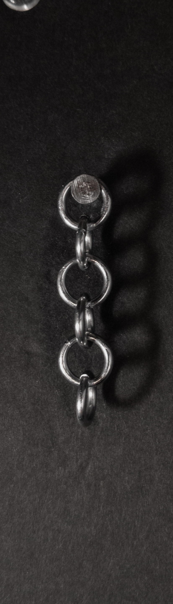
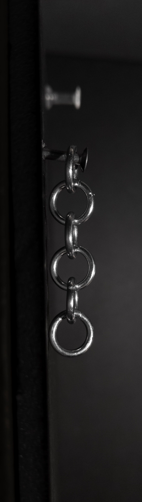
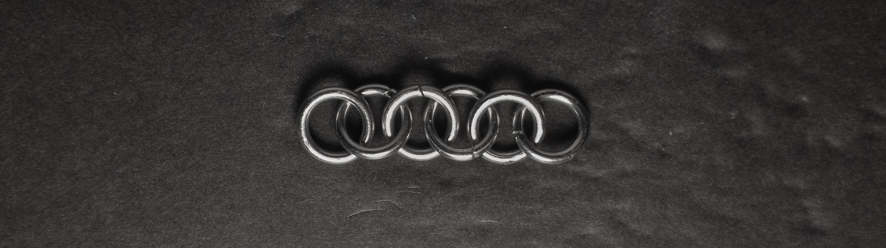
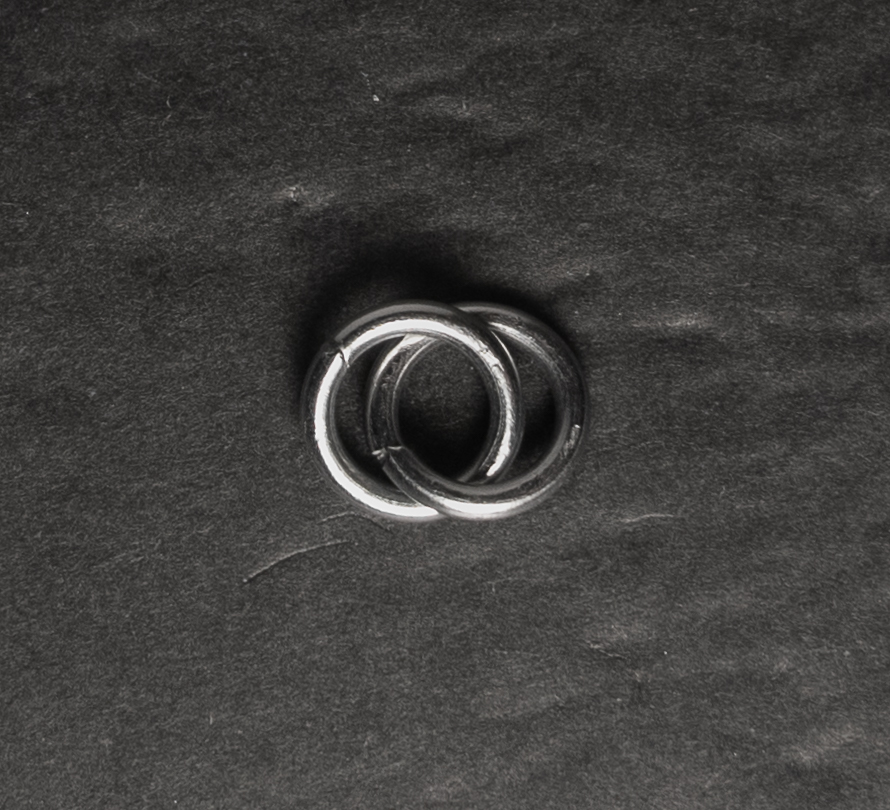
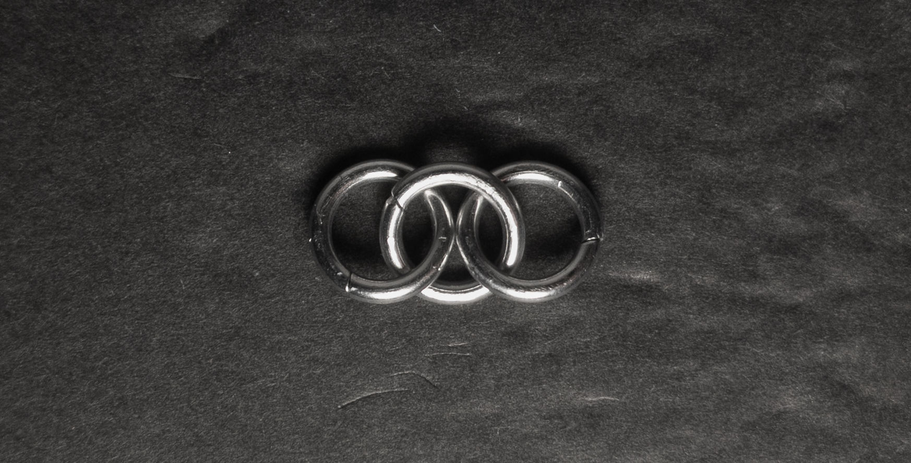
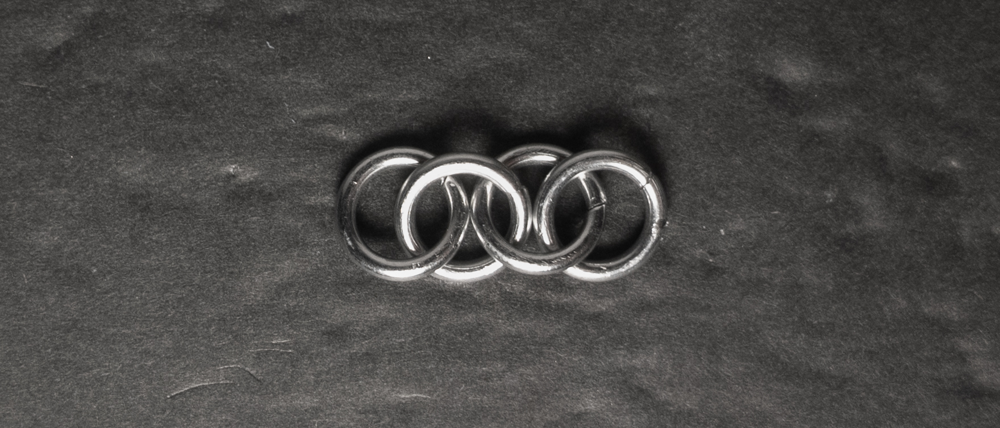
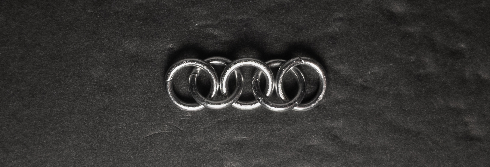

 posted: 2023-08-27 

## 2-in-1 Chain

### Overview

After finishing work on a challenging weave ([Hoodoo Sheet](hoodoo_sheet.md)), I decided to start a new journey from a basic weave and work my way back up the chain of complexity. Due to this, I found [2 In 1 Chain](https://www.mailleartisans.org/weaves/weavedisplay.php?key=54) on [M.A.I.L.](https://www.mailleartisans.org/), the simplest possible weave and the basis of all other chainmail weaves. As this is the simplest possible weave, no tutorials are available, nor will I include one.

### Materials

For the sample piece showcased in this post, I used Bright Aluminum rings purchased from [The Ring Lord](https://theringlord.com/). The rings are 16 SWG with a 1/4" internal diameter, resulting in an aspect ratio of 4.03.

### Notes

The 2 in 1 Chain weave is the simplest weave in the world of chainmail, making it incredibly easy to understand and construct. The primary use of the weave is as a fundamental building block for other weaves. However, you can also create simple necklaces, bracelets, and other items with it. However, I find the weave to look too simple and basic. Despite its straightforward appearance, I highly recommend learning this weave as it serves as a gateway into the enjoyable world of chainmail. It provides an excellent foundation for advancing to more intricate and elaborate weaves, making it a crucial starting point for anyone interested in exploring the art of chainmail.

### Pictures

#### Vertical

#### Vertical: Profile

#### Flat

#### Flat: Profile

#### In Process

 

 

 

