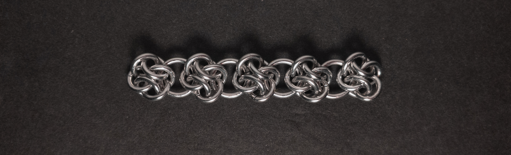
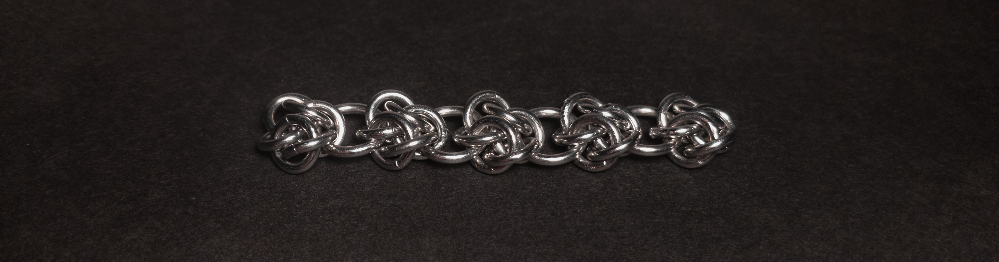
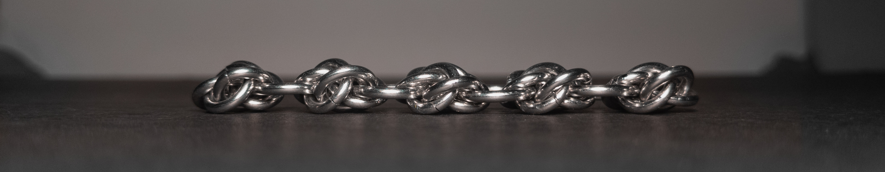
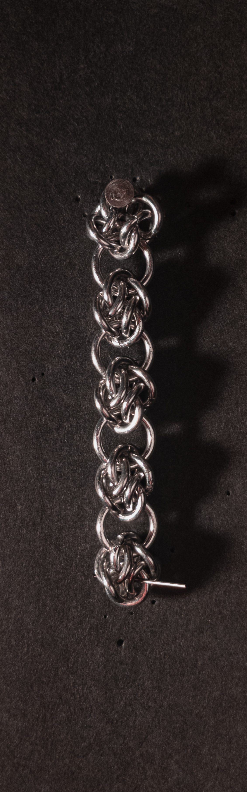
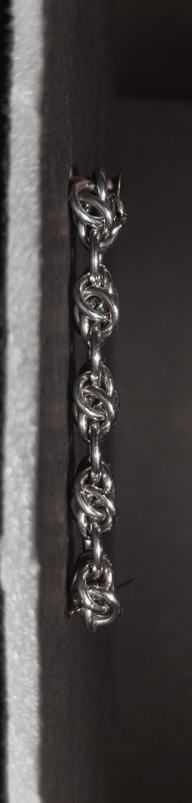
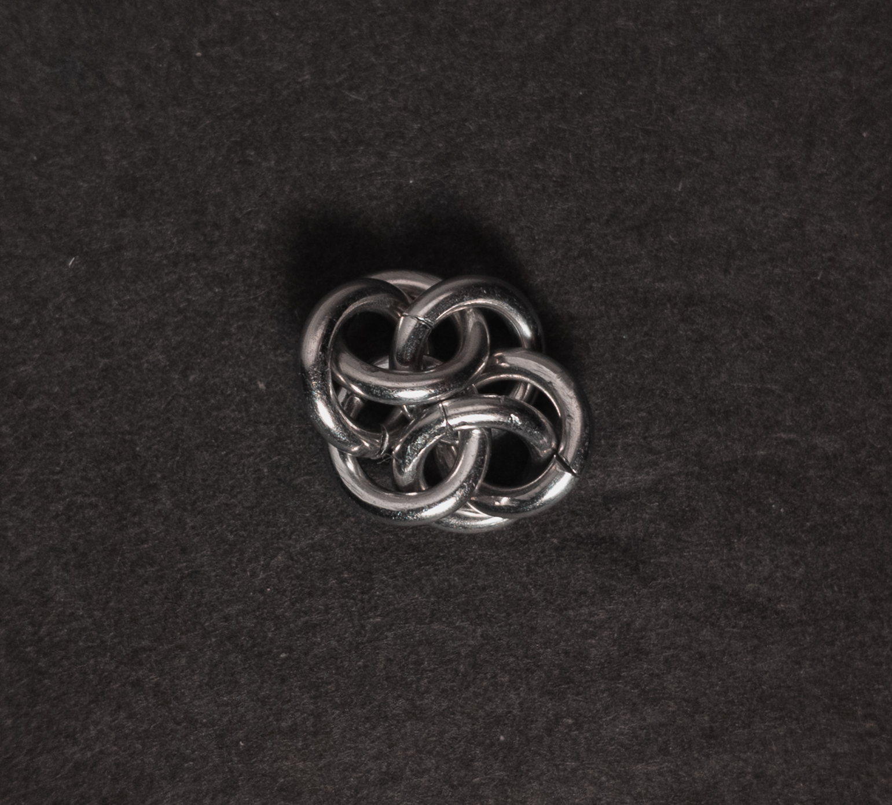
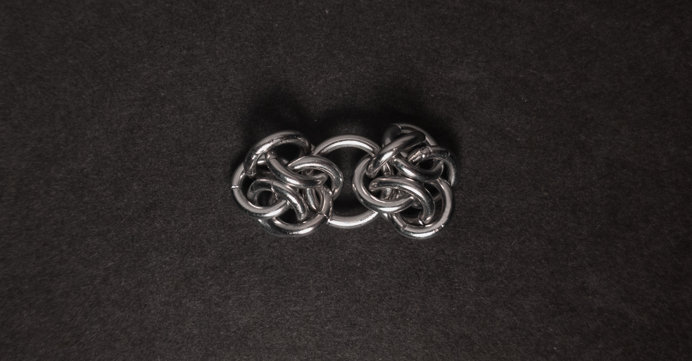
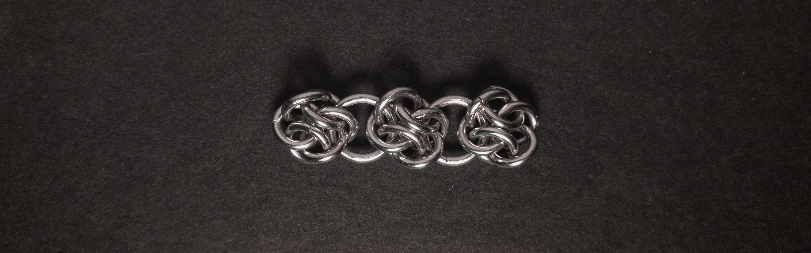
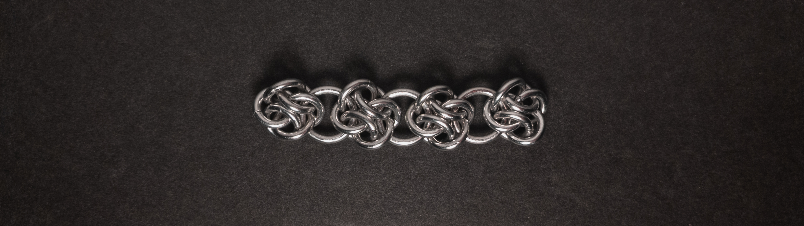

 posted: 2024-11-03 

## 4 Winds

### Overview

While looking through [M.A.I.L.](https://www.mailleartisans.org/) for new weaves to try out, I came across [4 Winds](https://www.mailleartisans.org/weaves/weavedisplay.php?key=981) by [chainge_maker](https://www.mailleartisans.org/members/memberdisplay.php?key=13268). 4 Winds is a cute European descended chain weave made by joining [Cloud Cover](cloud_cover.md) units differently. I recommend this [tutorial](https://www.mailleartisans.org/articles/articledisplay.php?key=583) by [lorraine](https://www.mailleartisans.org/members/memberdisplay.php?key=9915) for those who want to make it for themselves.

### Materials

For the sample piece showcased in this post, I used two sizes of rings made by hand(bonus post coming soon) from 16 SWG Bright Aluminum wire purchased from [The Ring Lord](https://theringlord.com/). The smaller rings have an ID(Inner Diameter) of 5mm for an AR(Aspect Ratio) of 3.1. The larger rings have an ID of 7mm for an AR of 4.3.

### Notes

The 4 Winds weave is easy to understand; however, due to the size of the rings, it can be a bit challenging to create. Please pay attention to the orientation of the rings in the units when making the weave; not doing so caused me to redo a few units. In my opinion, the weave looks aesthetically pleasing. As a chain weave with a flat and rectangular cross-section, it is well suited for necklaces, chokers, bracelets, or non-load-bearing strapping. Given the weave looks nice, has many uses, and provides good practice for working with smaller rings, I recommend learning to make this weave.

### Pictures

#### Flat

#### Flat: Angled

#### Flat: Profile

#### Vertical

#### Vertical: Profile

#### In Process

 

 

 

