 posted: 2025-01-05 

## 4 Winds Sheet

### Overview

After making [4 Winds](4_winds.md), I noticed how easy it would be to expand it to a sheet and wondered if someone already documented it. After a brief search through [M.A.I.L.](https://www.mailleartisans.org/) I found [4 Winds Sheet](https://www.mailleartisans.org/weaves/weavedisplay.php?key=983) also attribtuted to [chainge_maker](https://www.mailleartisans.org/members/memberdisplay.php?key=13268). As a descendant of 4 Winds, it is also a cute European weave; however, it can be dense if made correctly. I have written and included [this tutorial](#tutorial) as I could not find any publicly available tutorial.

### Materials

For the sample piece showcased in this post, I used two sizes of rings made by hand(bonus post coming soon) from 16 SWG Bright Aluminum wire purchased from [The Ring Lord](https://theringlord.com/). The smaller rings have an ID(Inner Diameter) of 5mm for an AR(Aspect Ratio) of 3.1. The larger rings have an ID of 9mm for an AR of 5.5.

### Tutorial

0. First, learn how to create units and chains of 4 Winds. I recommend [this tutorial](https://www.mailleartisans.org/articles/articledisplay.php?key=583).

1. Create 2 chains of 4 Winds the length of your desired sheet. When done, it should look something like this:

    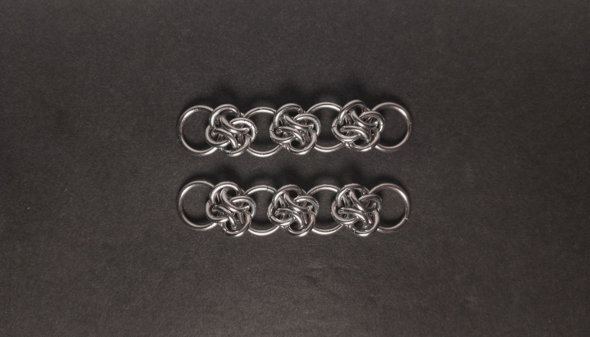

2. Open up one of the large rings in the top chain(green in the image below) and add one 4 Winds unit. Make sure the large ring(green in the image below) goes through the three rings highlighted red in the image below. The same join is performed in 4 Winds chain when adding a unit to the end of a chain. When done, it should look something like this:

    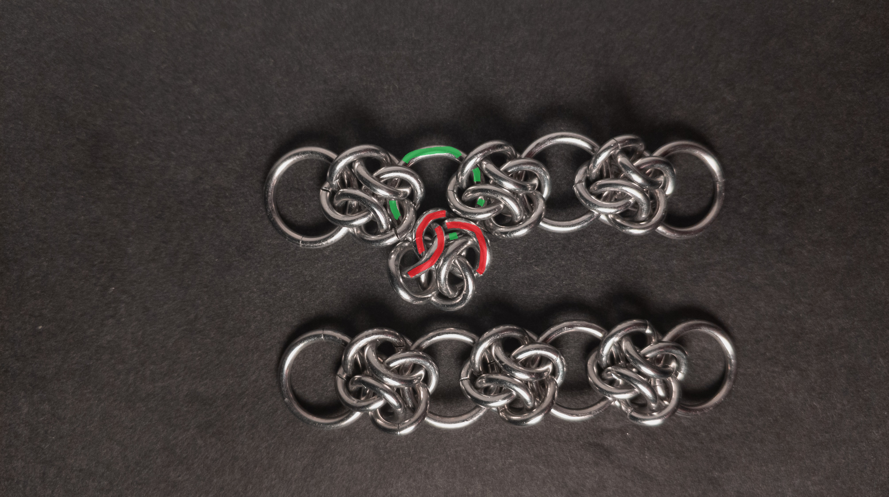

3. Open the opposite large ring in the bottom chain and pass it through the same 4 Winds unit from the last step. Make sure the large ring(orange in the image below) goes through the three rings highlighted blue in the image below. The same join is performed in 4 Winds chain when adding a a large ring to a unit to extend the chain. When done, it should look something like this:

    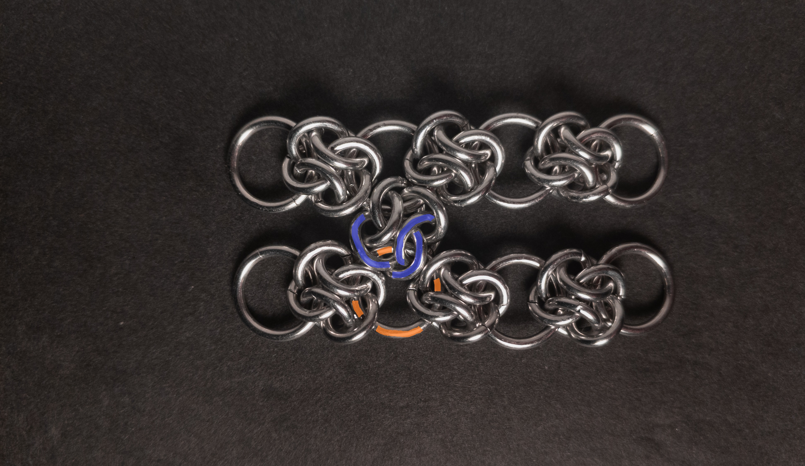

4. Repeat steps 2 & 3 for each pair of large rings(each pair in matching colours in the image below) from each 4 Winds chain. When done, it should look something like this:

    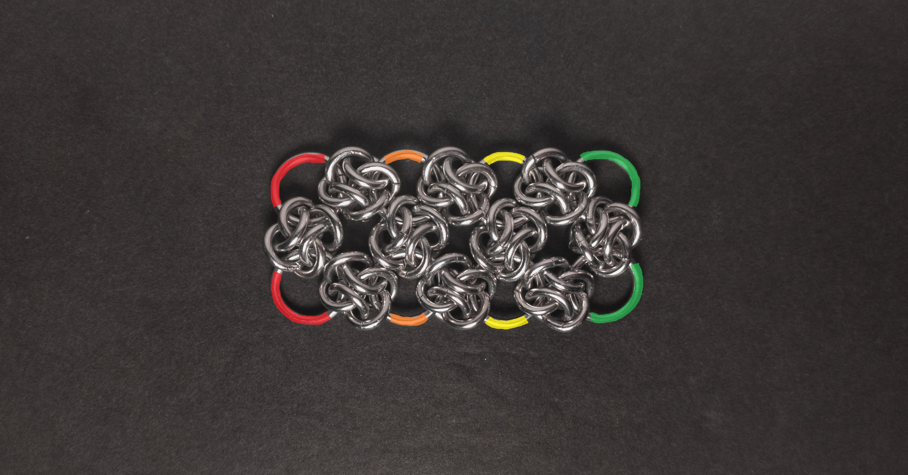

5. Create another 4 Winds chain as long as the other chains. When done, it should look something like this:

    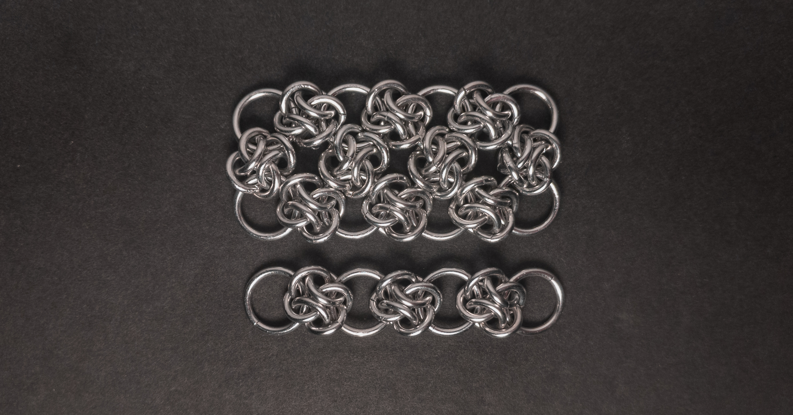

6. Repeat steps 2 & 3 for each pair of large rings(each pair in matching colours in the image below), the old bottom chain and the new chain. When done, it should look something like this:

    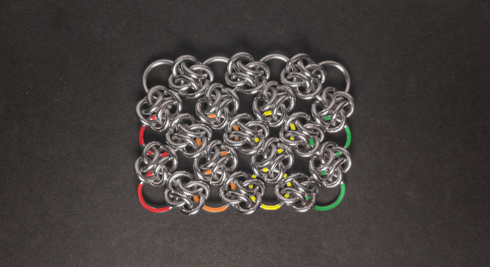

7. Repeat steps 4 through 6 to join more chains until you are happy with the width.

8. Enjoy your patch of 4 Winds Sheet.

### Notes

The 4 Winds Sheet weave is quite simple to understand, particularly if you have a solid grasp of the 4 Winds weave. However, it inherits the difficulties of working with small rings from 4 Winds, and additional challenges arise if the large rings aren’t sufficiently sized, as it can be tricky to fit four units onto a single ring. If I were to make this weave again, I would use higher AR large rings to simplify the process, though I found that bent nose pliers made it possible to close the large rings on four units. Aesthetically, I consider the weave to be very stunning. Since this is a sheet weave, bracelets, chokers, strapping, or fabric can be made with it. While it can be difficult to create, to me, the visual appeal far outweighs the challenges, making this a weave worth learning.

### Pictures

#### Flat

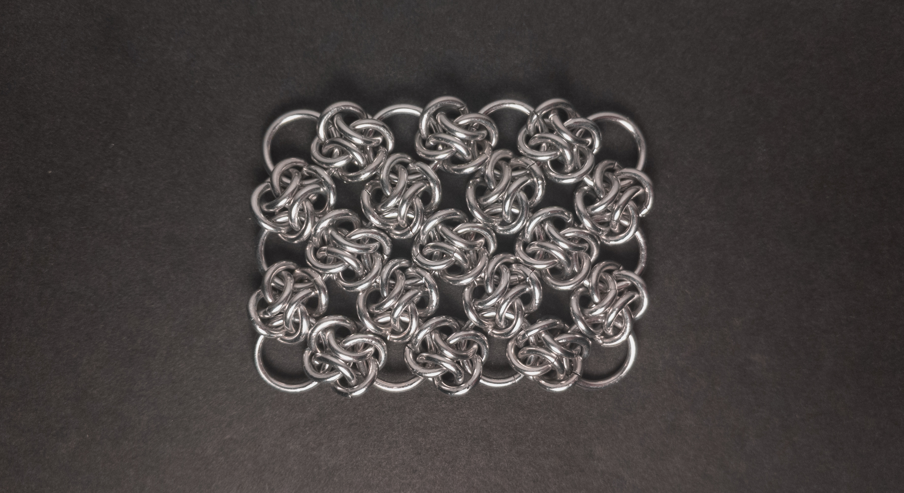

#### Flat: Angled

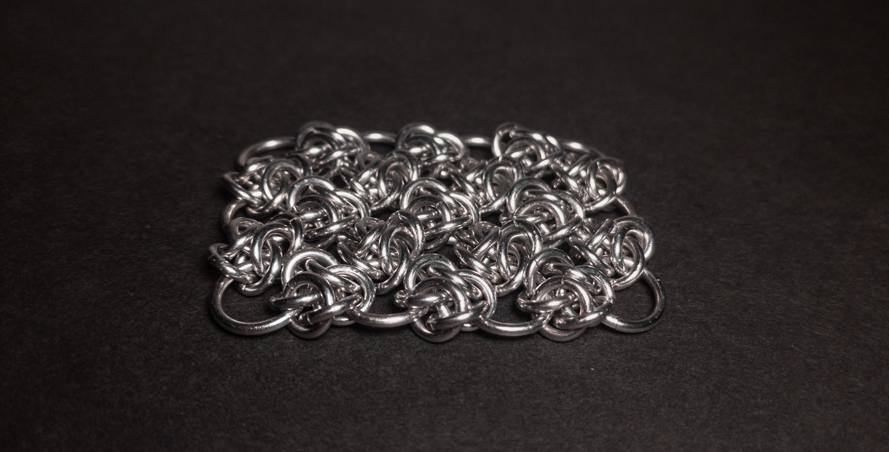

#### Flat: Profile

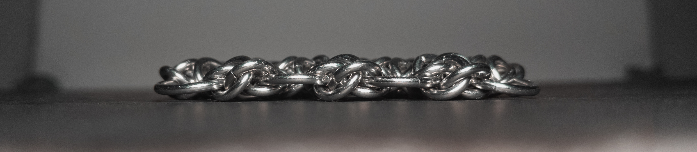

#### Vertical

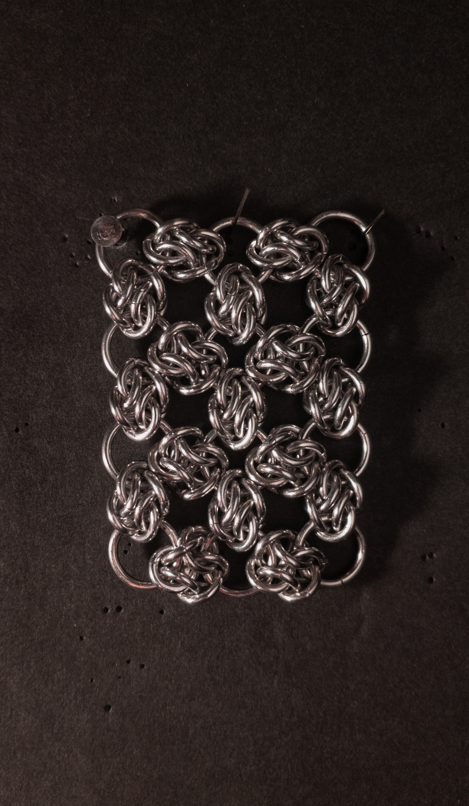

#### Vertical: Profile

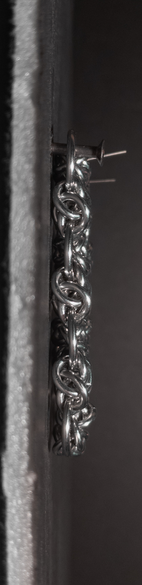

<!-- Removed in process since the tutorial shows it off -->
