 posted: 2024-07-14 

## Abhainn

### Overview

While looking for new weaves to try out, I came across [Abhainn](https://www.mailleartisans.org/weaves/weavedisplay.php?key=1206) uploaded to [M.A.I.L.](https://www.mailleartisans.org/) by [lorraine](https://www.mailleartisans.org/members/memberdisplay.php?key=9915) and attributed to Diana Ferguson. Abhainn is a fascinating variation of a simple 4-in-2 chain created by adding 2-in-1 chains to each side going in opposite directions. If you are interested in following along at home, this [tutorial](https://www.mailleartisans.org/articles/articledisplay.php?key=670) by lorraine is quite good.

### Materials

For the sample piece showcased in this post, I used two sizes of rings made from 16 SWG Bright Aluminum wire. The larger rings, which I made myself(bonus post coming soon), have an ID(Inner Diameter) of 8mm for an AR(Aspect Ratio) of 4.9. The smaller rings, purchased from [The Ring Lord](https://theringlord.com/), have an ID of .25in for an AR of 4.

### Notes

The Abhainn weave presents a moderate level of complexity in understanding and creation. Employing separate colours for the ring sizes should aid clarity. Additionally, marking the starting end with a twist tie can make the process easier. Despite its complexity, I find the weave to possess an aesthetically pleasing appearance, though, from some angles, it can appear overly intricate. With its chain-like structure and relatively flat and broad cross-section, the weave lends itself well to applications such as bracelets, chokers, or straps. The name "Abhainn," meaning "river" in Irish, aptly reflects the weave's flowing and interconnected pattern, as evident from the [Flat: Angled view](#flat-angled). Despite the weave's complexity, its aesthetic allure makes it worth learning, especially if one has access to two colours of rings to offset its intricacy.

### Pictures

#### Flat

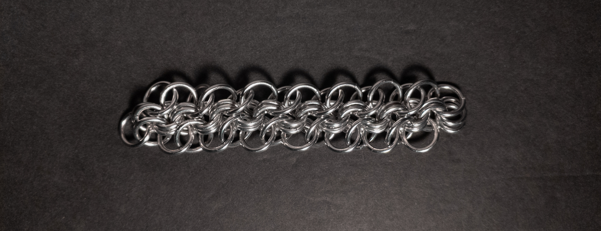

#### Flat: Angled

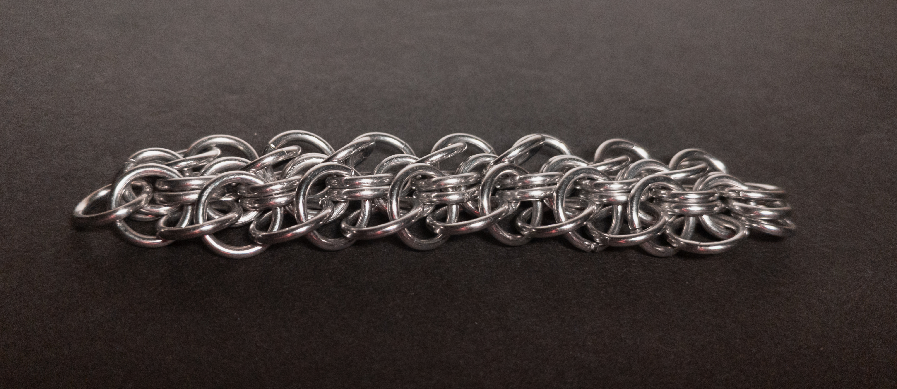

#### Flat: Profile

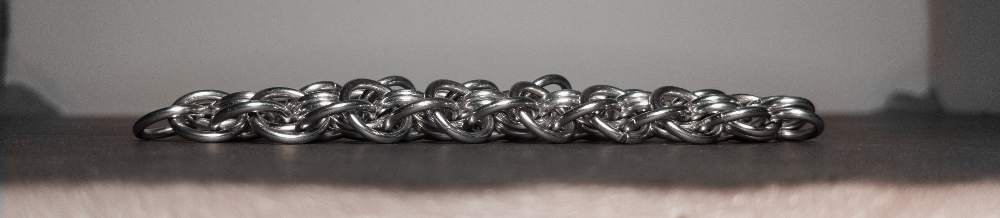

#### Vertical

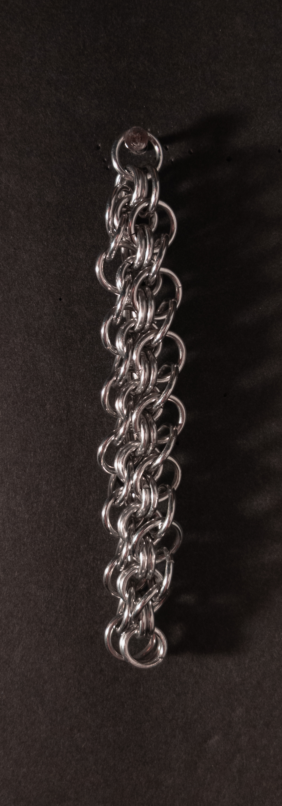

#### Vertical: Profile

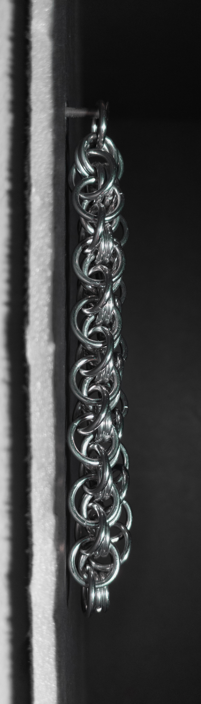

#### In Process

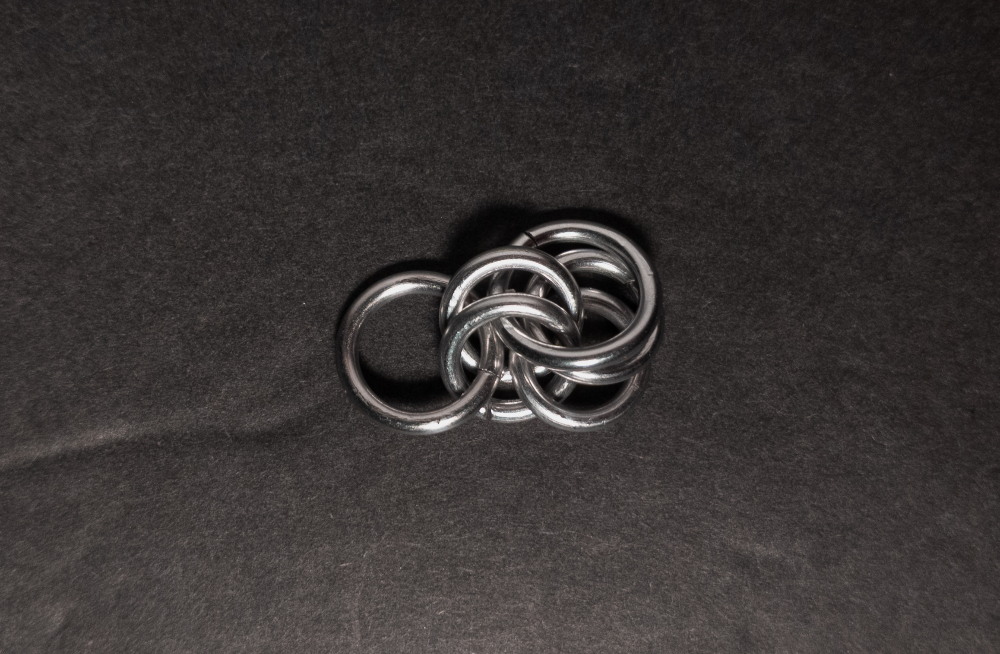

 

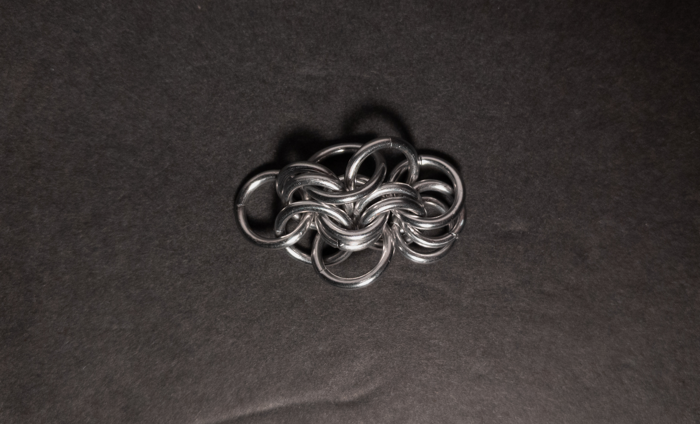

 

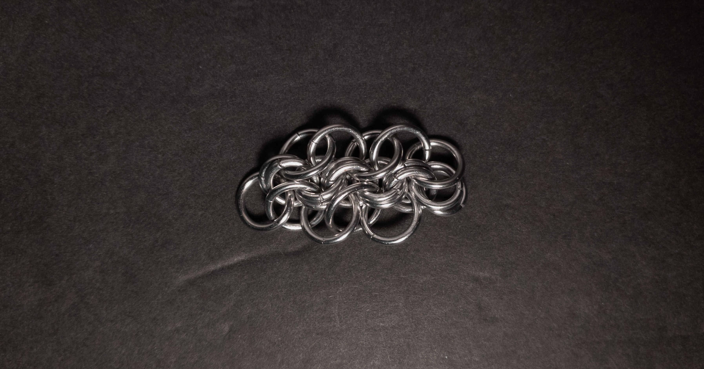

 

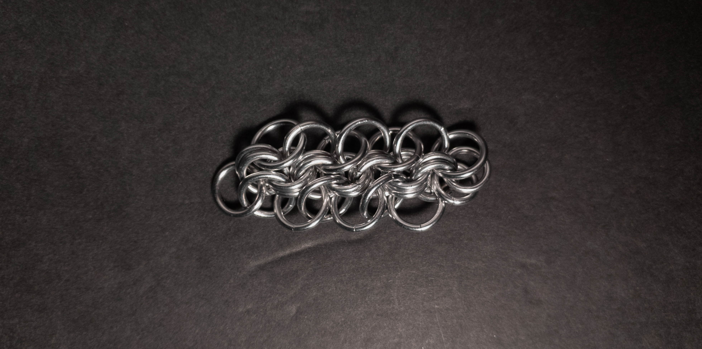

 

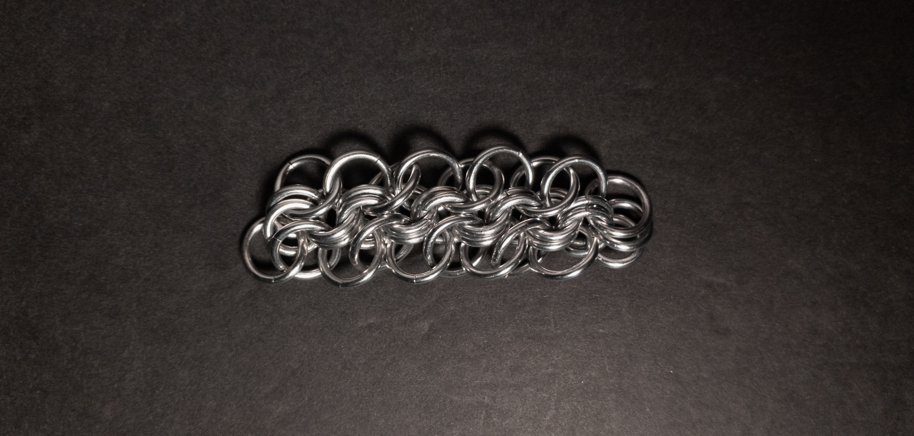

 

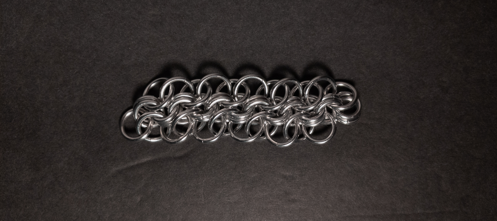

 

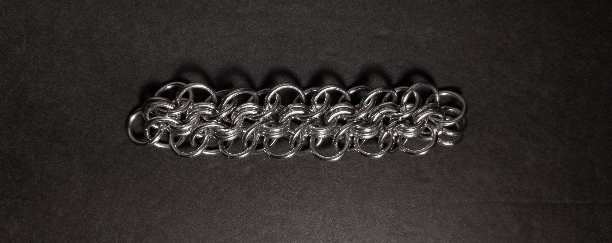
