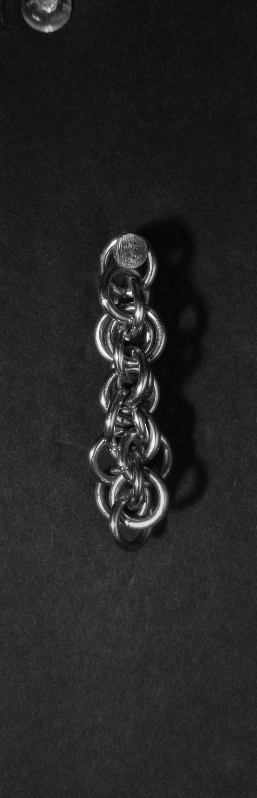
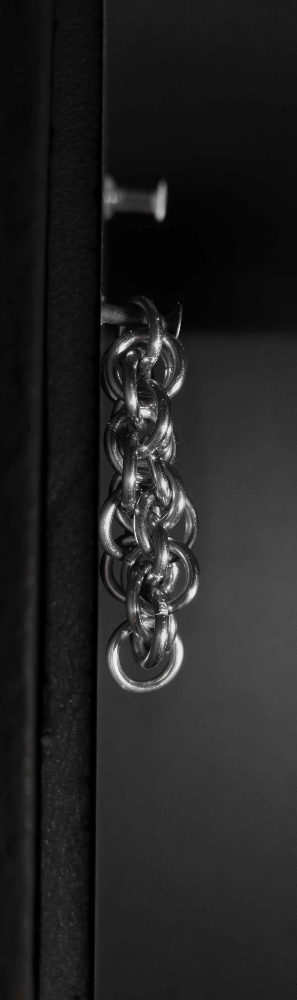
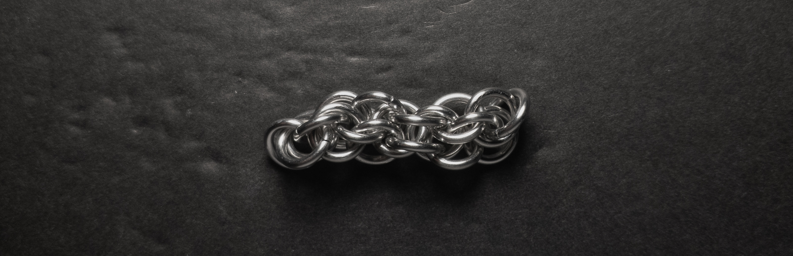
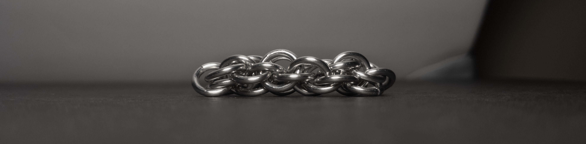
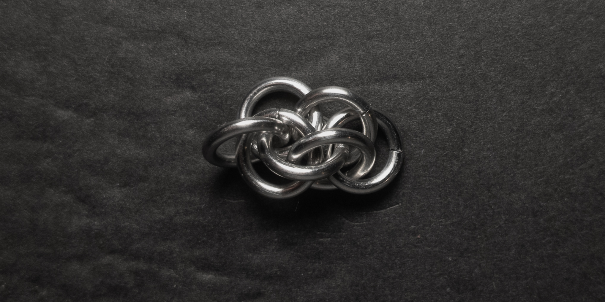
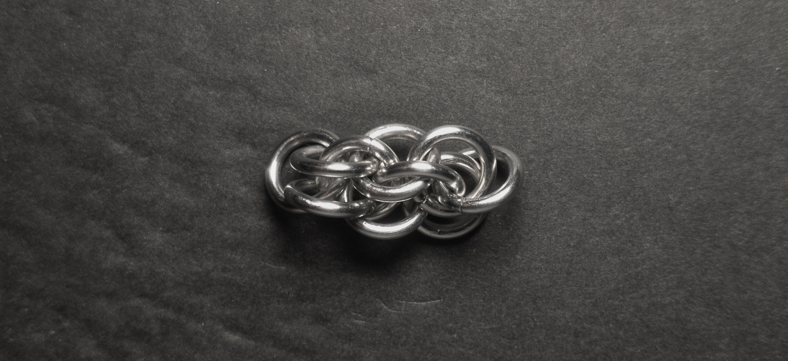
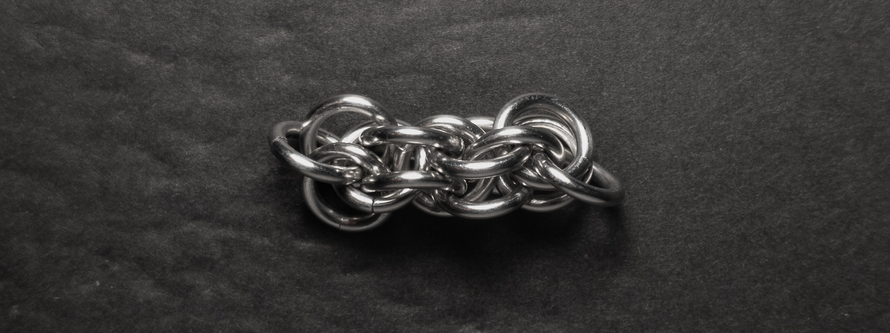
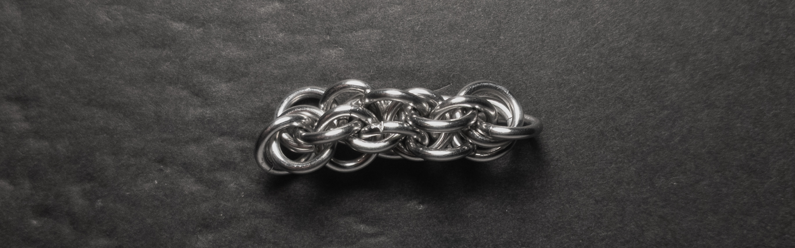

 posted: 2023-09-17 

## Abstain

### Overview

While searching [M.A.I.L.](https://www.mailleartisans.org/) for an appropriate weave to do after [Shaggy Loops](shaggy_loops.md) in my journey of increasing complexity, I found this [tutorial](https://www.mailleartisans.org/articles/articledisplay.php?key=671) by [lorraine](https://www.mailleartisans.org/members/memberdisplay.php?key=9915) discussing how to create the [Abstain](https://www.mailleartisans.org/weaves/weavedisplay.php?key=1233) weave. Abstain came about when [Maille_Fantasy](https://www.mailleartisans.org/members/memberdisplay.php?key=9189) tried to make Shaggy Loops and accidentally put the dangling rings through the ring below. If you are looking for a neat spiral weave try it out yourself.

### Materials

For the sample piece showcased in this post, I made the rings myself (bonus post coming soon if you are interested). I used 16 SWG Bright Aluminum wire from [The Ring Lord](https://theringlord.com/) coiled around a 6mm mandrel for an approximate aspect ratio of 3.7.

### Notes

The Abstain weave is moderately simple to understand and relatively easy to construct. It exhibits an appealing appearance in most situations, but if the rings used are too large, the spiral may not lock in properly, which detracts from its overall aesthetics. Being a chain weave with a circular cross-section, Abstain is well-suited for use in bracelets, chokers, and even dangly necklaces. One intriguing aspect of this weave is that it functions as a spiral weave but is locked in place to prevent unravelling. This unique characteristic adds to its versatility and design possibilities. In conclusion, I highly recommend learning the Abstain weave, as it offers a fun and adaptable experience for those interested in chainmail craftsmanship.

### Pictures

#### Vertical

#### Vertical: Profile

#### Flat

#### Flat: Profile

#### In Process

 

 

 

