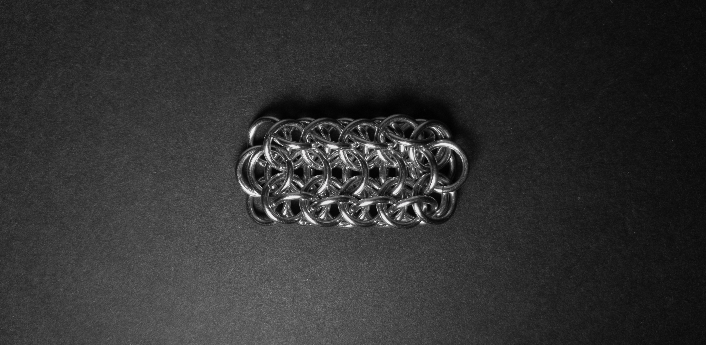
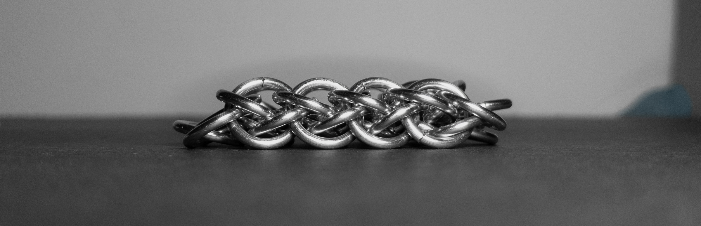
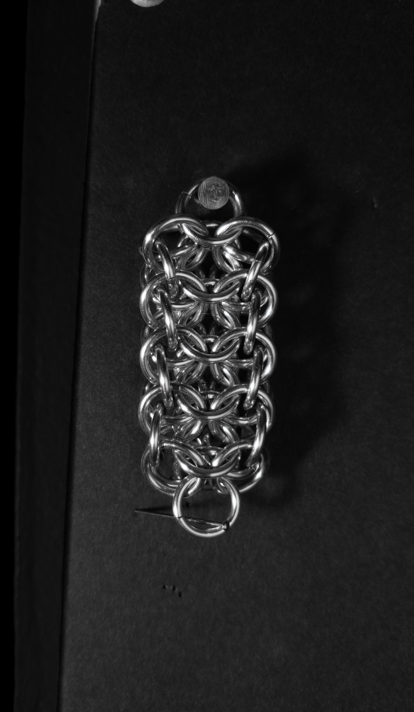
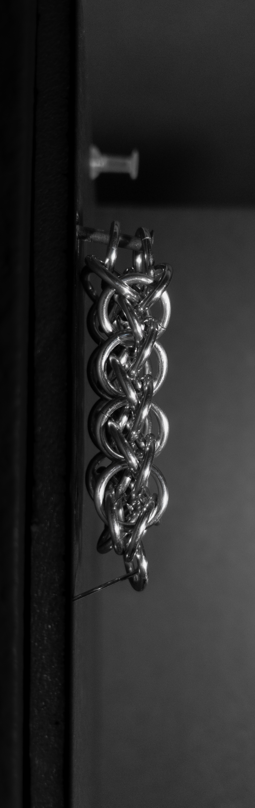
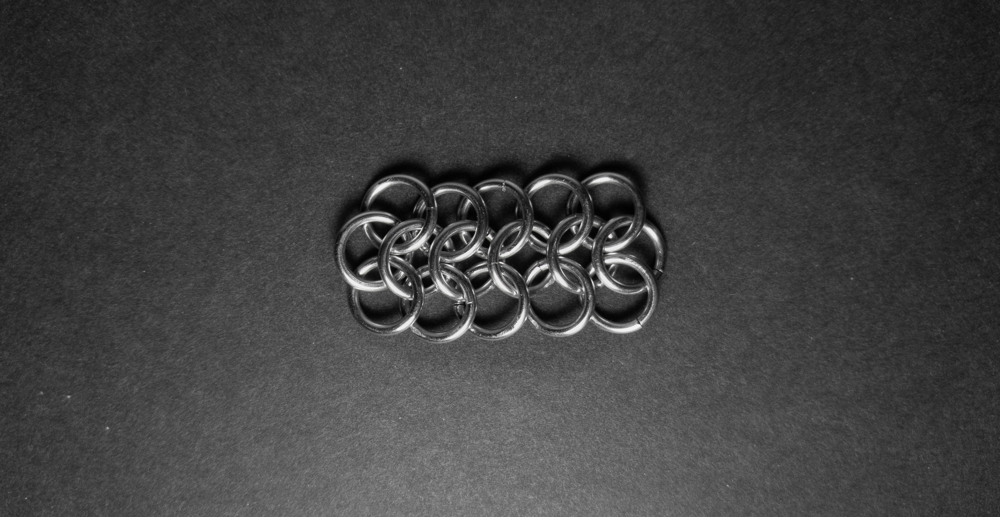
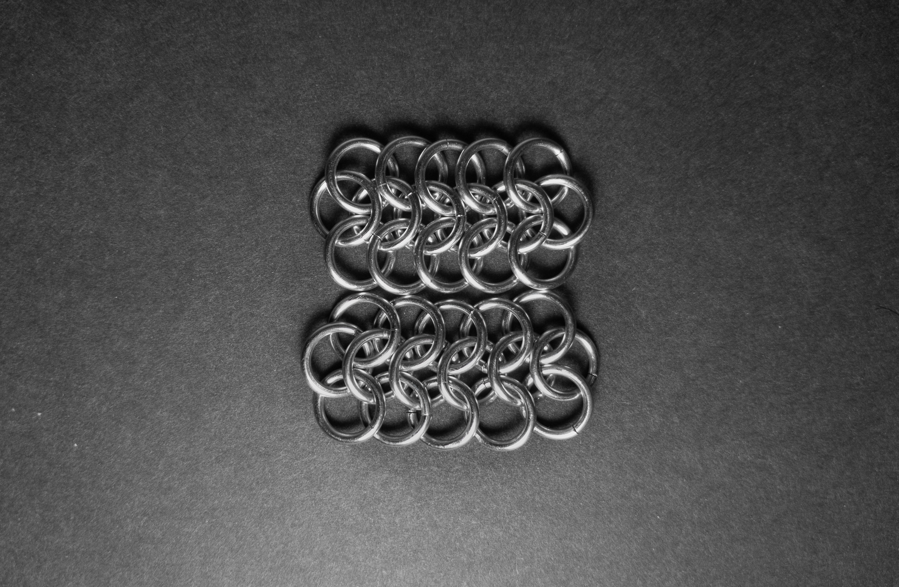

 posted: 2023-11-13 

## Alienmaille

### Overview

While searching [M.A.I.L.](https://www.mailleartisans.org/) for interesting weaves I came across [Alienmaille](https://www.mailleartisans.org/weaves/weavedisplay.php?key=84) by [lorenzo](https://www.mailleartisans.org/members/memberdisplay.php?key=17). Alienmaille is an interesting variation of [European 4-in-1](european_4_in_1.md) created by layering alternating layers on top of each other and holding them together with rings. If you want to make this yourself, I suggest this [tutorial](https://www.mailleartisans.org/articles/articledisplay.php?key=32) by [Knotlinks](https://www.mailleartisans.org/members/memberdisplay.php?key=98).

### Materials

For the sample piece showcased in this post, I made the rings myself (bonus post coming soon if you are interested). I used 16 SWG Bright Aluminum wire from [The Ring Lord](https://theringlord.com/) coiled around an 7mm mandrel for an approximate aspect ratio of 4.3.

### Notes

Alienmaille is a weave that offers simplicity in understanding its fundamental structure. Creating the European 4-in-1 sheets that form the basis of this weave is a straightforward process, but the challenge arises when it comes to joining these sheets. To facilitate this step, using cardstock to layer one European 4-in-1 sheet atop another can be helpful. The resulting weave is quite fetching. Its flat and rectangular cross-section makes it well-suited for applications such as bracelets, chokers, and straps. Given its unique yet simple design and appealing appearance, I highly recommend acquiring the skills to create this weave.

### Pictures

#### Flat

#### Flat: Profile

#### Vertical

#### Vertical: Profile

#### In Process

 

