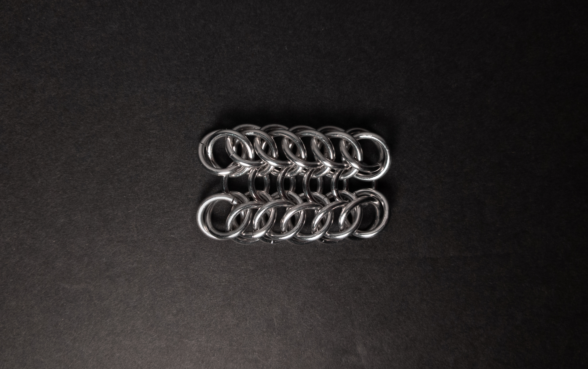
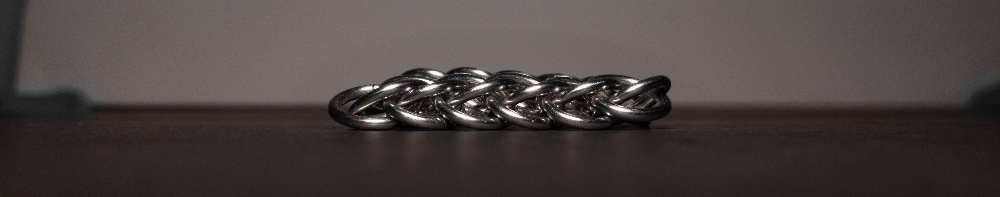
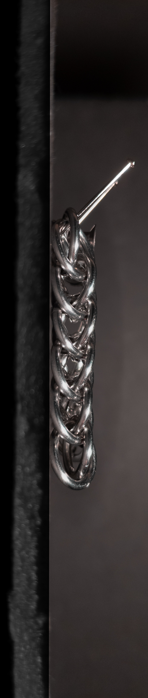
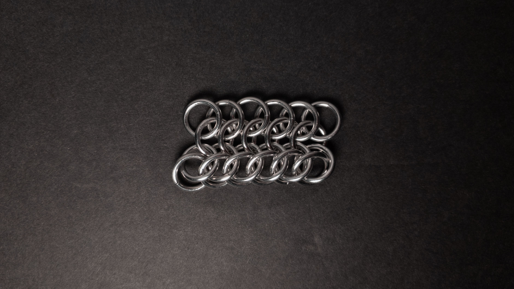

 posted: 2023-12-17 

## Aligator Back

### Overview

While looking for new weaves to try out, I came across [Aligator Back](https://www.mailleartisans.org/weaves/weavedisplay.php?key=819) by [Corvus](https://www.mailleartisans.org/members/memberdisplay.php?key=4033) on [M.A.I.L.](https://www.mailleartisans.org/). Aligator back is a combination of [European 4-in-1](european_4_in_1.md) and [Half Persian 3-in-1](half_persian_3_in_1.md). Aligator Back is just one step away from being [Persian Dragonscale](persian_dragonscale.md). I recommend this helpful [video tutorial](https://www.youtube.com/watch?v=jPRKwYSijlE) by [Mechanical Brain](https://www.youtube.com/@mechanicalbrain4366) if you would like to try making this at home.

### Materials

For the sample piece showcased in this post, I made the rings myself (bonus post coming soon if you are interested). I used 16 SWG Bright Aluminum wire from [The Ring Lord](https://theringlord.com/) coiled around a 7mm mandrel for an approximate aspect ratio of 4.3.

### Notes

Alligator Back, while somewhat simple to understand, can present a bit of a challenge when starting and ending the two Half Persian 3-in-1 lines. The creation process is generally straightforward; however, the Half Persian 3-in-1 lines' closures can be tricky. The weave exhibits a pleasing look in one orientation, but it's not locked in that particular form. As it is flat and wide, Alligator Back is best suited for applications such as bracelets, chokers, or as a band/strap. However, despite its ability to be aesthetically pleasing, as it doesn't consistently maintain that form, I do not recommend you learn it unless you are already exploring Persian Dragonscale.

### Pictures

#### Flat

#### Flat: Profile

#### Vertical

#### Vertical: Profile

#### In Process

 

