 posted: 2023-08-20 

## Alure

### Overview

Recently, while browsing [M.A.I.L.](https://www.mailleartisans.org/), I found [Alure](https://www.mailleartisans.org/weaves/weavedisplay.php?key=1065), an intriguing and alluring weave designed by [Nárrína](https://www.mailleartisans.org/members/memberdisplay.php?key=6120). Nárrína created Alure while trying to build on a three-ring [Mobius Ball](mobius_ball.md). Sadly there are no tutorials available for the weave. Due to this, I decided that it would be a neat challenge to create a tutorial for the weave to help others who may be interested.

### Materials

For the sample piece showcased in this post, I used Bright Aluminum rings purchased from [The Ring Lord](https://theringlord.com/). The rings are 16 SWG with a 1/4" internal diameter, resulting in an aspect ratio of 4.03.

### Tutorial

1. Start by creating a three-ring Mobius Ball as shown below:

    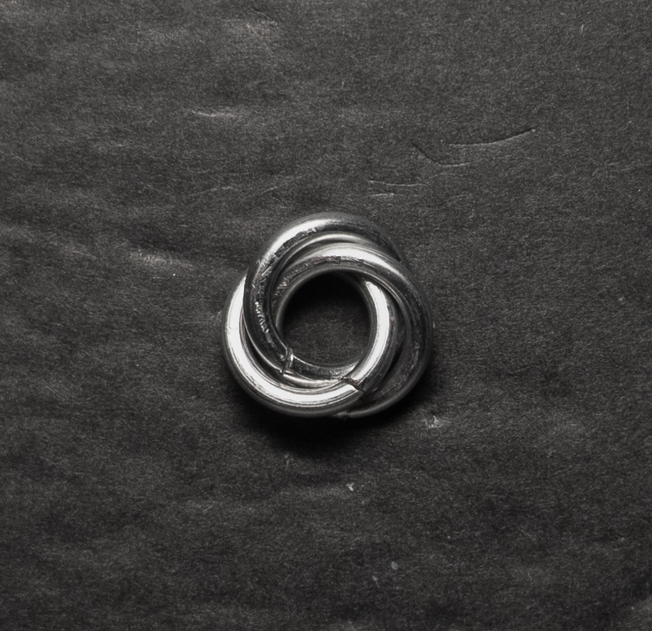

2. Add a single ring around any of the single rings of the Mobius ball to get what you see below(new ring highlighted in green):

    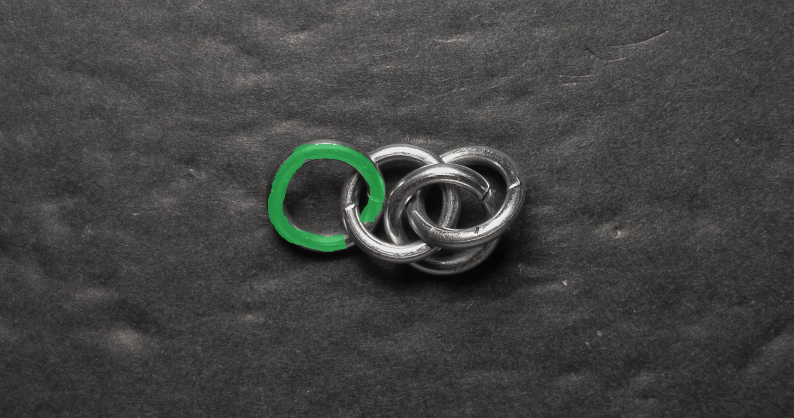

3. Using the image below as a guide, move the red ring under the blue ring and place a new ring through the eye formed between the red and blue rings.

    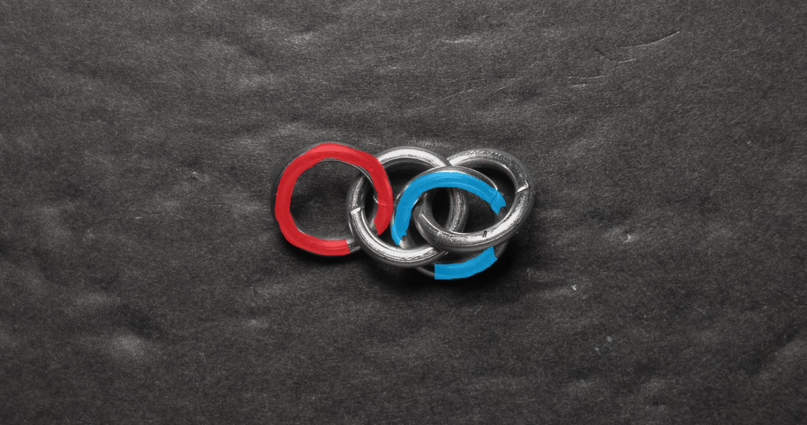

    If done correctly, it should look like the image below(new ring highlighted in green):

    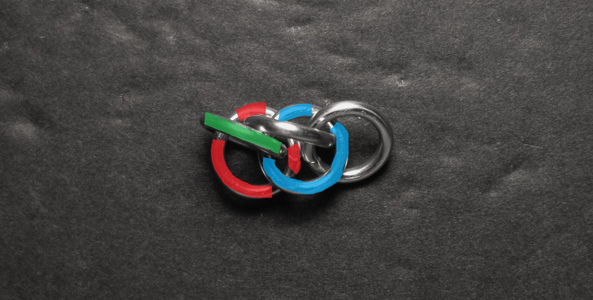

4. Add a new ring through the ring added in the previous step. If done correctly, it should look like the image below(new ring highlighted in green):

    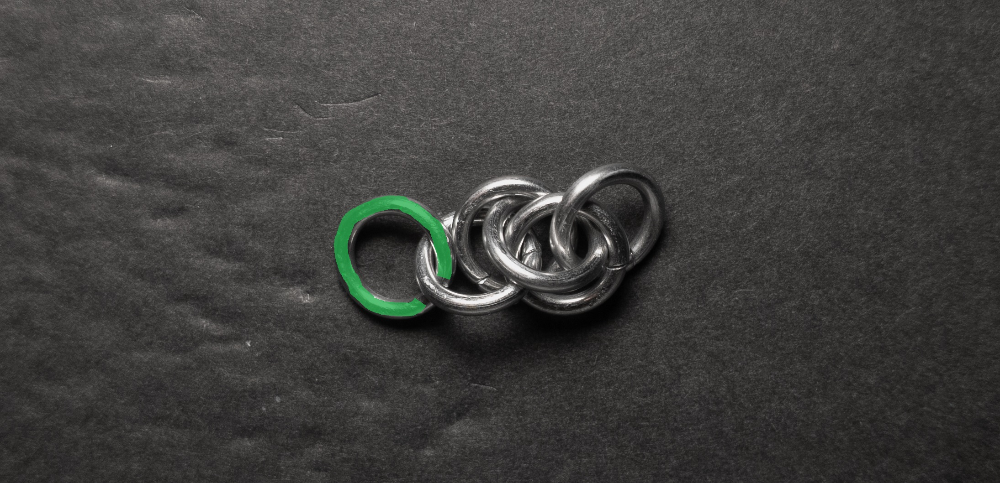

5. Using the coloured image below as a guide, we need to add a new ring through the eye formed by the red and blue ring, then through the eye formed by the blue and yellow ring starting from behind the blue ring.

    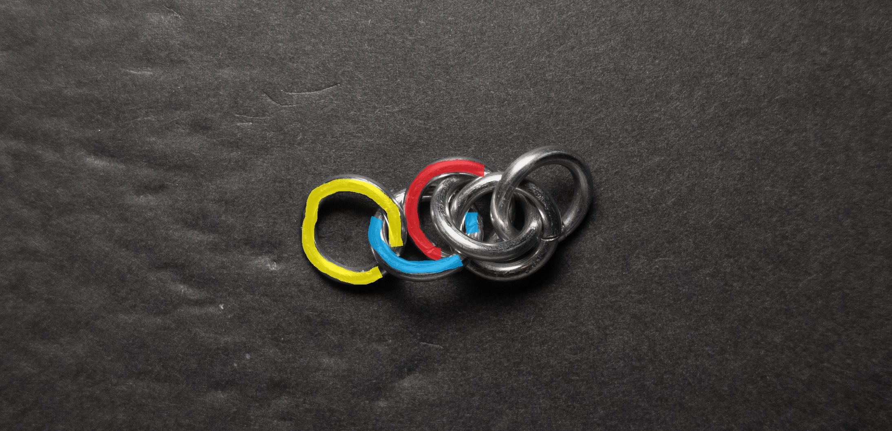

    If done correctly, it should look like the image below(new ring highlighted in green):

    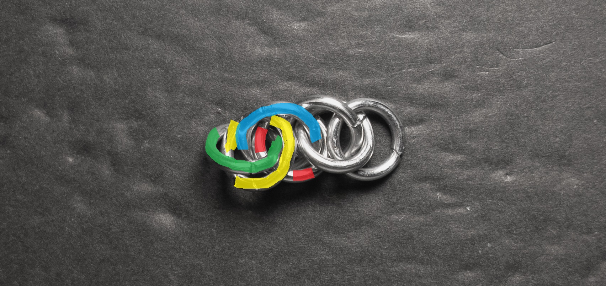

6. Next, add a new ring through the ring added in the previous step. If done correctly, it should look like the image below(new ring highlighted in green):

    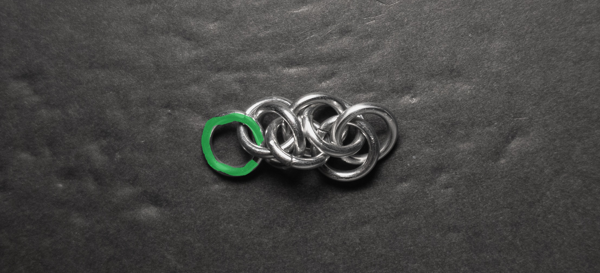

7. Repeat steps 3 through 6 until the chain reaches your desired length.

### Notes

The Alure weave presents a somewhat complex and intricate construction process. Though, the pattern being short and repetitive reduces the complexity. Personally, I do not find the aesthetics of the weave particularly pleasing. As a chain weave, it offers versatility in its applications, ranging from bracelets to various types of necklaces, chokers, and even substituting string in other crafts. Given the weave's level of complexity, I would recommend dedicating the effort to learning it only if you personally derive aesthetic enjoyment from its appearance.

### Pictures

#### Vertical

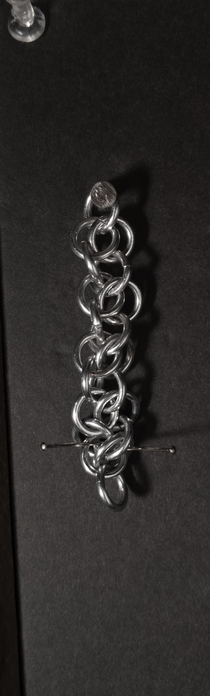

#### Vertical: Profile

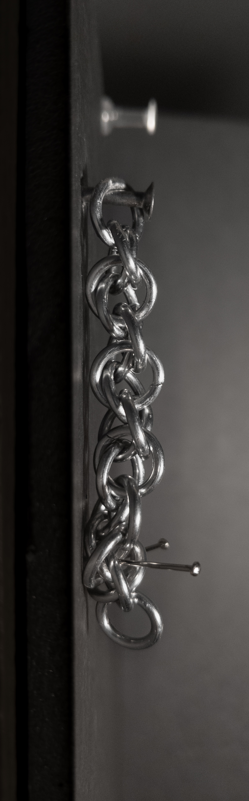

#### Flat

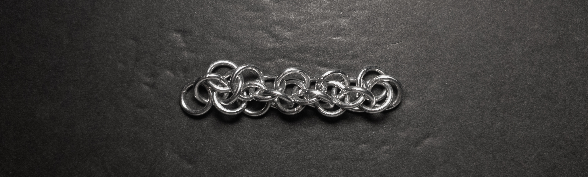

#### Flat: Profile

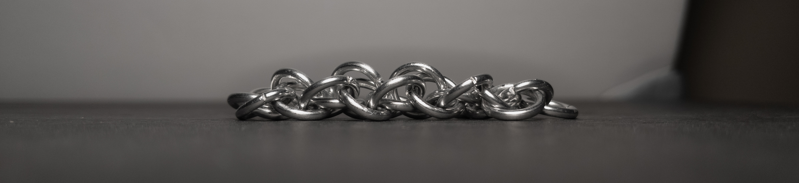

#### In Process

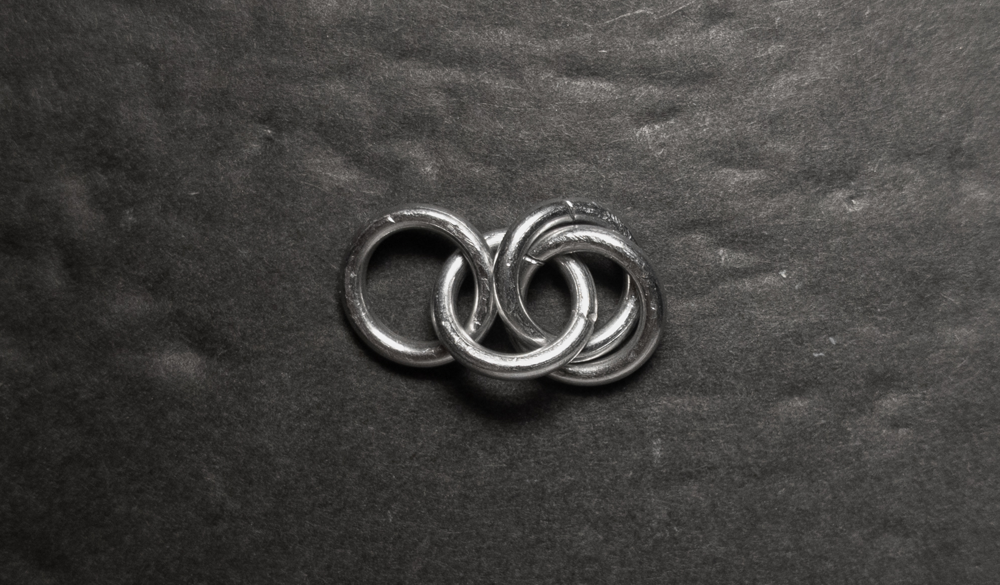

 

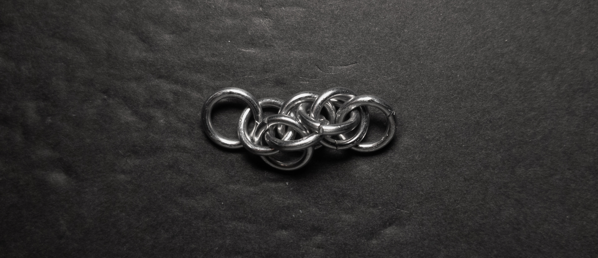

 

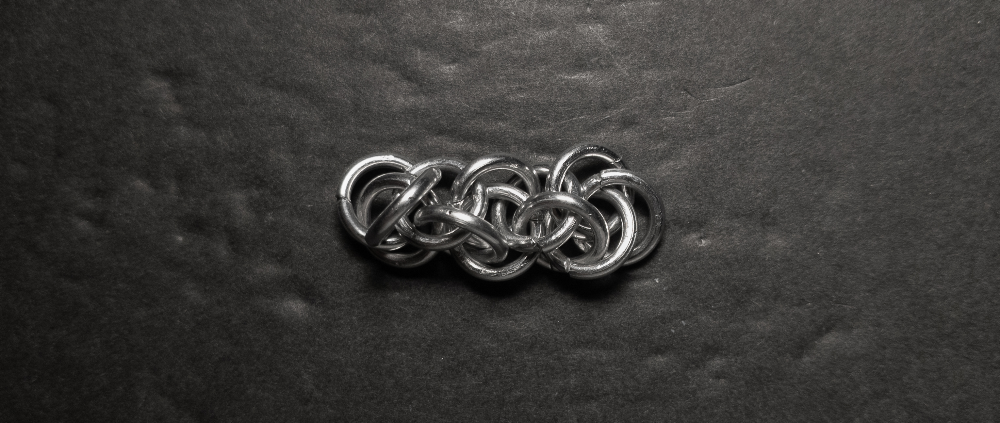

 

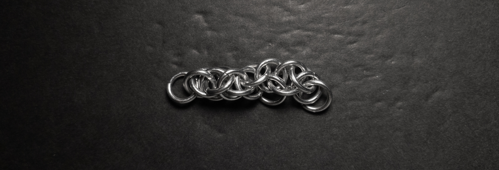
