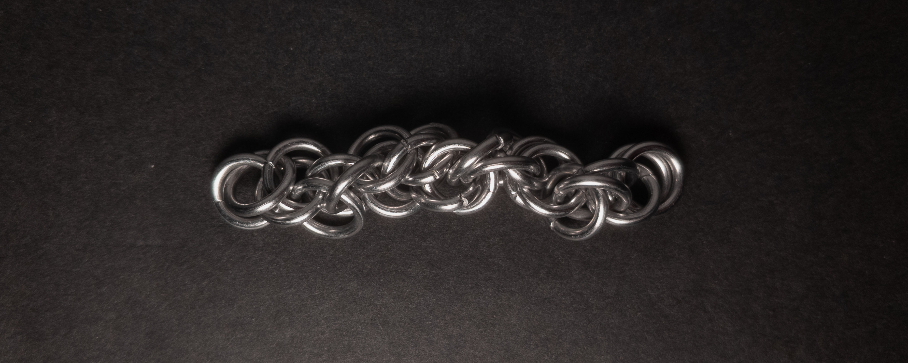

 posted: 2024-04-07 

## Archimedes

### Overview

I stumbled upon the [Archimedes](https://www.mailleartisans.org/weaves/weavedisplay.php?key=1301) weave, uploaded to [M.A.I.L.](https://www.mailleartisans.org/) by [kerravonsen](https://www.mailleartisans.org/members/memberdisplay.php?key=19866) some time ago. Despite initially struggling to learn it, I recently revisited the weave and was successful in my recent attempt. Archimedes was conceived during experimentation with [Shaggy Loops](shaggy_loops.md) while endeavouring to learn [Abstain](abstain.md), and it incorporates elements from both weaves. For those interested in trying it out, I highly recommend following kerravonsen's [tutorial](https://www.mailleartisans.org/articles/articledisplay.php?key=679).

### Materials

For the sample piece showcased in this post, I used Bright Aluminum rings purchased from [The Ring Lord](https://theringlord.com/). The rings are 16 SWG with a 1/4" internal diameter, resulting in an aspect ratio of 4.03.

### Notes

The concept of the Archimedes weave is relatively easy to grasp. While it should be straightforward to create, distinguishing between the rings can prove challenging, resulting in a messy appearance with an indistinct pattern. However, using different colors of rings should dramatically improve clarity and enhance the aesthetic appeal. Despite its messy appearance, the weave's circular cross-section makes it suitable for various uses, such as bracelets, necklaces, chokers, or cords. While the weave is interesting, its difficulty in creation and aesthetic appreciation while mono-color may deter some. Therefore, I do not recommend learning to make it unless you have three(two minimum) or more colors available to create a sample or have a specific use in mind.

### Pictures

#### Flat

#### Flat: Profile

#### Vertical

#### Vertical: Profile

#### In Process

 

 

 

