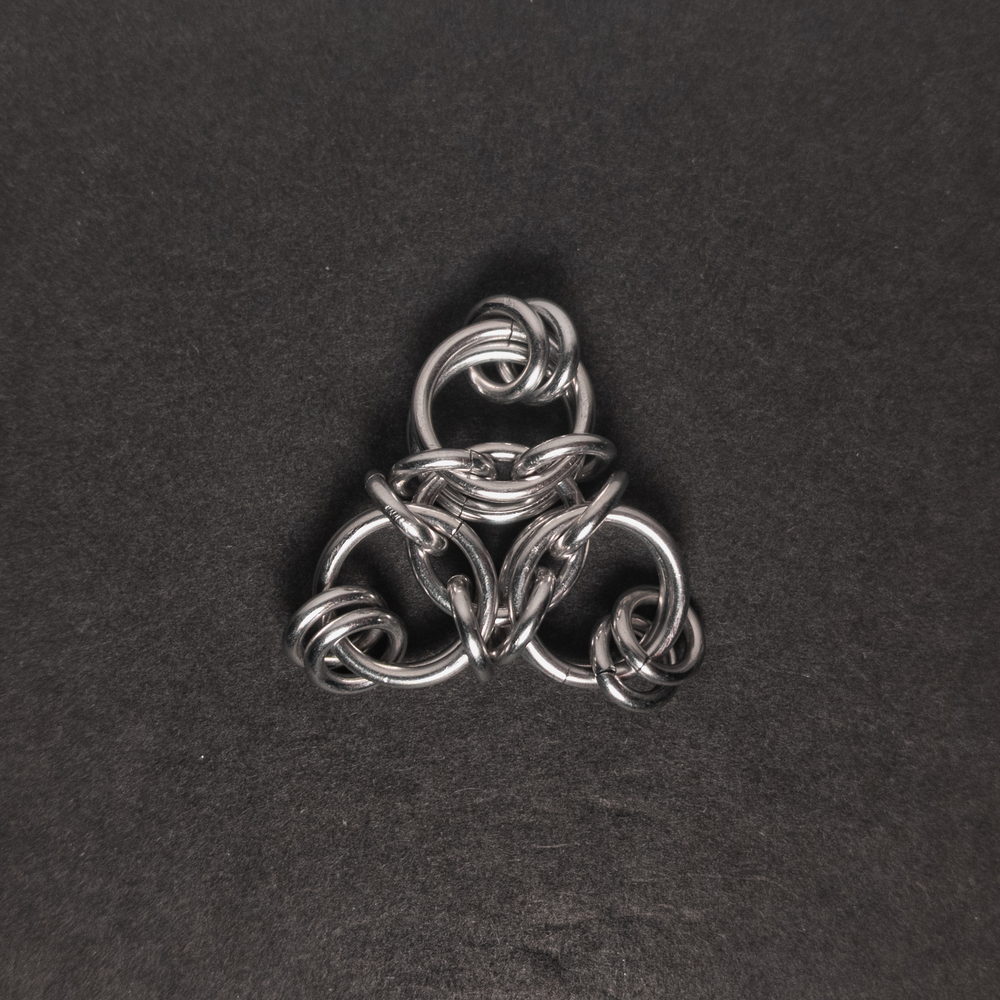
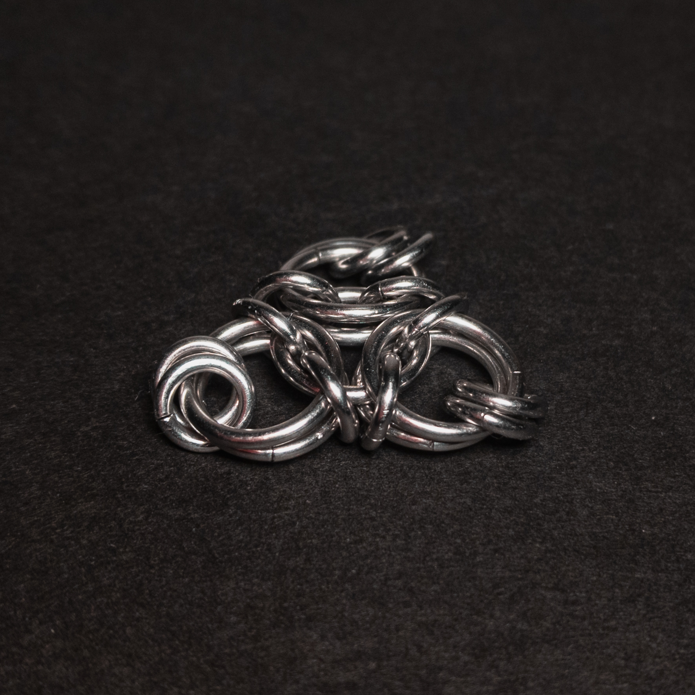
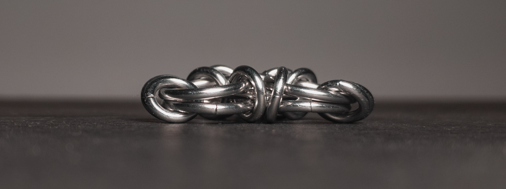
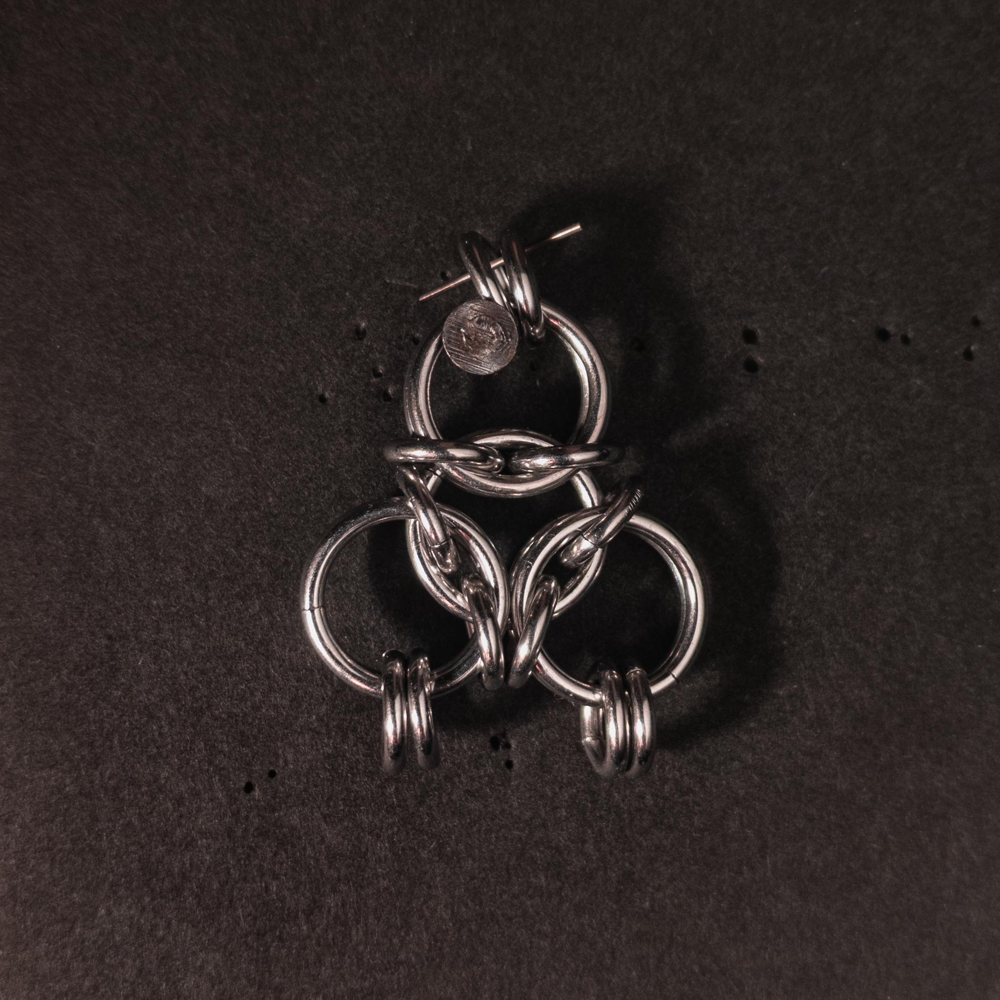
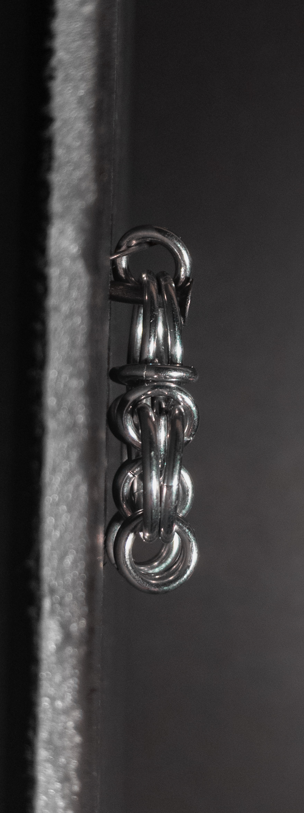
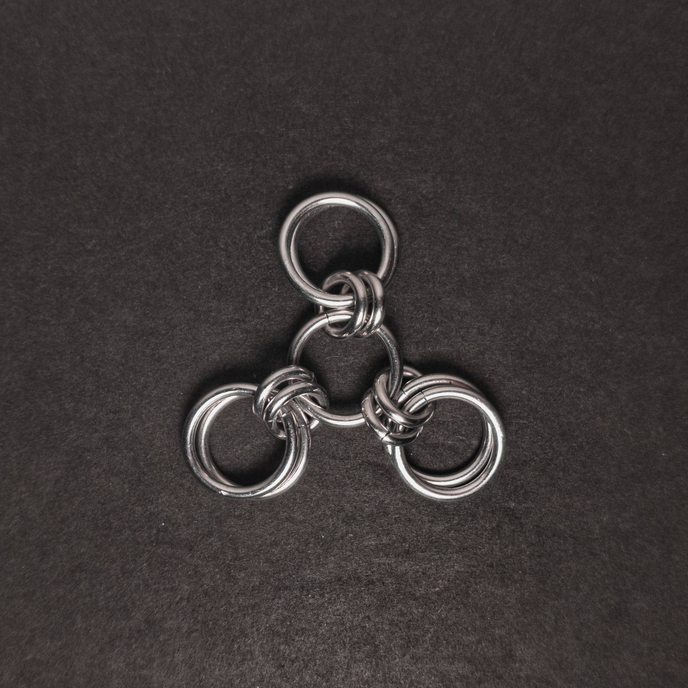
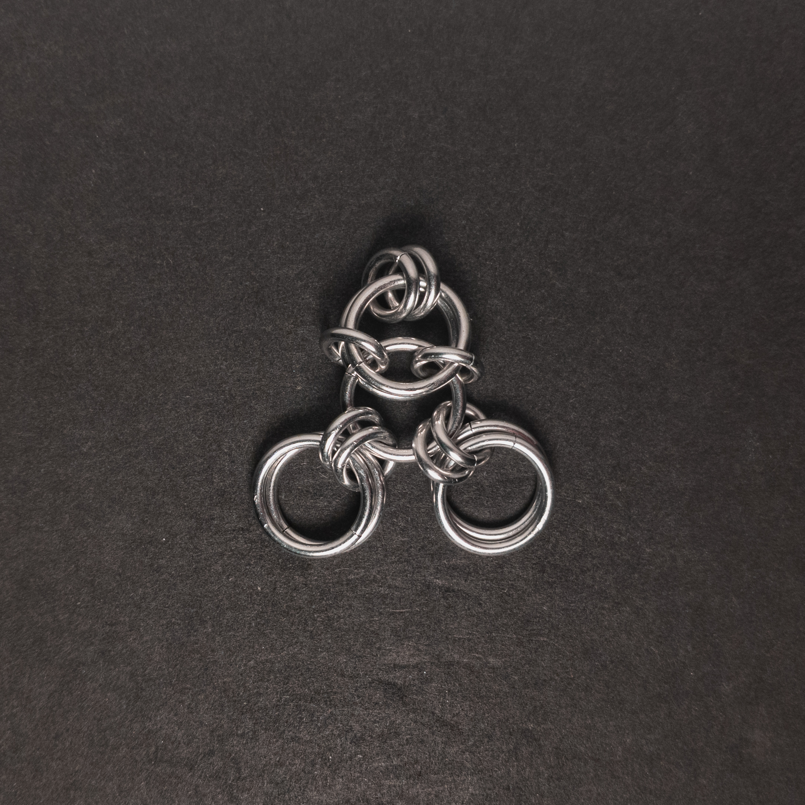
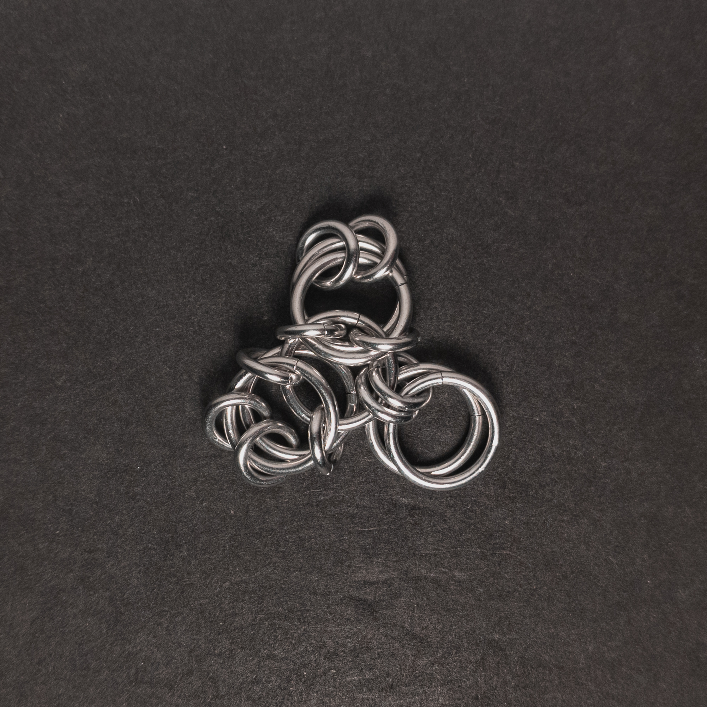

 posted: 2024-04-07 

## Aura 3 Unit

### Overview

I recently came across [Aura 3 Unit](https://chainmaillers.com/maillepedia/aura-3-unit.52/) by [Corvus](https://www.mailleartisans.org/members/memberdisplay.php?key=4033) on [Chainmaillers](https://chainmaillers.com/) and wanted to try making it. This striking unit is a member of the European and Japanese weave families; also, it bears a strong resemblance and relation to [Celtic Visions](celtic_visions.md). If you want to make it yourself, I recommend this [tutorial](https://www.mailleartisans.org/articles/articledisplay.php?key=440) by Corvus.

### Materials

For the sample piece showcased in this post, I used two sizes of rings made by hand(bonus post coming soon) from 16 SWG Bright Aluminum wire purchased from [The Ring Lord](https://theringlord.com/). The smaller rings have an ID(Inner Diameter) of 5mm for an AR(Aspect Ratio) of 3.1. The larger rings have an ID of 10mm for an AR of 6.1.

### Notes

The Aura 3 Unit weave is quite simple to both understand and create. Overall, it looks pleasant, though the small rings at the edges can sometimes move around, which may make a slightly messy appearance. As this is a unit weave, desk ornaments, pendants, and charms are highly compatible applications. While working on the weave, I noticed many similarities to Celtic Visions, as it appears to result from joining three smaller units to one large ring. Given its ease of creation and appealing look, I recommend learning how to make this weave.

### Pictures

#### Flat

#### Flat: Angled

#### Flat: Profile

#### Vertical

#### Vertical: Profile

#### In Process

 

 

