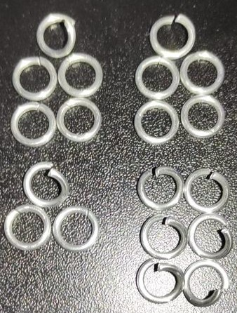

 posted: 2023-01-29 

## Chainmail B3 Web

### Overview

Today I found a weave submission on [M.A.I.L.](https://www.mailleartisans.org/) by [Shadowfire19](https://www.mailleartisans.org/members/memberdisplay.php?key=16160) for a weave called [B3 Web](https://www.mailleartisans.org/weaves/weavedisplay.php?key=1362). This weave is a web version of the [B3](b_3.md) weave created by using the end rings as common connectors. Being a weave based on B3 it is necessary to learn how to make B3 before making this. In addition it can also be as hard to make as B3.

As the M.A.I.L. page for this weave has no tutorials I thought I will try to make one myself. You can find it below.

### Materials

The rings used for this peice are 16 SWG with a 1/4" internal diameter for an aspect ratio of 4.03 made of Bright Aluminum that I bought from the [Ring Lord](https://theringlord.com/).

If you plan to follow along with this tutorial I do recomend that you try to find larger aspect ratio rings as that may make the weave easier to make.

### Tutorial

1. Start with creating a [B3](b_3.md) unit.

2. Open 9 rings and close another 10 rings. These are the rings you will need to create a new B3 on your base. The result is shown in the image below:

3. Take one open ring, put it through four closed rings and close the open ring to create a unit of 2-1-2 chain. Do this a second time to get a total of 2 units of 2-1-2 chain.

4. Take another open ring, put it through an open B3 end, put two more closed rings through the open ring, then close the open ring to turn that B3 end into a 2-1-2 chain. When you do this it should look like the image below:

5. Now as with making a B3 unit join all the 2-1-2 chain segments together to create a new B3 unit. When you do this it should look like the image below:

6. Repeat steps 2-5 to add a new B3 unit to your web in progress 3 more times. Below are reference images for a web with 3, 4 and 5 units respectively:

7. To prep before adding the final unit set aside 9 open rings and 8 closed rings. These are the rings you will need to create a final B3 ring and close a ring in your web. When you open the rings it should look the image below.

8. Take one open ring, put it through four closed rings then close the open ring to create a unit of 2-1-2 chain.

9. For both of the ends closes to each other in the ring take an open ring, put it through the end, put two more closed rings through the open ring, then close the open ring to turn that end into a 2-1-2 chain. After finishing for both ends it should look something like the image below:

10. Now as with making a B3 unit join all the 2-1-2 chain segments together to create a new B3 unit. When you do this it should look like the image below:

With this done the weave is complete; you can stop here or you can keep adding on to this pattern using the open ends of the B3 units by extending the pattern follow steps 2-5 to add a unit to just one more, or use follow steps 7-10 to join two units with one new unit.

### Notes

B3 Web is a novel pattern that can be created entirely from B3 units. When put together the weave unfortunately is not very rigid and does not maintain it's hexagonal shape well; which I personally dislike. Because of that issues, I would not suggest using this in projects that are unable to have an even tension to make sure that it keeps its nice hexagonal shape.

Perhaps a variation in the rings used for the ends of the individual B3 connectors may remedy allow it to retain a hexagonal shape as a sheet without outside force, however that test would need to be left for a later update.

Any project that uses a variation of this to wrap around an object may be able to keep it with a nicely defined shape.