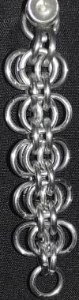
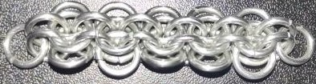
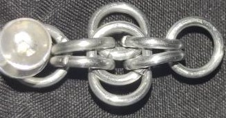
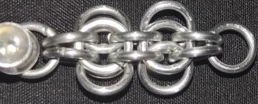
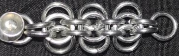
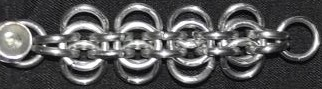

 posted: 2023-04-16 

## Back to Work

### Overview

I found a [tutorial](https://www.mailleartisans.org/articles/articledisplay.php?key=685) by [Flutter](https://www.mailleartisans.org/members/memberdisplay.php?key=19707) on [M.A.I.L.](https://www.mailleartisans.org/) that shows how to create the [Back To Work](https://www.mailleartisans.org/weaves/weavedisplay.php?key=612) weave. Back To Work is an interesting variation of the weave [Conundrum 2](https://www.mailleartisans.org/weaves/weavedisplay.php?key=359) that the creator [Emil](https://www.mailleartisans.org/members/memberdisplay.php?key=3058) came up with when trying to recreate [Harvest Moon](https://www.mailleartisans.org/weaves/weavedisplay.php?key=33) from memory. It is a fun and clever weave that I suggest trying.

### Materials

The rings used for the sample piece shown in this post are 16 SWG with a 1/4" internal diameter for an aspect ratio of 4.03 made of Bright Aluminum that I bought from the [Ring Lord](https://theringlord.com/).

### Notes

Back To Work is a weave that is easy to make, but it can be challenging to start unless you mark the starting ring. This can be done by using a starting ring of a different color, adding an additional ring, or using extra wire. When using rings with the ideal aspect ratio, the weave will look good in all circumstances. However, it looks best when under tension, such as when used vertically. The main limitation of this weave is that it is not very flexible on its narrow side. Despite this, Back To Work is an interesting and enjoyable weave that has many practical applications and few drawbacks overall.

### Pictures

#### Vertical

#### Flat

#### In Process

 

 

 

