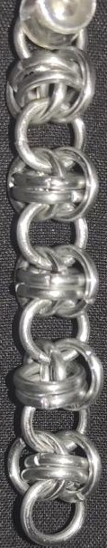
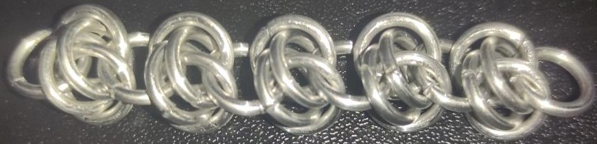
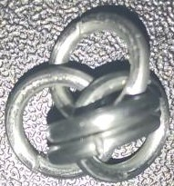
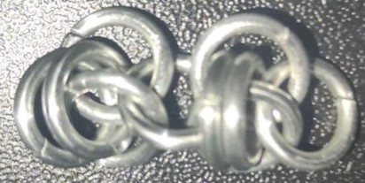
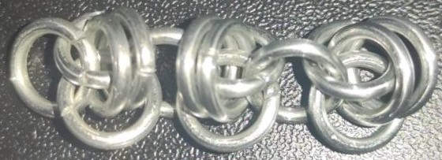
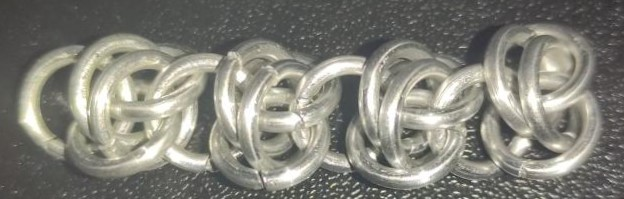
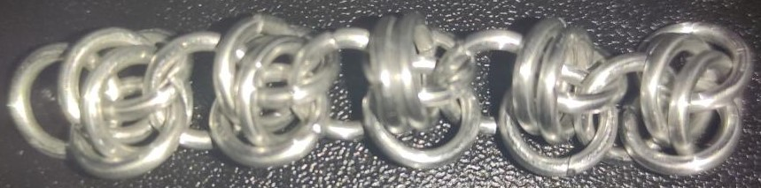

 posted: 2023-03-19 

## Barrel

### Overview

Recently I found a [tutorial](https://www.mailleartisans.org/articles/articledisplay.php?key=388) by [cliffordparker](https://www.mailleartisans.org/members/memberdisplay.php?key=1227) on [M.A.I.L.](https://www.mailleartisans.org/) that shows how to create a [Barrel](https://www.mailleartisans.org/weaves/weavedisplay.php?key=600) weave. Barrel is an interesting weave with a poorly documented history. If you are curious and have large enough rings on hand, I recommend trying it out.

### Materials

The rings used for the sample piece shown in this post are 16 SWG with a 1/4" internal diameter for an aspect ratio of 4.03 made of Bright Aluminum that I bought from the [Ring Lord](https://theringlord.com/).

### Notes

Barrel is a simple weave to make. The sample piece shown in this post is a bit loose due to being made with rings whose AR is 4.03 instead of the recommended 3.5. However, it can still look wonderful when under tension, which can be applied by integrating it into a bracelet or orienting it vertically. Additionally, the weave uses relatively few rings per inch of length, making this a budget-friendly weave when using expensive materials. I highly suggest finishing the weave by adding one additional ring between the final two rings. I think this should be mentioned in the tutorial; however, the tutorial is otherwise good. Overall, barrel is a great, versatile, and forgiving weave that I highly recommend learning.

### Pictures

#### Vertical

#### Flat

#### In Process

 

 

 

 

