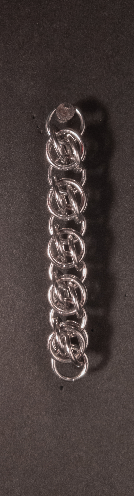
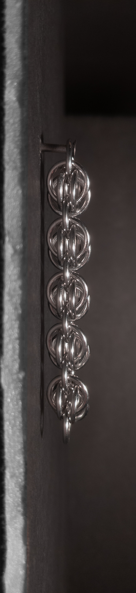
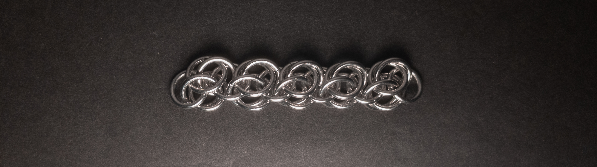
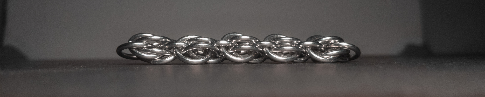
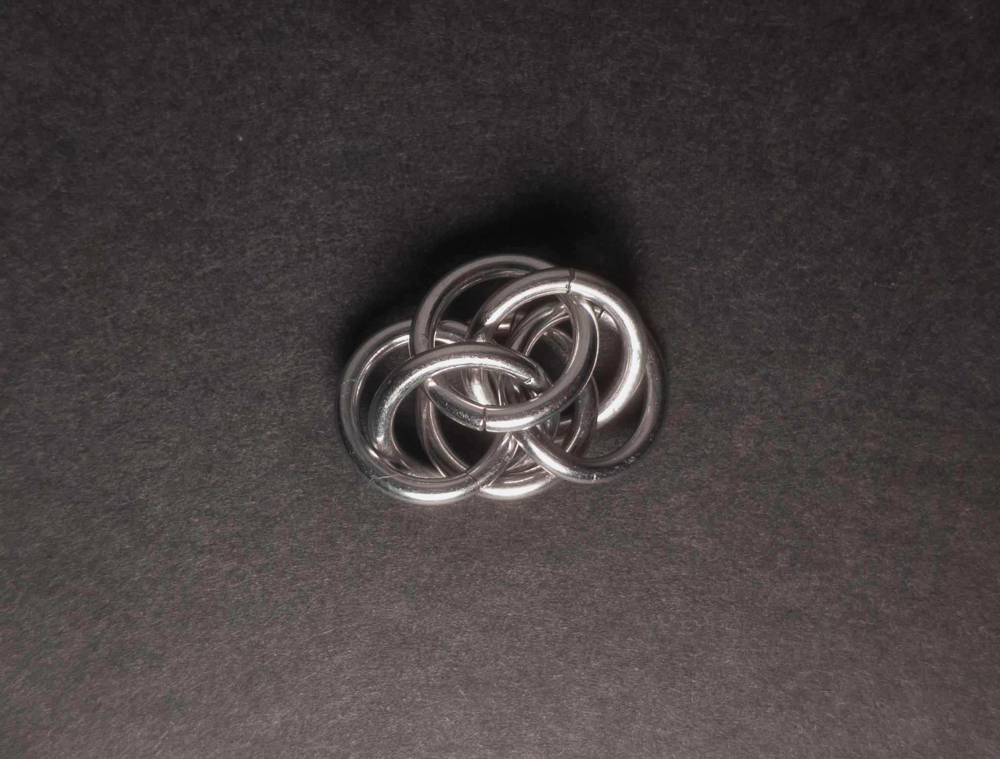
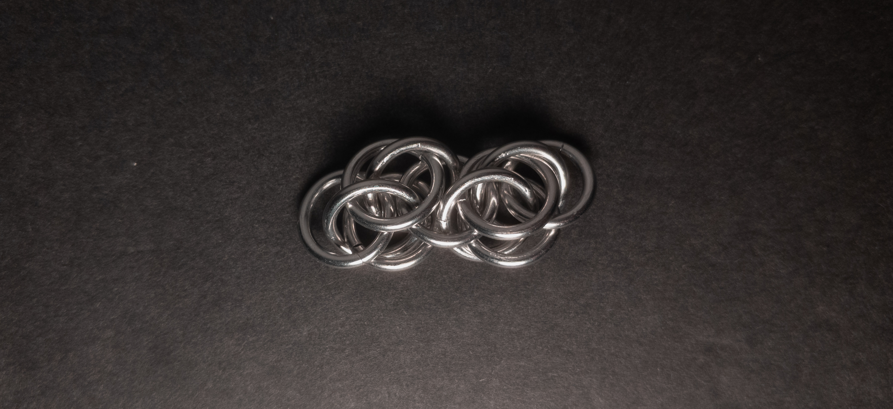
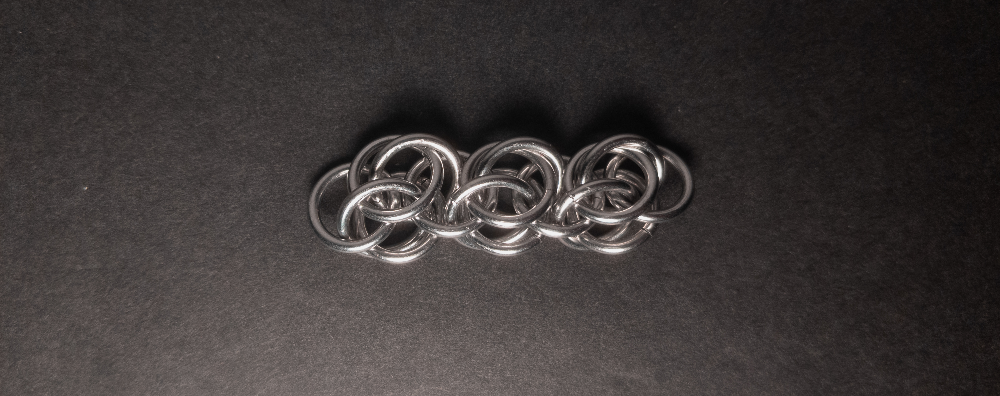
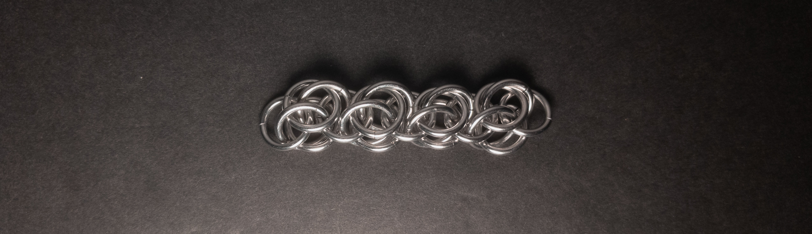

 posted: 2024-04-28 

## Bee Stings

### Overview

While working with [Scary Weave](scary_weave.md) units in Scary Weave and [Honey Bee](honey_bee.md), I became interested in how to extend the units rather than joining them together. After checking [M.A.I.L.](https://www.mailleartisans.org/) for existing documentation, I found [Bee Stings](https://www.mailleartisans.org/weaves/weavedisplay.php?key=790) by [Argentum](https://www.mailleartisans.org/members/memberdisplay.php?key=9049), which matched what I had imagined. If you want to make it yourself, I recommend this [tutorial](https://www.mailleartisans.org/articles/articledisplay.php?key=638) by [Waluy](https://www.mailleartisans.org/members/memberdisplay.php?key=16213).

### Materials

For the sample piece showcased in this post, I made the rings myself (bonus post coming soon if you are interested). I used 16 SWG Bright Aluminum wire from [The Ring Lord](https://theringlord.com/) coiled around an 8mm mandrel for an approximate aspect ratio of 4.9.

### Notes

The Bee Stings weave offers a moderate level of complexity in understanding, but it is relatively straightforward to create. Its visual appeal is notable, with a visually pleasing appearance in all orientations, particularly striking when under tension. With its somewhat square cross-section, the weave is versatile and suitable for use in bracelets, necklaces, chokers, and as a cord. When creating the weave, I suggest being careful with the first unit, as it can be unstable alone. Overall, Bee Stings is an eye-catching weave that is relatively simple to make, so I recommend adding it to your repertoire.

### Pictures

#### Vertical

#### Vertical: Profile

#### Flat

#### Flat: Profile

#### In Process

 

 

 

