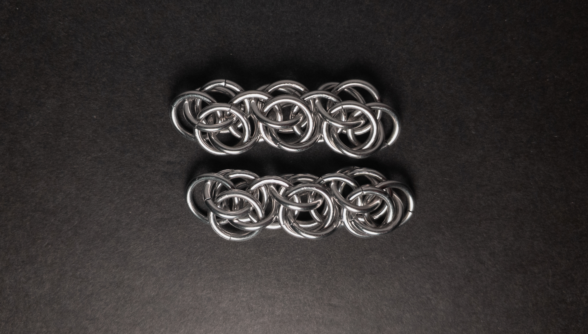
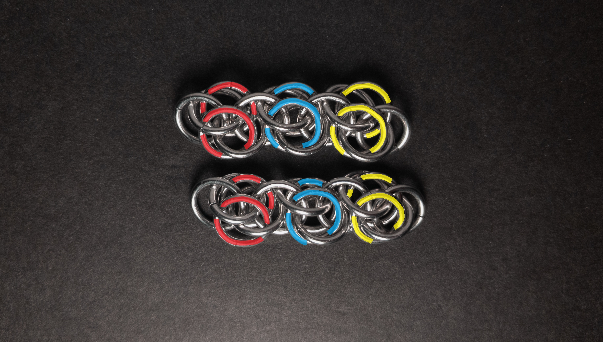
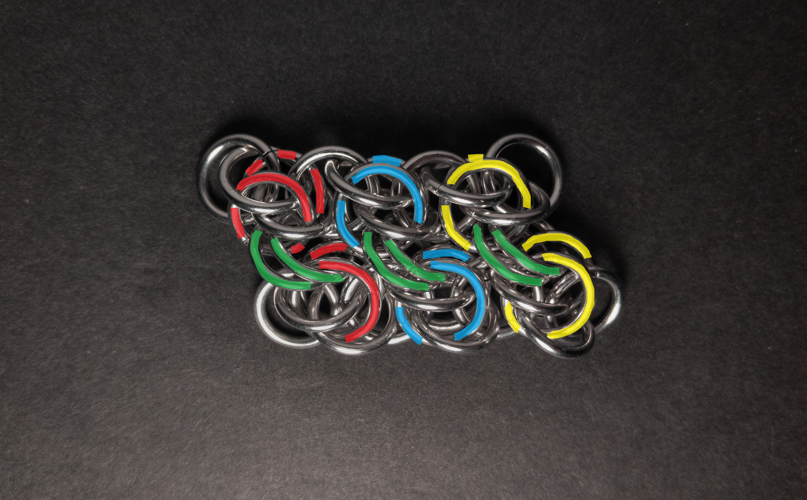
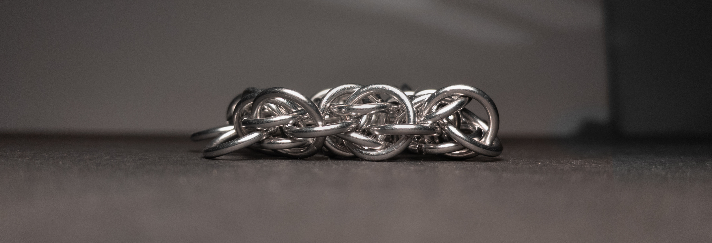
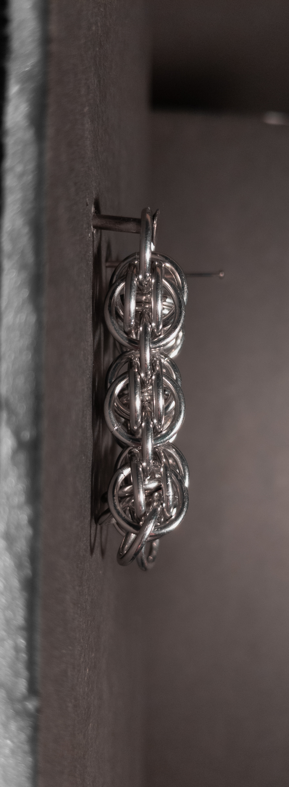

 posted: 2024-05-19 

##  Beehive

### Overview

After making [Bee Stings](bee_stings.md), I wondered if it had a documented horizontal expansion. While looking for it on [M.A.I.L.](https://www.mailleartisans.org/) I found [Beehive](https://www.mailleartisans.org/weaves/weavedisplay.php?key=789) by [Argentum](https://www.mailleartisans.org/members/memberdisplay.php?key=9049). Beehive is a fairly basic expansion of the Bee Stings chain into a sheet weave. As I could not find any tutorial, I have created and included a tutorial in this post.

### Materials

For the sample piece showcased in this post, I made the rings myself (bonus post coming soon if you are interested). I used 16 SWG Bright Aluminum wire from [The Ring Lord](https://theringlord.com/) coiled around an 8mm mandrel for an approximate aspect ratio of 4.9.

### Tutorial

1. Begin with two chains of Bee Stings as long as you want your sheet to be.

    

2. Below is a version of the above image, coloured to show the three groups of rings to join in the next step:

    

3. Add two new rings(green in the image below) between each top and bottom ring of corresponding units from each chain(red, blue, and yellow in the images above and below). When done, it should look something like this:

    

4. Keep making new Bee Stings chains and joining them as in the previous step to continue the sheet until you are happy with its width.

### Notes

The Beehive weave, stemming from the creation of Bee Stings, presents a moderate level of complexity in understanding. However, it is relatively straightforward to create. Despite its messy appearance, the weave can look appealing when maintained under appropriate tension to retain its rectangular shape, although achieving this stability can be challenging. As a sheet weave, it is very versatile, able to be used in bands, chokers, straps or in place of fabric. Given its complexity and tendency to appear messy, I only recommend learning this weave if you have a strategy to maintain tension and appreciate its aesthetic.

### Pictures

#### Flat

#### Flat: Profile

#### Vertical

#### Vertical: Profile

