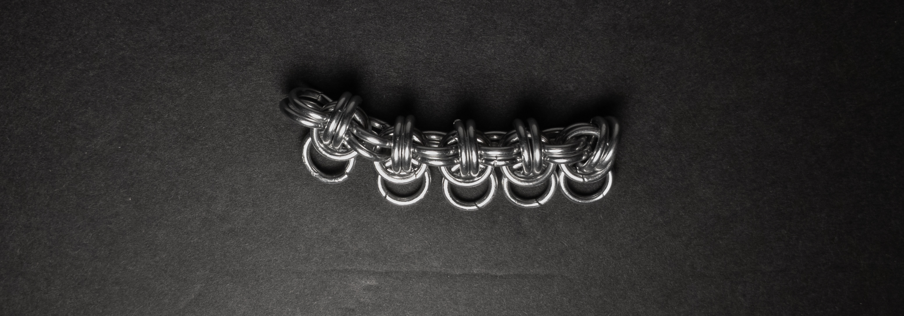
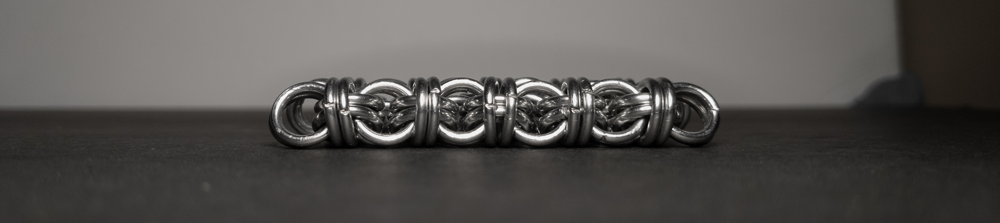

 posted: 2023-10-29 

## Beez Stew

### Overview

While looking through [M.A.I.L.](https://www.mailleartisans.org/) for a new weave to try out, I found [Beez Stew](https://www.mailleartisans.org/weaves/weavedisplay.php?key=394) by [beeslayer](https://www.mailleartisans.org/members/memberdisplay.php?key=1819). Beez Stew is a neat combination of both [Byzee Beez to Butterflies](byzee_beez_to_butterflies.md) and [European 4-in-1](european_4_in_1.md) made by splitting Byzee Beez to Butterflies in half and joining the halves together using European 4-in-1. Unfortunately, I could not find a tutorial; however, I figured out how to make the weave and write a tutorial for those who wish to make it themselves.

### Materials

For the sample piece showcased in this post, I used Bright Aluminum rings purchased from [The Ring Lord](https://theringlord.com/). The rings are 16 SWG with a 1/4" internal diameter, resulting in an aspect ratio of 4.03.

### Tutorial

1. Start by creating a 2-3(two rings through three rings) unit as shown below:

    

2. Add two new rings(green in the image below) to the two outermost rings of the set of three rings(blue in the image below), making sure to add both rings to the same side of the two rings(shown in yellow in the image below). When done, it should look something like this:

    

3. Create a new 3-2 unit and add two rings(green in image below) through the outermost two rings of the three rings of both units(blue and purple in the image below), making sure to keep the rings on the same side of the two rings in the units(yellow and red in the image below) and ensuring that the rings you use to join the units are on the opposite side of the two rings(yellow in image below) in the first unit of the rings added in step 2. When done, it should look something like this:

   

4. Repeat Step 3 until the chain reaches the length you desire. When done, it should look something like this:

   

5. Now terminate the chain by adding two new rings(green in the image below) between the two outermost rings of the three rings(blue in the image below) of the last 3-2 unit you added, making sure to add them to the side of the two rings(yellow in the image below) that hasn't had rings added to it yet. When done, it should look something like this:

   

6. Repeat Steps 1 through 5 to make a second chain of the same length. When done, it should look something like this:

   

7. Finally, to join the two chains, designate one chain as the top(blue in the image below) and the other as the bottom(yellow in the image below). Then, add new rings(green in the image below) between each set of two top rings and two bottom rings to join them together(like European 4-in-1), making sure to keep the orientation consistent. When done, it should look something like this:

   

### Notes

The Beez Stew weave offers a satisfying blend of simplicity in comprehension and creation. I find the weave aesthetically appealing and charming. With its rectangular cross-section, Beez Stew is a versatile choice, making it suitable for various applications like bracelets, chokers, or even as a strap in clothing. Notably, the weave consists of two chains joined together like European 4-in-1, which suggests that one could extend the distance between the two component chains by incorporating a segment of European 4-in-1 in between. If possible, this allows for great versatility, perhaps even using the component chains like edging for two edges of a European 4-in-1 sheet. Considering its interesting structure and the range of potential uses, I highly recommend learning this weave to expand your repertoire of chainmail techniques.

### Pictures

#### Flat

#### Flat: Profile

#### Vertical

#### Vertical: Profile

#### In Process

 

 

 

 

 

 

