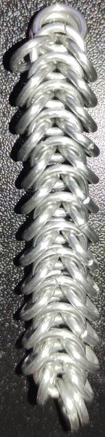
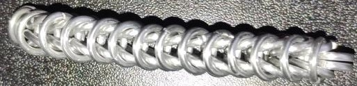
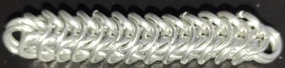

 posted: 2023-03-05 

## Box Chain

### Overview

Recently I found a good [tutorial](https://chainmail101.com/box-chain) that covers how to create [Box Chain](https://www.mailleartisans.org/weaves/weavedisplay.php?key=12), which is sometimes called Box Chain 4-in-1. Box Chain is a fun variation of [European 4-in-1](european_4_in_1.md) that is simple to learn and easy to make.

### Materials

The rings used for the sample peice shown in this post are 16 SWG with a 1/4" internal diameter for an aspect ratio of 4.03 made of Bright Aluminum that I bought from the [Ring Lord](https://theringlord.com/).

### Notes

The weave is quite easy to make and extend; however, when using a smaller aspect ratio like I did the end result is less square and more rectangular. The ideal aspect ratio for this weave is 5.1 which I did not have available to make this with, though it still looks quite nice and can even be made with an aspect ratio as low as 3.8. While the weave can be a bit stiff it is still flexible enough to be used for making braclets or necklaces. Overall the weave looks quite nice, is very easy to make, and has a reasonable flexibility. This makes it very good for use in jewelry and a good beginner weave to learn.

### Pictures:

#### Top:

#### Side:

#### Isometric:

