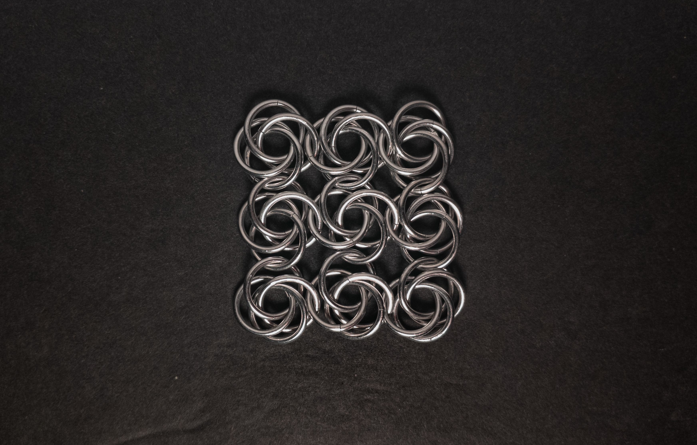
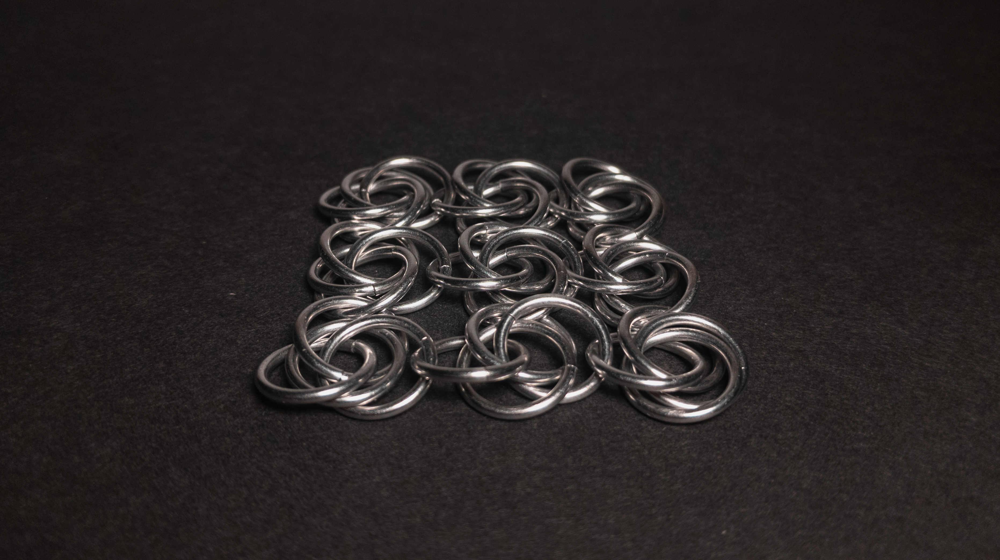
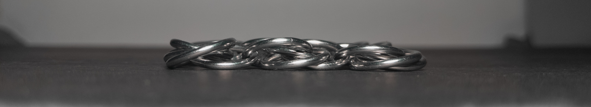
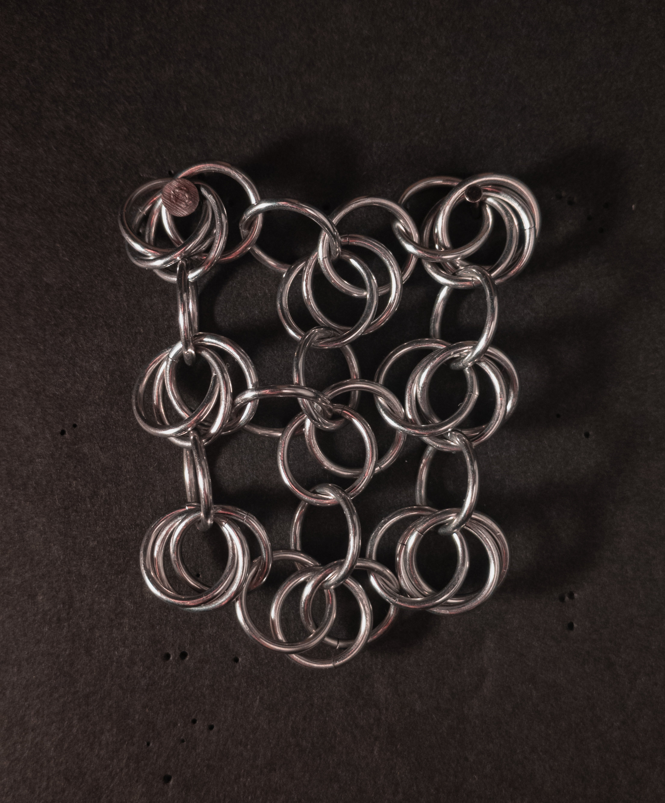
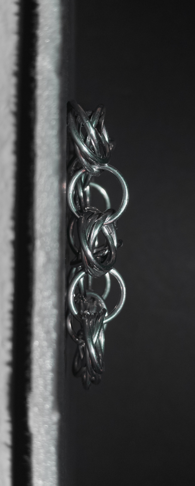
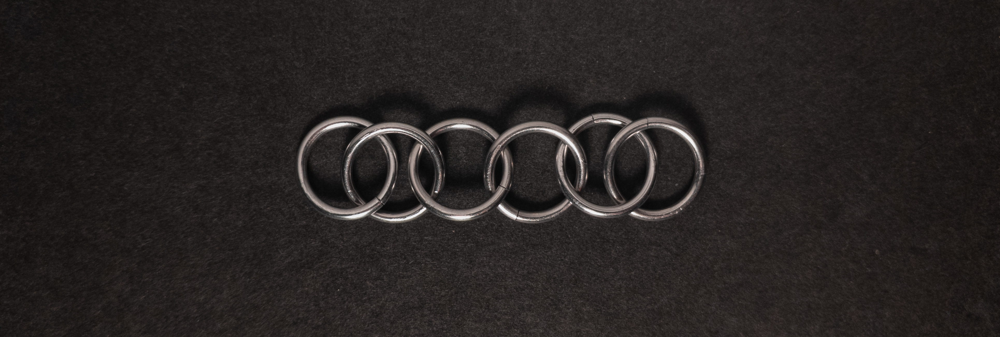
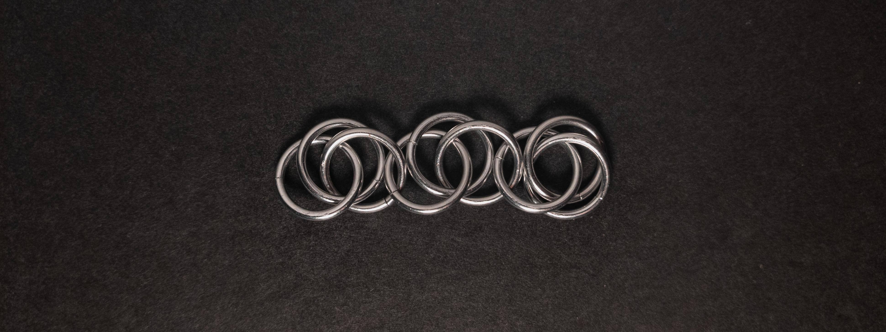
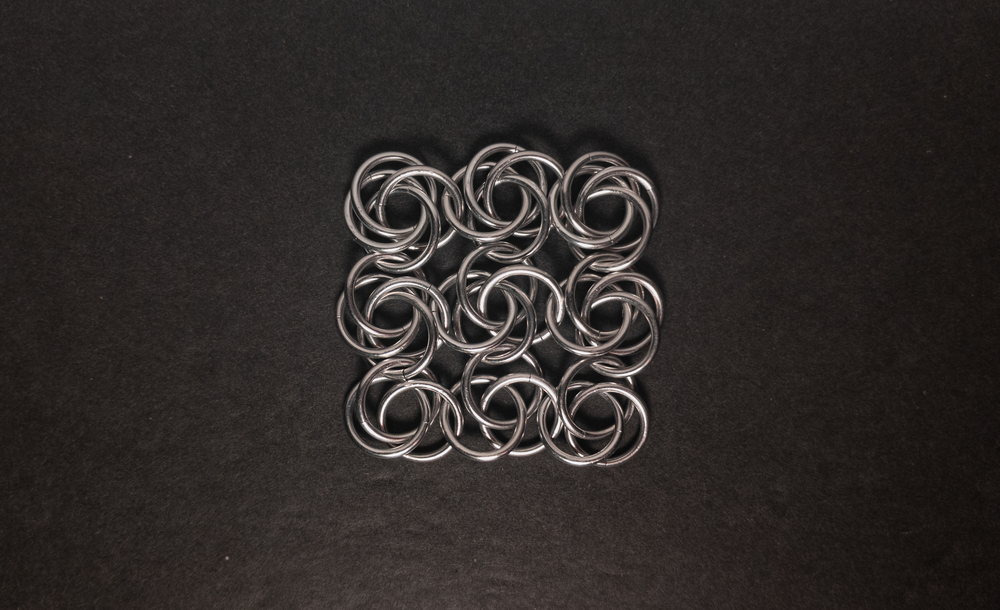

 posted: 2024-10-20 

## Brejão Flowers

### Overview

While combing [M.A.I.L.](https://www.mailleartisans.org/) for new weaves to try, I came across [Brejão Flowers](https://www.mailleartisans.org/weaves/weavedisplay.php?key=507) by [RINGOLINO](https://www.mailleartisans.org/members/memberdisplay.php?key=3635). Brejão Flowers is a striking sheet of 4-ring [Mobius Balls](mobius_ball.md) where each ring joins to another Mobius Ball in a cardinal direction. For those who wish to make it at home, I found this [tutorial](https://www.mailleartisans.org/articles/articledisplay.php?key=578) by [MaxumX](https://www.mailleartisans.org/members/memberdisplay.php?key=949) very helpful.

### Materials

For the sample piece showcased in this post, I made the rings myself (bonus post coming soon if you are interested). I used 16 SWG Bright Aluminum wire from [The Ring Lord](https://theringlord.com/) coiled around a 10mm mandrel for an approximate aspect ratio of 6.15.

### Notes

The Brejão Flowers weave is not very complex to understand, though it may take a few attempts to master the pattern. It is easy to make and looks stunning when laid flat and properly arranged. However, handling the weave causes the rings to flop around, significantly diminishing its aesthetic appeal. As a sheet weave, it can technically be in place of fabric. Still, due to its reliance on remaining flat to look its best, it is more suitable for projects where it can stay in a fixed position, such as being left untouched or cast in resin. Given the limited use cases, I only recommend learning this weave if you can either leave it undisturbed or have a method to secure it in place.

### Pictures

#### Flat

#### Flat: Angled

#### Flat: Profile

#### Vertical

#### Vertical: Profile

#### In Process

 

 

 

