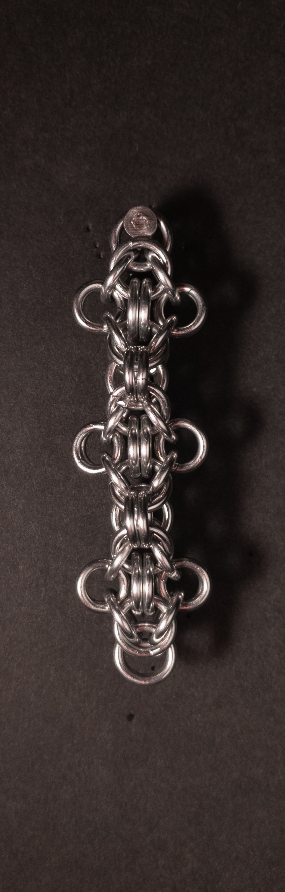
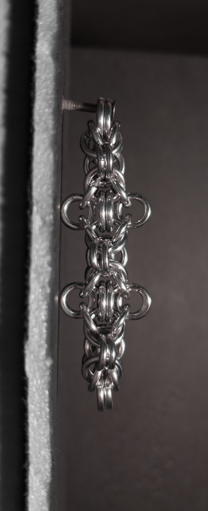
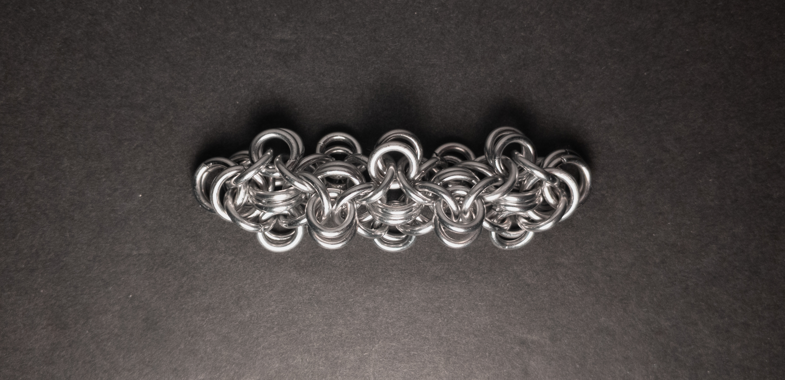
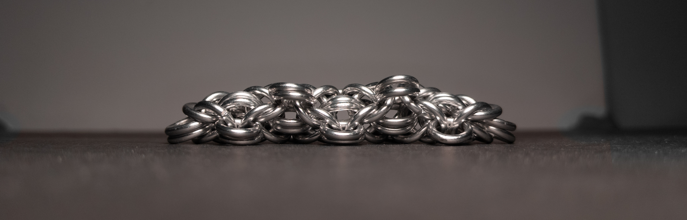

 posted: 2024-05-12 

##  Byzantine Cross Chain

### Overview

I came across [Byzantine Cross Chain](https://www.mailleartisans.org/weaves/weavedisplay.php?key=1090) by [Corvus](https://www.mailleartisans.org/members/memberdisplay.php?key=4033) while searching [M.A.I.L.](https://www.mailleartisans.org/) for fun and interesting new weaves to try out. Byzantine Cross Chain is a simple variant of [Byzantine](byzantine.md) that adds spikiness and a degree of dimensionality. If you decide that you want to make this weave yourself, [this video tutorial](https://www.youtube.com/watch?v=jjTIqcf4P4Y) by Deb of [Aussie Mail](https://www.youtube.com/@AussieMaillers) is wonderfully thorough and easy to follow.

### Materials

For the sample piece showcased in this post, I used two sizes of rings made from 16 SWG Bright Aluminum wire. The smaller rings, which I made myself(bonus post coming soon), have an ID(Inner Diameter) of 5mm for an AR(Aspect Ratio) of 3.1. The larger rings have an ID of .25in for an AR of 4, purchased from [The Ring Lord](https://theringlord.com/).

### Notes

The Byzantine Cross Chain weave offers simplicity in understanding and creation, making it accessible for crafters of various skill levels. Its aesthetic appeal is evident, especially when viewed vertically; however, its appearance may not be as striking when laid flat due to the spikes' orientations changing. Since the weave's instability while flat and in-progress causes issues with clarity, no in-progress images for this weave will be in the post. While the weave resembles a cord, its spikes render it unsuitable for applications such as chokers or bracelets; however, it could be well-suited for use in necklaces, pendants, or earrings. The name likely originates from its Byzantine roots, with the spikes creating a cross-like appearance. Despite its limited uses, the weave's simple and unique design makes it worth learning.

### Pictures

#### Vertical

#### Vertical: Profile

#### Flat

#### Flat: Profile

