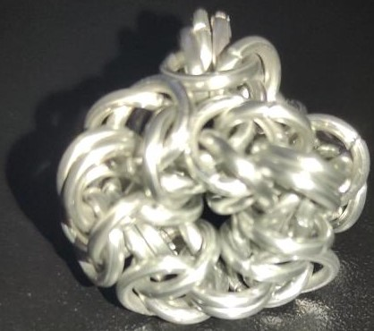
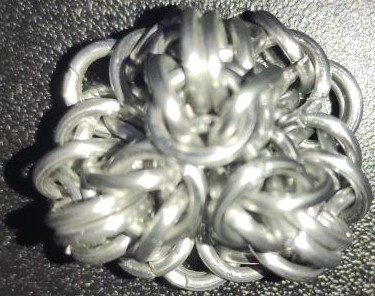
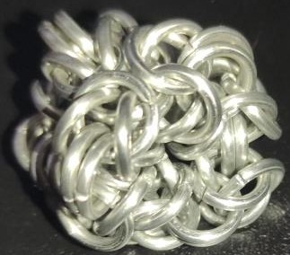
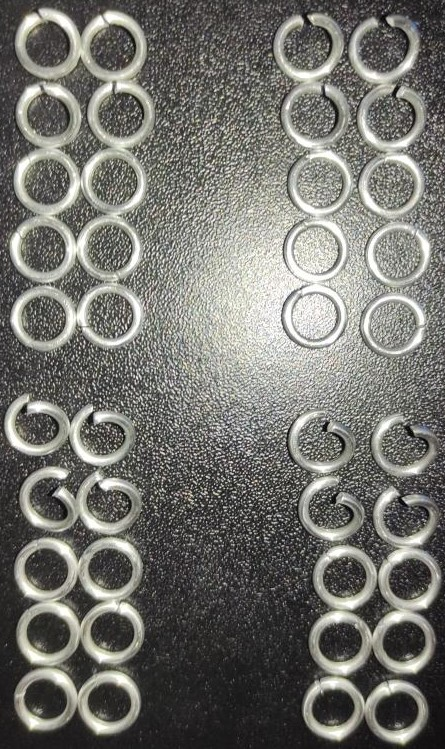
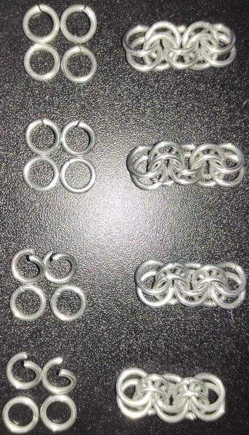
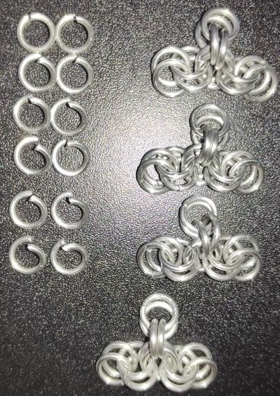
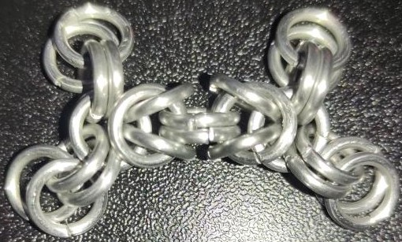
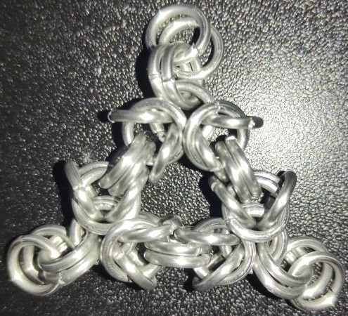
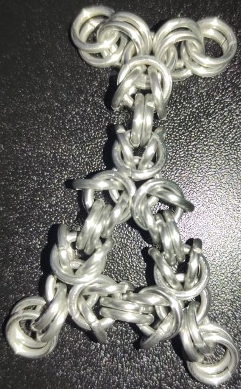
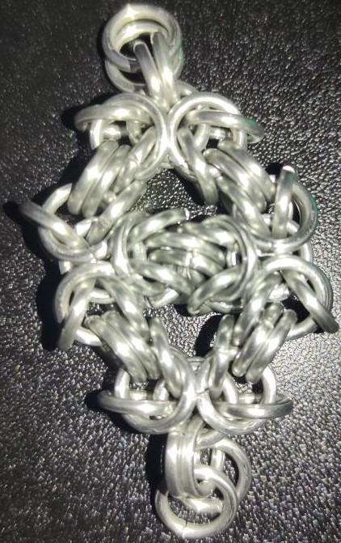

 posted: 2023-01-29 

## Byzantine Diamond Ball

### Overview

Recently I found a [tutorial](https://www.mailleartisans.org/articles/articledisplay.php?key=378) by [Nearoth](https://www.mailleartisans.org/members/memberdisplay.php?key=2686) on [M.A.I.L.](https://www.mailleartisans.org/) for a cool item called the [Byzantine Diamond Ball](https://www.mailleartisans.org/weaves/weavedisplay.php?key=580). This is a pretty cool weave that creates a triangular pyramid where each edge is a byzantine unit.

### Materials

The rings used for this peice are 16 SWG with a 1/4" internal diameter for an aspect ratio of 4.03 made of Bright Aluminum that I bought from the [Ring Lord](https://theringlord.com/).

### Notes

This is a very simple and easy to make item. As I don't see a way for this pattern to be continued or repeated in the same piece I am not sure this qualifies as a weave.

The item is quite loose, and accordign to the creator the AR cannot go too low; though the author also suggests the option to captivate a bead or marble at the center to make it tighter. Additionally the item doesn't seem to have very good connectivity for possibly including it in other weaves. 

However, my overall feeling is that this is a pretty neat and novel chainmail item that can be made and used as either a paperweight, a gift, a fidget toy, or just something fun to look at.

### Pictures

#### Face:

#### Vertex:

#### Isometric:

#### In-Process:

1. Set aside open/closed rings for the starting 2-2-2-2-2 chain segments.

2. Open/closed rings for adding addtional 2-2 section to middle of the 2-2-2-2-2 chain segments to create four basic units and the current 2-2-2-2-2 chain segments.

3. The four basic units and the opened rings that will be used to join them[]

4. Joining the first two units.

5. Adding a third unit.

6. Joining the fourth unit.

7. Joining the fourth unit to create a diamond.

8. Joining the last two open connectors to get the final product.

