 posted: 2023-06-25 

## Byzee Beez

### Overview

While checking out [M.A.I.L.](https://www.mailleartisans.org/) for new weaves to try out, I came across [Byzee Beez](https://www.mailleartisans.org/weaves/weavedisplay.php?key=195) submitted by [Raevyn](https://www.mailleartisans.org/members/memberdisplay.php?key=550). I found the weave to be aesthetically pleasing, and it happened to be a derivative of [Byzantine](byzantine.md) (my favourite weave), so I decided to try and make it myself. Unfortunately, I could not find a tutorial. However, the weave is a straightforward extension of Byzantine, so I was able to make it and provide some guidance that will hopefully help you if you try to make it yourself.

### Materials

For the sample piece showcased in this post, I used Bright Aluminum rings purchased from [The Ring Lord](https://theringlord.com/). The rings are 16 SWG with a 1/4" internal diameter, resulting in an aspect ratio of 4.03.

### Tutorial

1. First, create a 2-2-2-2-2 chain as shown in the image below.

    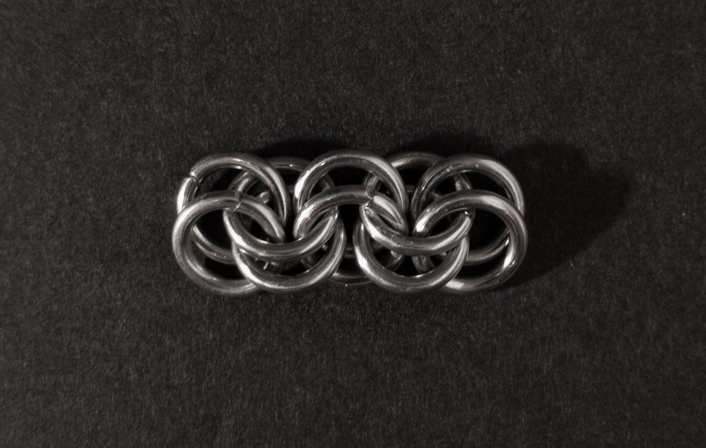

2. With your 2-2-2-2-2 chain, for each side, fold the red rings backward, then add two new rings to the now edge side between the two blue rings.
    
    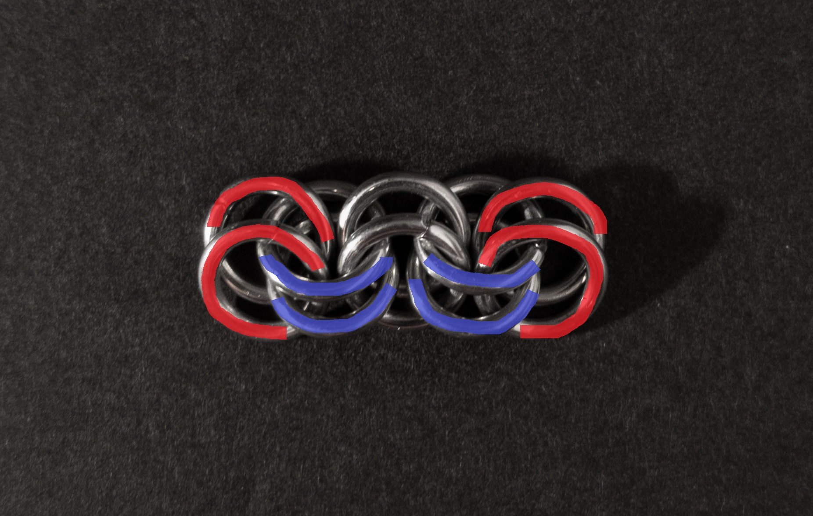

    When you are done, it should look like this (new rings in green):

    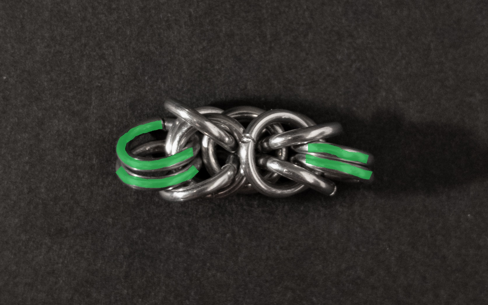

    If you are familiar with Byzantine, this is actually one unit of Byzantine.

3. To complete your unit, add a single ring between each of the four eyes(the ones on the right are highlighted in yellow) between each red ring and its corresponding blue ring. After this, add another ring through the top and bottom pairs of the new rings you just added.

    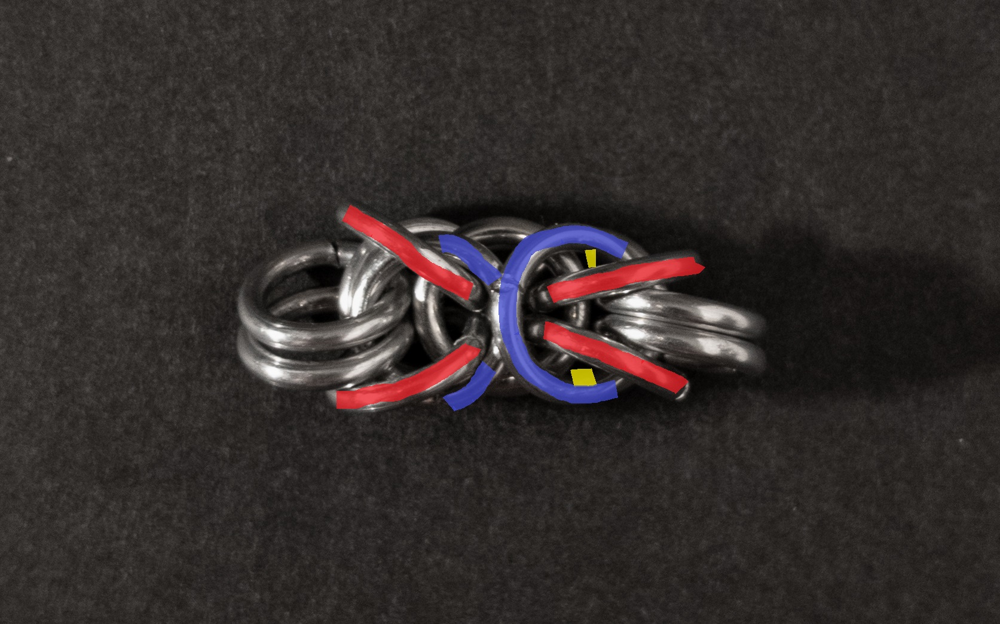

    When done, it should look like this (first new rings in green, second new rings in blue):

    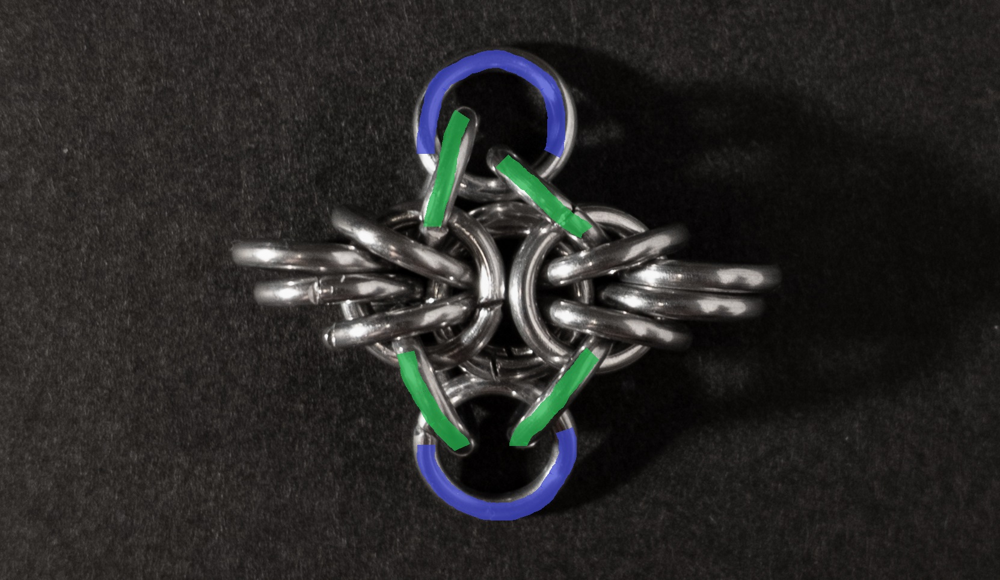

4. To add a new unit to the chain, make a new unit and join them by making them share the final ring you add for either the top or bottom of a unit.

### Notes

The Byzee Beez chainmail weave is a variation of the Byzantine weave that is relatively easy to understand and create, especially if you are already familiar with Byzantine. Personally, I find the weave visually appealing; however, I made it using rings with an Aspect Ratio (AR) of 4.03 instead of the recommended AR of 4.3. It's worth noting that your results may vary when using different ARs. Despite its name's association with bees, I don't see a strong visual resemblance to bees in this weave, but it still has an attractive look. One of the notable features of Byzee Beez is its flexibility and its rectangular cross-section. This makes it well-suited for various applications such as bracelets, chokers, and loose cords. However, it may not be ideal for long-draping necklaces or when a stiffer cord is required. Overall, I highly recommend learning this weave due to its versatility and aesthetic appeal.

### Pictures

#### Flat

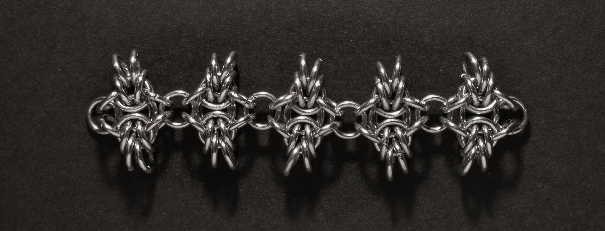

#### Flat: Profile

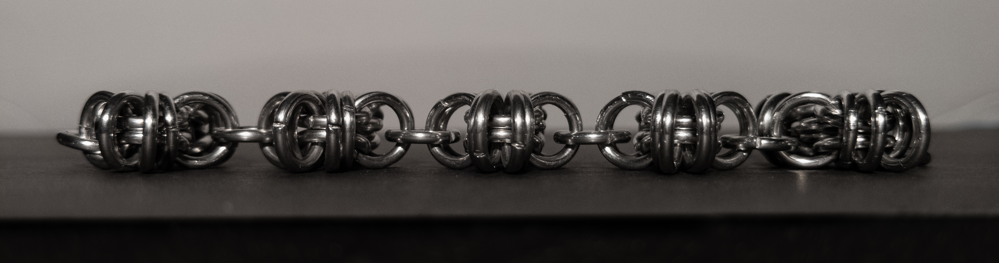

#### Vertical

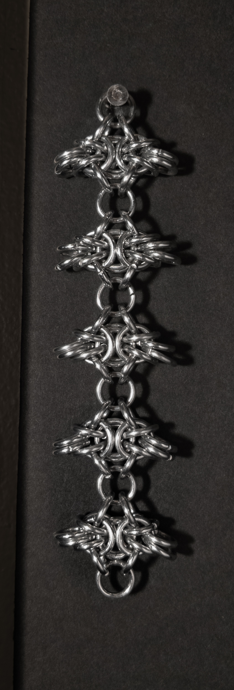

#### Vertical: Profile

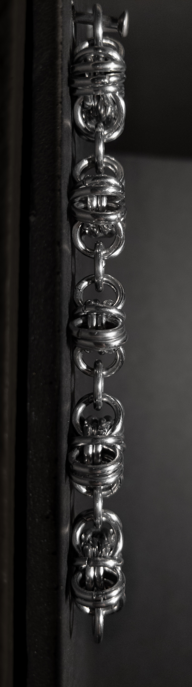

#### In Process

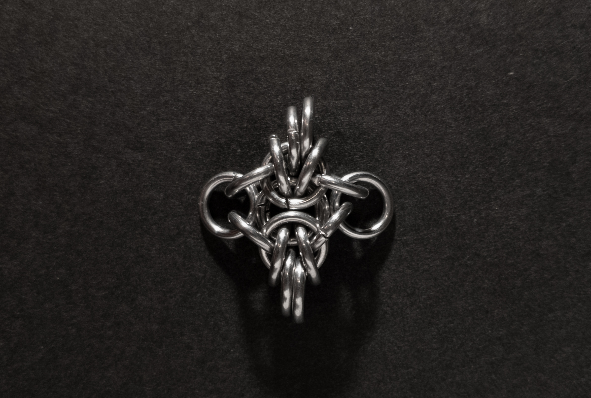

 

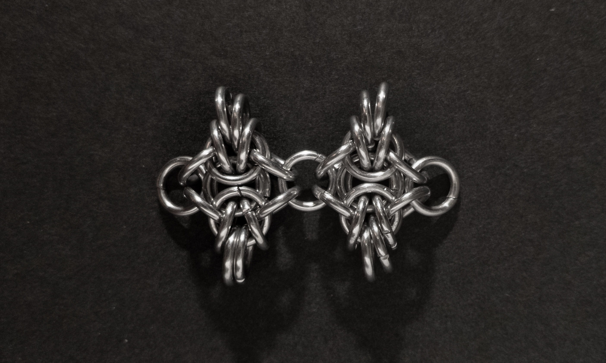

 

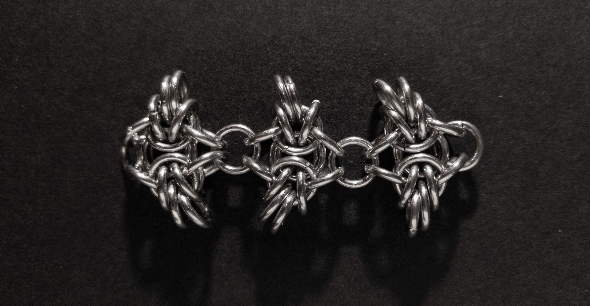

 

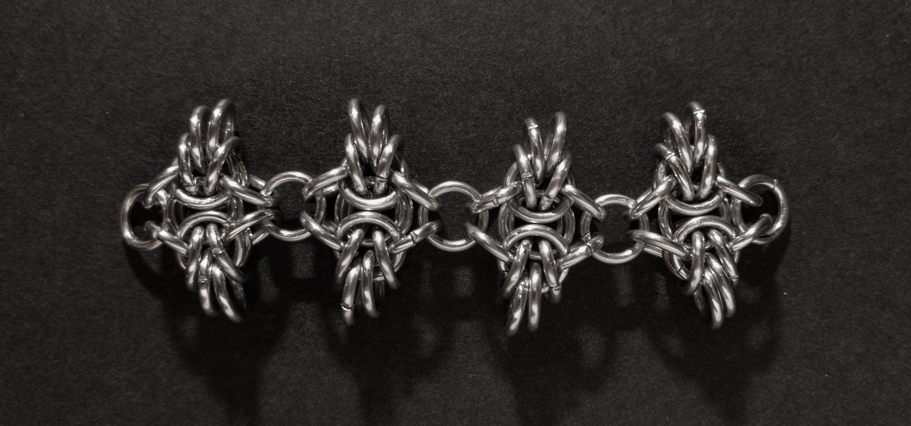