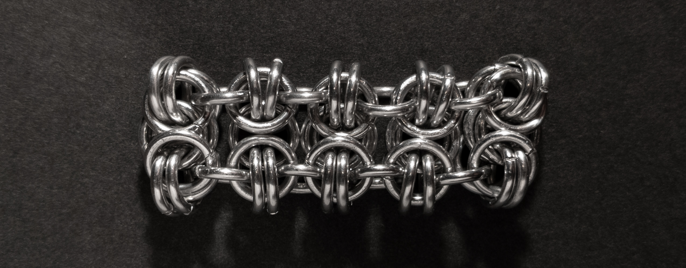
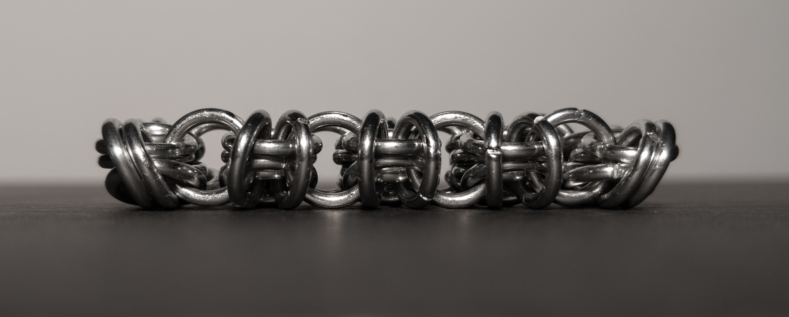
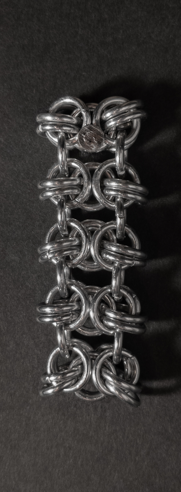
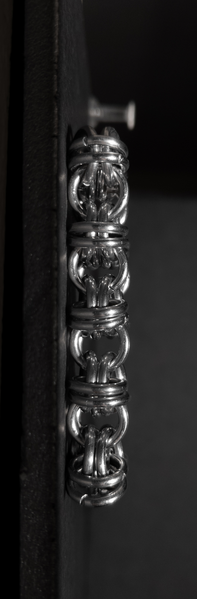
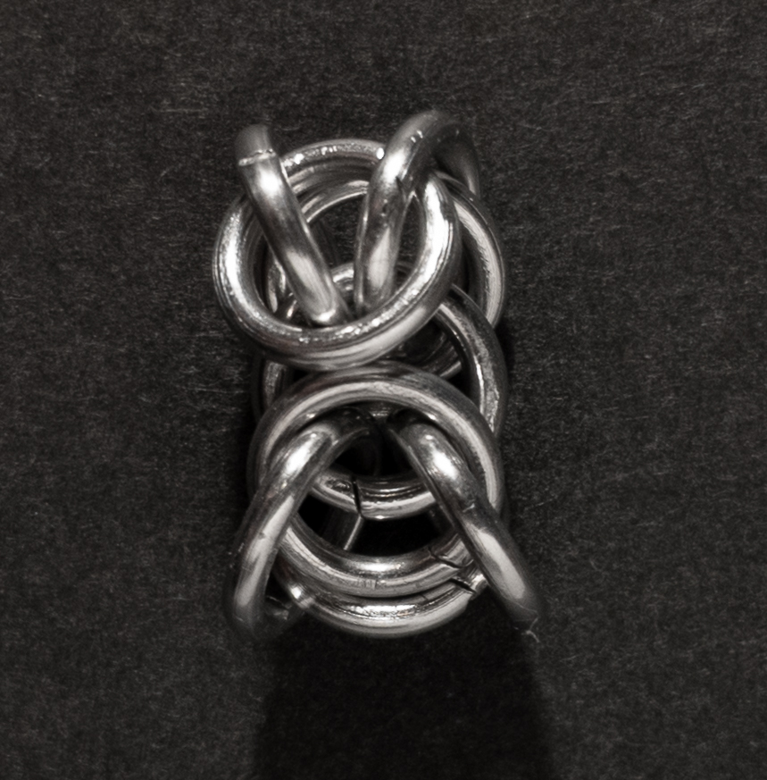
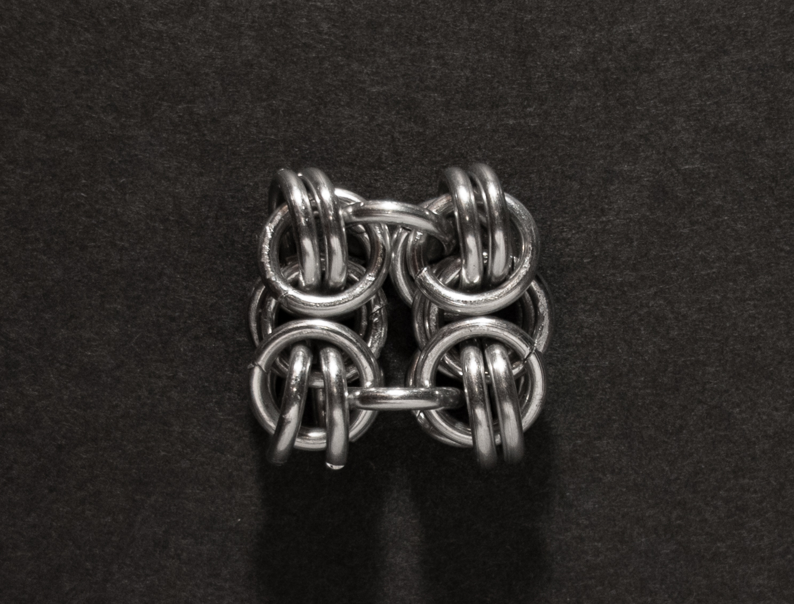
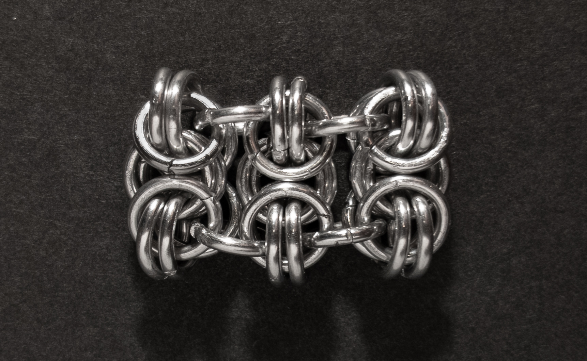
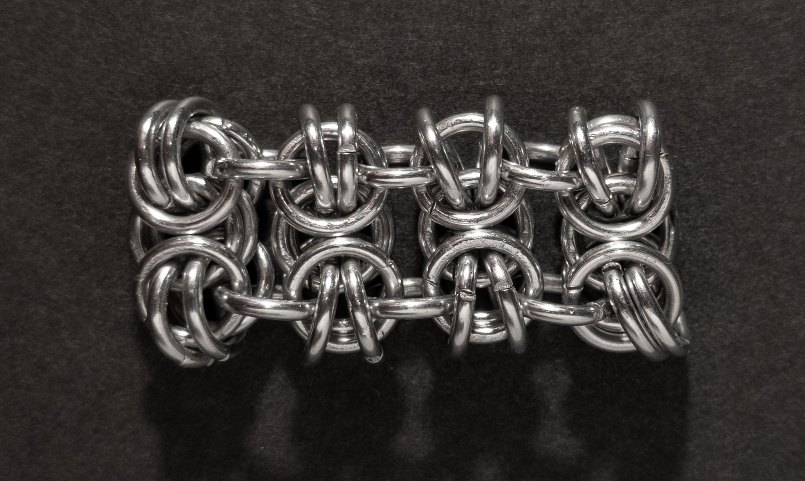

 posted: 2023-07-09 - updated: 2023-07-23 

## Byzee Beez To Butterflies

### Overview

Recently I found a great [tutorial](https://www.mailleartisans.org/articles/articledisplay.php?key=311) by [MaxumX](https://www.mailleartisans.org/members/memberdisplay.php?key=949) on [M.A.I.L.](https://www.mailleartisans.org/) for the [Byzee Beez To Butterflies](https://www.mailleartisans.org/weaves/weavedisplay.php?key=333) weave. Byzee Beez To Butterflies is descended from the [Byzantine](byzantine.md) weave, which is one of my favourites, as it is a variant of [Byzee Beez](byzee_beez.md) which itself is a direct variation of Byzantine. As Byzee Beez To Butterflies is a variation of Byzantine that I find aesthetically pleasing, I decided to try and make it myself.

### Materials

For the sample piece showcased in this post, I used Bright Aluminum rings purchased from [The Ring Lord](https://theringlord.com/). The rings are 16 SWG with a 1/4" internal diameter, resulting in an aspect ratio of 4.03.

### Notes

The Byzee Beez To Butterflies chainmail weave is both simple to understand and simple to make. The sample piece used rings with an Aspect Ratio of 4.03, which allowed for following along with the tutorial. However, it was noted that the tightness of the rings in the sample piece differed from the example shown on the M.A.I.L. page for the weave. This weave offers flexibility and features a rectangular cross-section, making it well-suited for situations where it can lie flat, such as bracelets or chokers. However, when used for longer necklaces, the rectangular shape may cause it to lay awkwardly. The name of the weave is intriguing, with the first portion (Byzee Beez) directly referring to the base weave it is derived from, while the second portion (To Butterflies) highlights how the rings along the long side of the weave can resemble butterfly wings when opened. Overall, I highly recommend learning to make this weave due to its simplicity and unique characteristics.

### Pictures

#### Flat

#### Flat: Profile

#### Vertical

#### Vertical: Profile

#### In Process

 

 

 

