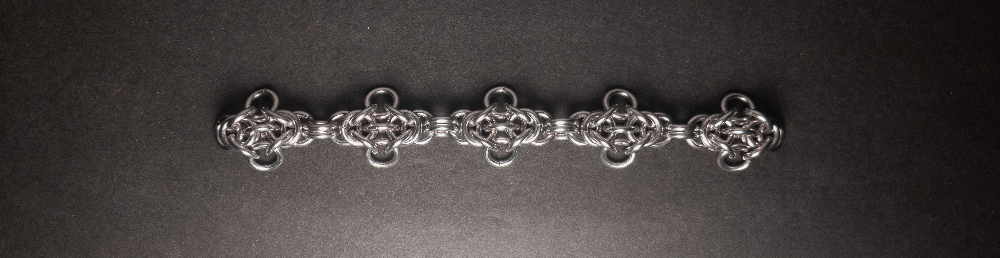
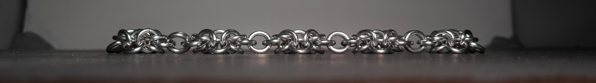
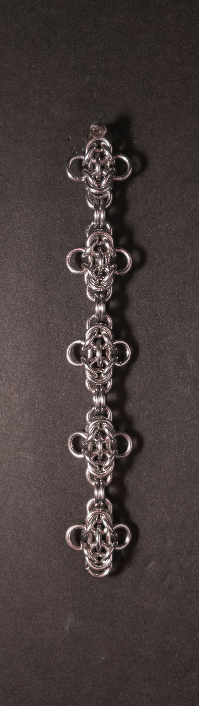
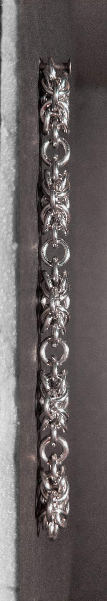
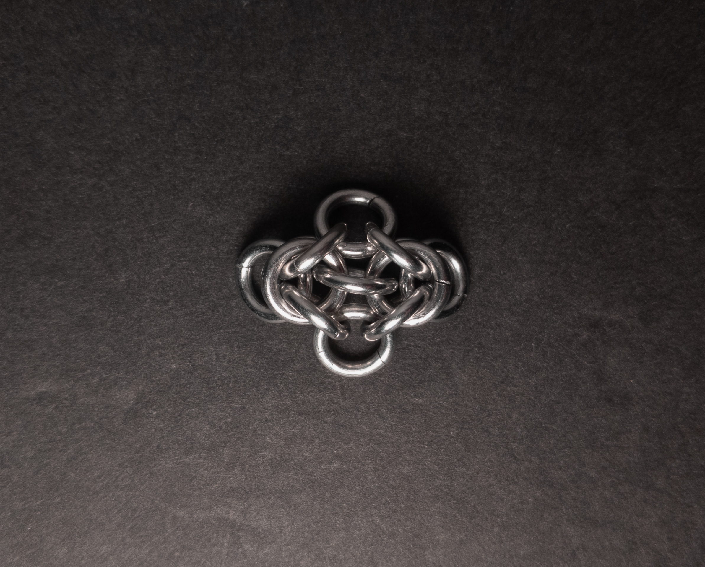
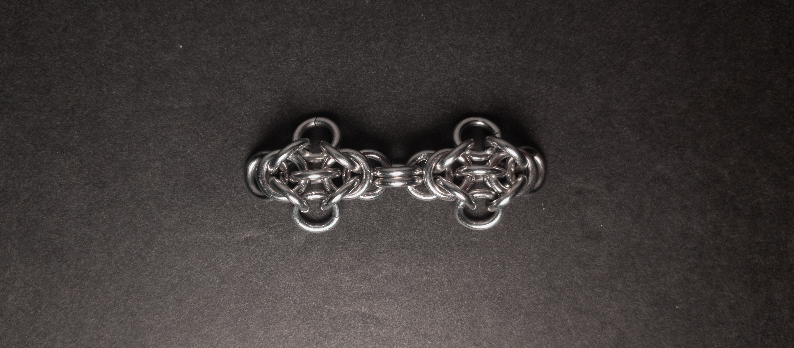
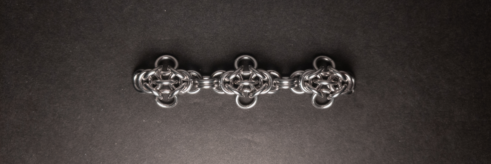
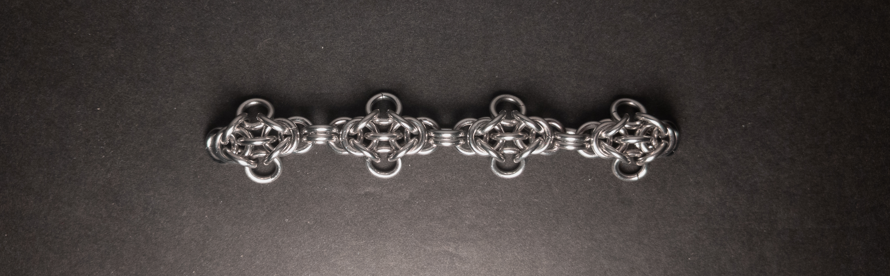

 posted: 2024-05-25 

## Byzy Bugs

### Overview

While searching [M.A.I.L.](https://www.mailleartisans.org/members/memberdisplay.php?key=12217) for interesting weaves to try out, I came across [Byzy Bugs](https://www.mailleartisans.org/weaves/weavedisplay.php?key=899) by [Xynyth](https://www.mailleartisans.org/members/memberdisplay.php?key=12217). Byzy Bugs is a fun variation on the classic [Byzantine](byzantine.md) weave with alternately linked units and rings on the outer edge that look like wings. If you want to make this yourself, this [tutorial](https://www.youtube.com/watch?v=rFJO2DeU6Bg) by [Aussie Maille](https://www.youtube.com/@AussieMaillers) is a great resource.

### Materials

For the sample piece showcased in this post, I made the rings myself (bonus post coming soon if you are interested). I used 16 SWG Bright Aluminum wire from [The Ring Lord](https://theringlord.com/) coiled around a 5mm mandrel for an approximate aspect ratio of 3.1.

### Notes

The Byzy Bugs weave is straightforward to understand and learn, making it accessible even for beginners. Despite its simplicity, it yields a visually pleasing result. With its passably square cross-section, the weave is versatile and suitable for various applications such as bracelets, necklaces, chokers, and cords. Simplicity, ease of learning, and aesthetic appeal make Byzy Bugs an excellent choice for crafters of all skill levels. Therefore, I highly recommend learning to make it yourself.

### Pictures

#### Flat

#### Flat: Profile

#### Vertical

#### Vertical: Profile

#### In Process

 

 

 

