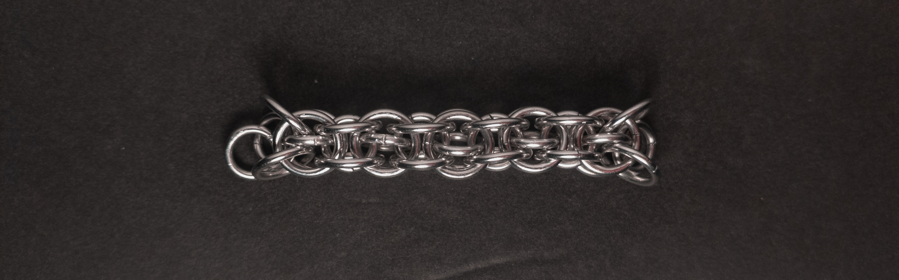
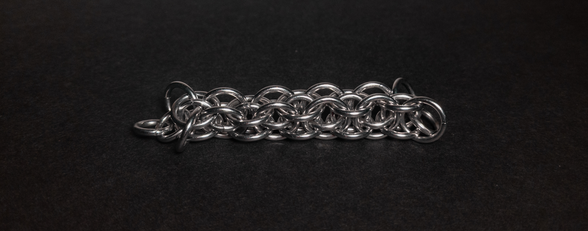
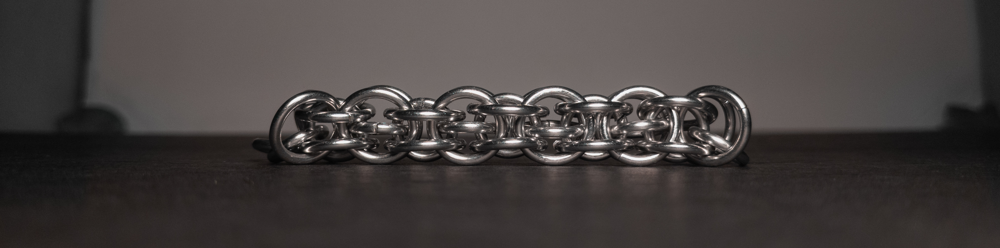
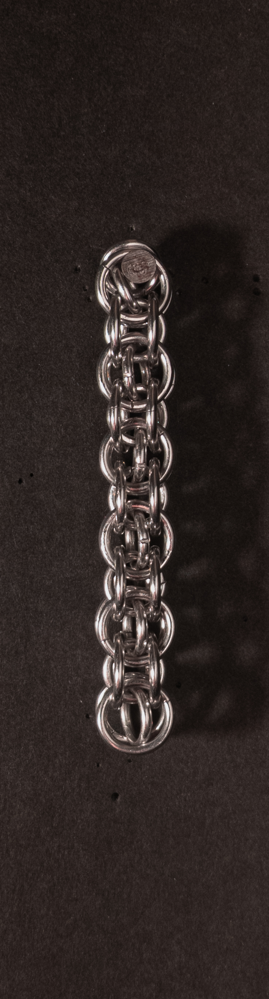
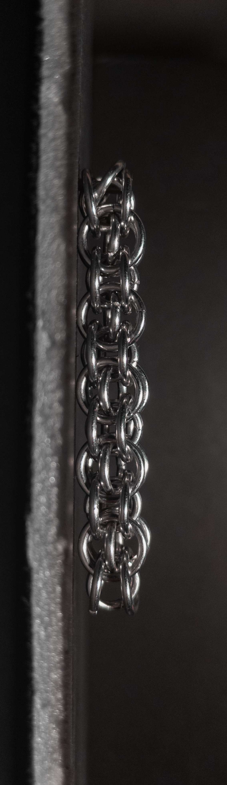
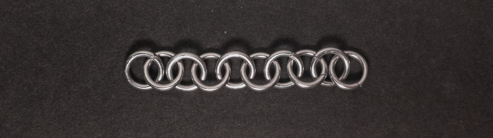
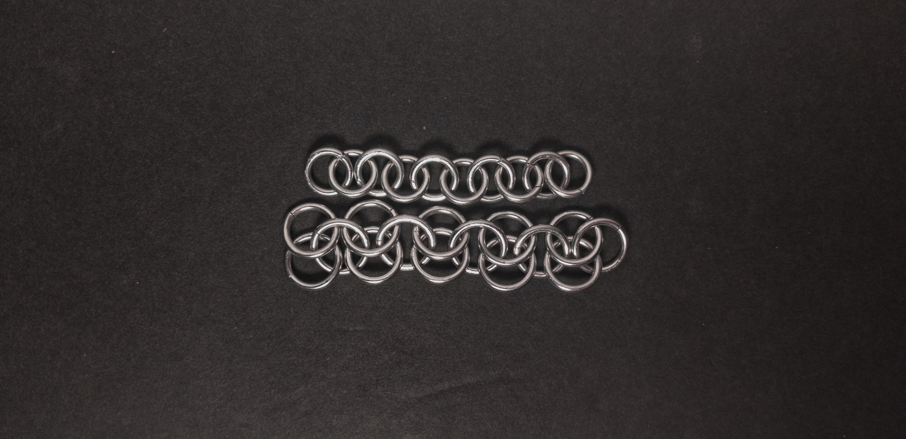
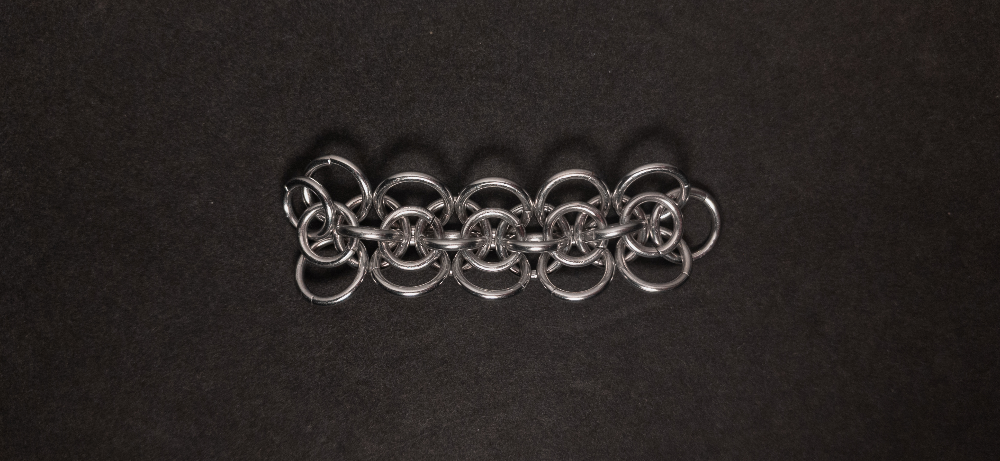
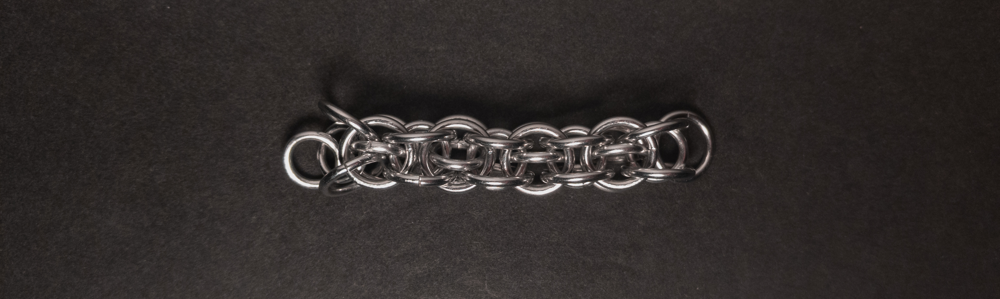

 posted: 2024-12-22 

## Captive 2-in-1 Chain

### Overview

While looking through [M.A.I.L.](https://www.mailleartisans.org/) for new weaves to try out, I came across [Captive 2-in-1 Chain](https://www.mailleartisans.org/weaves/weavedisplay.php?key=676) attributed to [tipo mastr](https://www.mailleartisans.org/members/memberdisplay.php?key=3208). It is a fun member of the Japanese family, constructed by trapping a [2-in-1 Chain](2_in_1_chain.md) inside a sleeve(which is where I believe the Japanese family inspiration comes from). If you wish to try making it yourself, I recommend this [tutorial](https://www.mailleartisans.org/articles/articledisplay.php?key=470) by [MaxumX](https://www.mailleartisans.org/members/memberdisplay.php?key=949).

### Materials

For the sample piece showcased in this post, I used two sizes of rings made from 16 SWG Bright Aluminum wire. The larger rings, which I made myself(bonus post coming soon), have an ID(Inner Diameter) of 8mm for an AR(Aspect Ratio) of 4.9. The smaller rings have an ID of .25in for an AR of 4, purchased from [The Ring Lord](https://theringlord.com/).

### Notes

The Captive 2-in-1 Chain is easy to understand, though it can be tricky to start as joining the larger weave around the captive chain requires some care. Once started, however, it is straightforward to add onto the weave. The weave looks aesthetically pleasing, even in a single colour; however, contrasting colours for the inner chain and captive sleeve would drastically enhance its appearance. With its square cross-section, good flexibility, and appealing design, this chain weave is well suited for use in necklaces, bracelets, and as a cord. The name likely originates from taking a 2-in-1 Chain and holding it captive within a sleeve. Given its simplicity, versatility, and attractive appearance, I recommend learning to make this weave.

### Pictures

#### Flat

#### Flat: Angled

#### Flat: Profile

#### Vertical

#### Vertical: Profile

#### In Process

 

 

 

