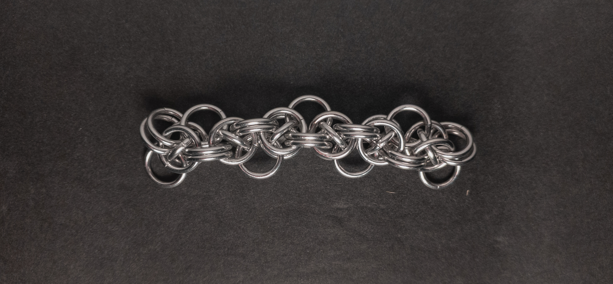
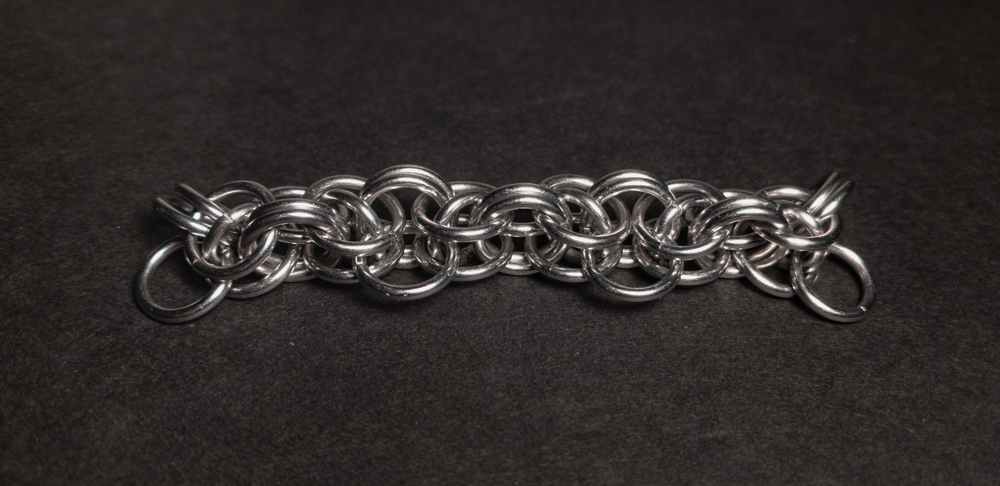
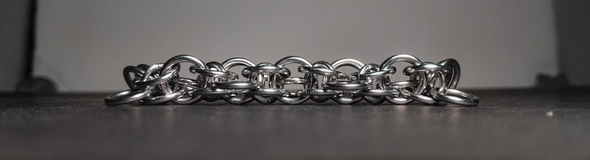
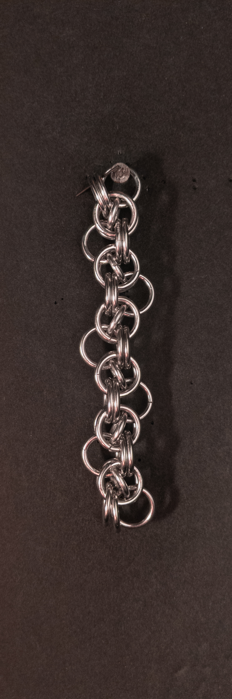
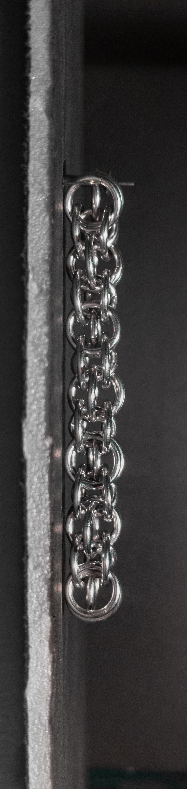
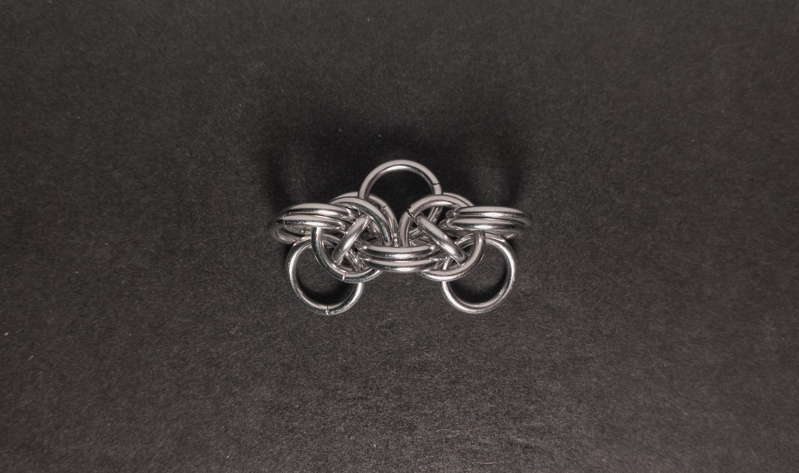
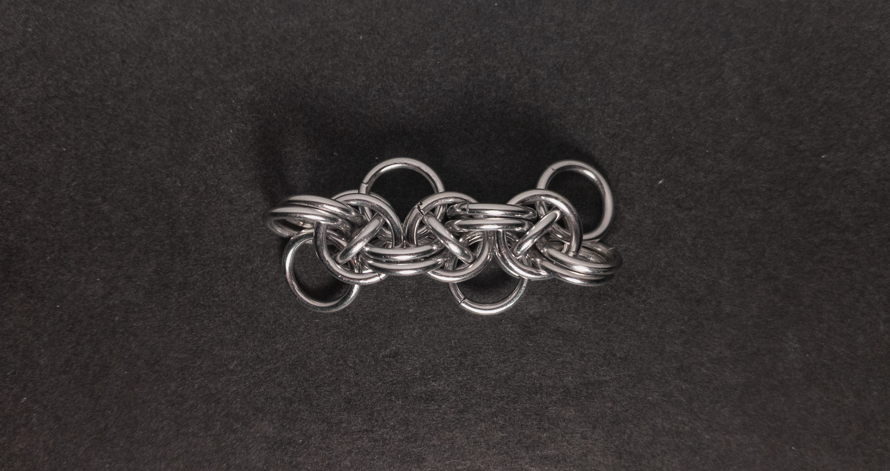
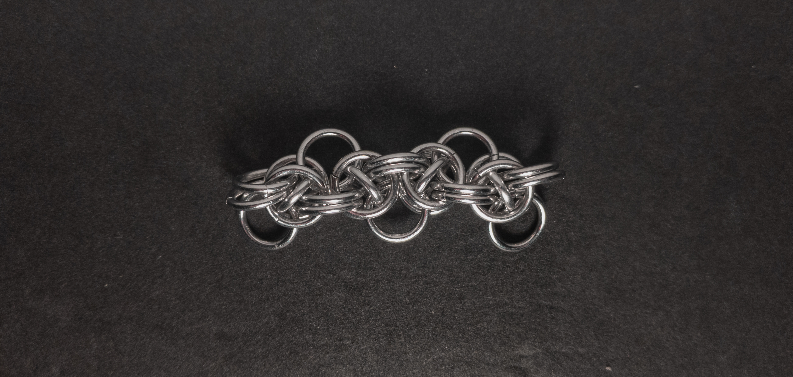
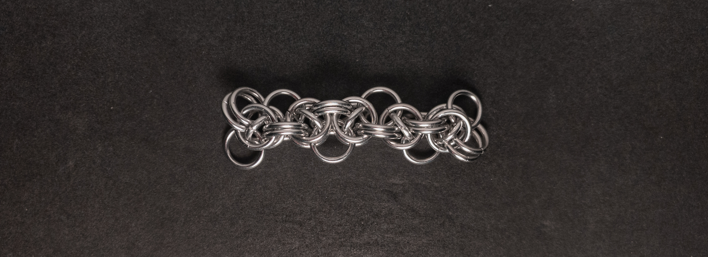

 posted: 2025-01-19 

## Captive 2 in 1 Parallel

### Overview

After making [Captive 2-in-1 Chain](captive_2_in_1_chain.md), I started looking into more captive weaves, which is how I found [Captive 2 in 1 Parallel](https://www.mailleartisans.org/weaves/weavedisplay.php?key=1015) by [MaxumX](https://www.mailleartisans.org/members/memberdisplay.php?key=949) on [M.A.I.L.](https://www.mailleartisans.org/). Captive 2-in-1 Parallel is another fun member of the Japanese and European families made by taking the captive chain from Captive 2-in-1 Chain and weaving it in and out of the outer weave, leading to its wavy appearance. For any readers who want to try it at home, I recommend this [video tutorial](https://www.youtube.com/watch?v=w7lKv0FacbQ) by [Aussie Maille](https://www.youtube.com/@AussieMaillers).

### Materials

For the sample piece showcased in this post, I used two sizes of rings made from 16 SWG Bright Aluminum wire. The larger rings, which I made myself(bonus post coming soon), have an ID(Inner Diameter) of 8mm for an AR(Aspect Ratio) of 4.9. The smaller rings have an ID of .25in for an AR of 4, purchased from [The Ring Lord](https://theringlord.com/).

### Notes

The Captive 2-in-1 Parallel weave is somewhat complex to create and tricky to start; however, it is easy to continue once started. I find the weave to look very appealing. As a chain weave with a flat and broad cross-section, it is well-suited for use in bracelets and chokers. When I came across the weave on M.A.I.L., I did not realize the given aspect ratios required different wire diameters. Thus, I used a single wire diameter; my small rings are smaller than the ones suggested by the M.A.I.L. listing since those aspect ratios do not work for rings with the same wire diameter. If you wish to use different wire sizes, I suggest following the tutorial's recommendations; if you want to try using rings with the same wire diameter, doubling up the large rings joined to the captive rings may be a good alternative. Considering the complexity of learning and creating this weave compared to its visual appeal, I find it challenging to recommend it to beginners. However, it is perfect for those with moderate experience, patience, or determination.

### Pictures

#### Flat

#### Flat: Angled

#### Flat: Profile

#### Vertical

#### Vertical: Profile

#### In Process

 

 

 

