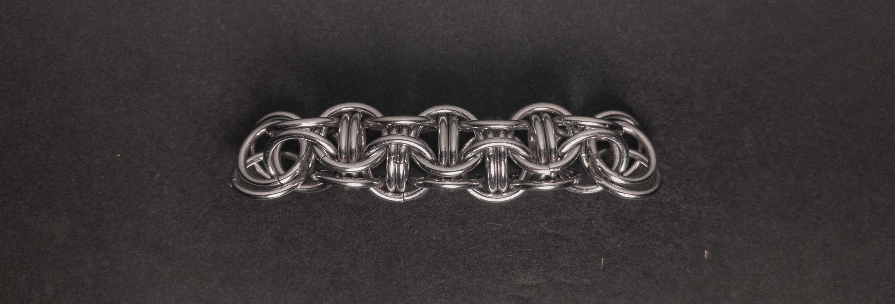
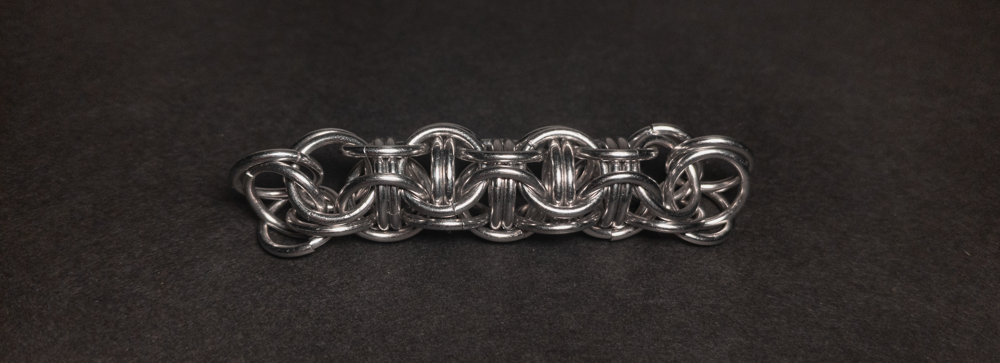
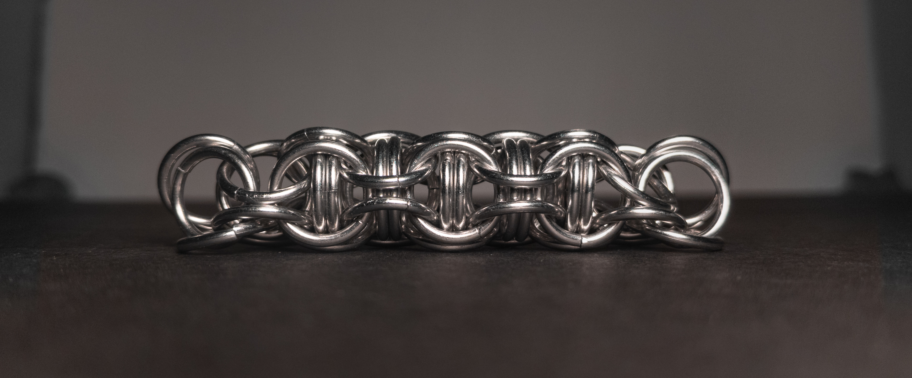
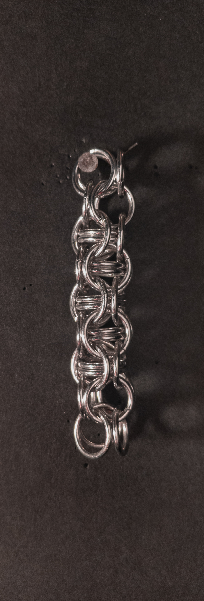
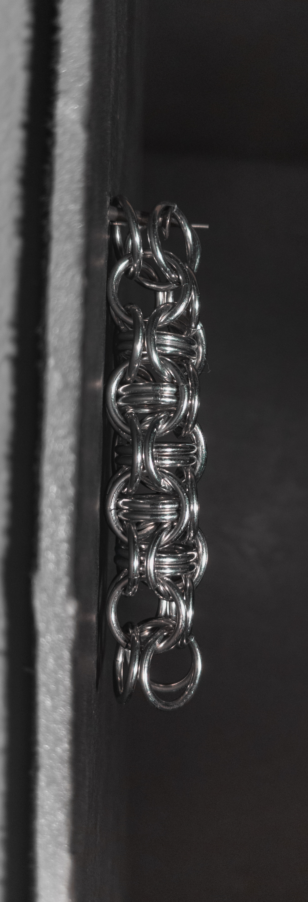
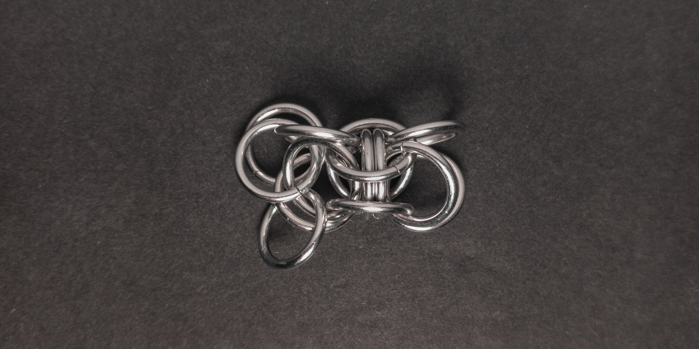
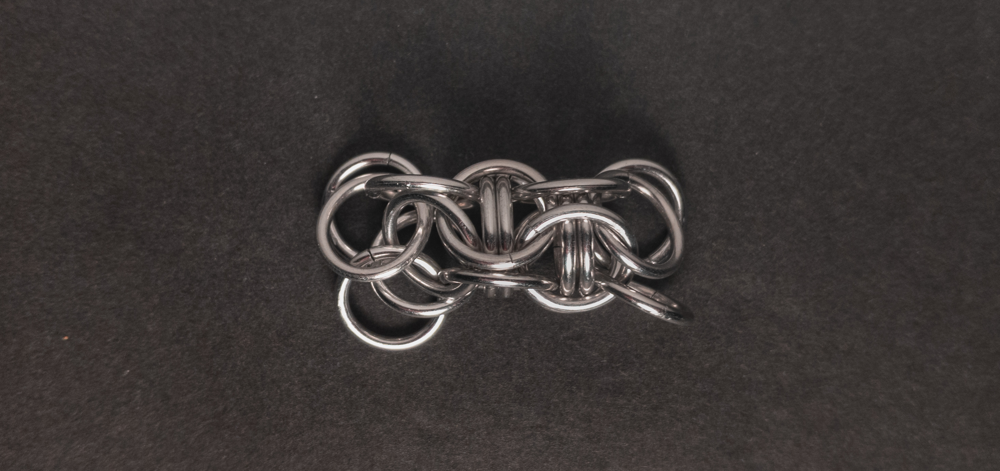
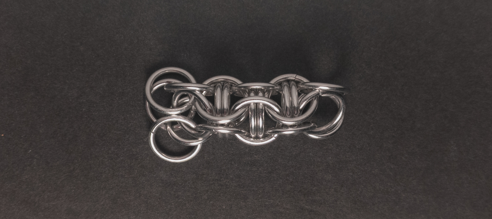
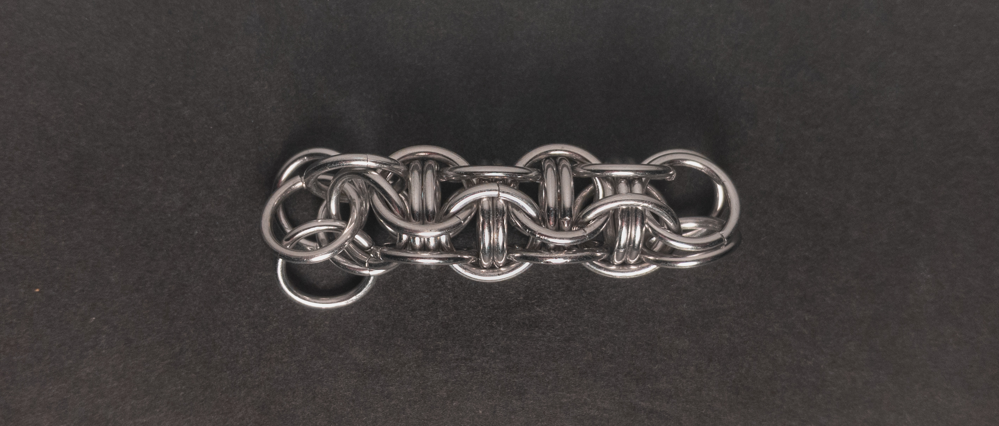
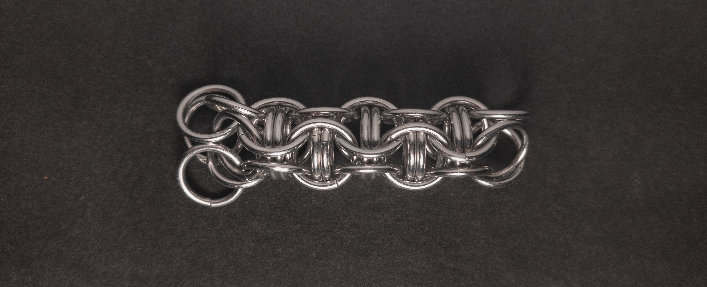

 posted: 2024-04-07 

## Captive Inverted Round

### Overview

When I found [Inverted Round](inverted_round.md) on [MAIL](https://www.mailleartisans.org/), I also came across [Captive Inverted Round](https://www.mailleartisans.org/weaves/weavedisplay.php?key=68) by [lorenzo](https://www.mailleartisans.org/members/memberdisplay.php?key=17). Captive Inverted Round is a straightforward member of the European family, characterized by adding captive rings into the Inverted Round weave. I followed this [tutorial](https://www.mailleartisans.org/articles/articledisplay.php?key=221) by [Dark Dragon](https://www.mailleartisans.org/members/memberdisplay.php?key=1422) when learning this weave and recommend it if you also want to learn to make it.

### Materials

For the sample piece showcased in this post, I made the rings myself (bonus post coming soon if you are interested). I used 16 SWG Bright Aluminum wire from [The Ring Lord](https://theringlord.com/) coiled around a 9mm mandrel for an approximate aspect ratio of 5.5.

### Notes

The Captive Inverted Round weave is effortless to understand but can be hard to create, as the captive rings tend to pop out. To make the process easier, I recommend the following steps: hold the weave in one hand using a triangular pinching at the top, add the captive rings, guide the new rings to close the cage around the captive rings, partially close them with one pair of pliers in your free hand, and then carefully finish closing them with two pairs of pliers. In my opinion, the weave looks aesthetically pleasing. However, as a chain weave, it lacks flexibility due to the captive rings. Thus, it is best suited for structural applications, such as rods, especially when the ends are fixed in place or blocked off to prevent the captive rings from escaping. Considering the complexity of creating this weave and its limited versatility, I would only recommend it to those who desire its unique appearance or for structural projects.

### Pictures

#### Flat

#### Flat: Angled

#### Flat: Profile

#### Vertical

#### Vertical: Profile

#### In Process

 

 

 

 

