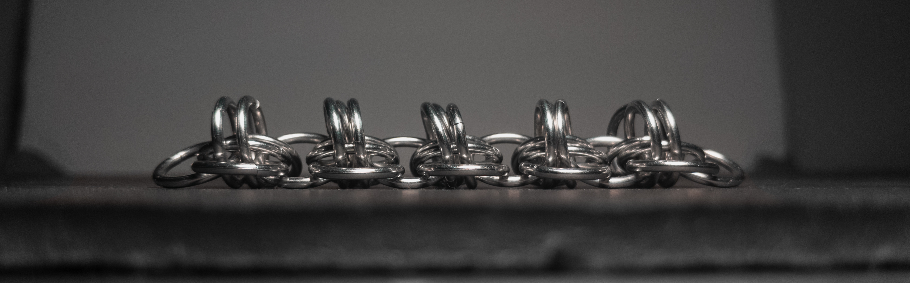

 posted: 2024-04-07 

## Cask

### Overview

While searching for new weaves to try making, I came across [Cask](https://www.mailleartisans.org/weaves/weavedisplay.php?key=904) by [Beryc](https://www.mailleartisans.org/members/memberdisplay.php?key=5709) on [M.A.I.L.](https://www.mailleartisans.org/). Cask is an intriguing weave made by applying the transformation of [European 4-in-1](european_4_in_1.md) into [Rhino](rhinos_snorting_drano.md) to [European 6-in-1](european_6_in_1.md), making it a member of the Rhino family. If you would like to make this yourself, I suggest following this [tutorial](https://www.youtube.com/watch?v=hlWU67xGRlI) from [Aussie Maille](https://www.youtube.com/@AussieMaillers).

### Materials

For the sample piece showcased in this post, I made the rings myself (bonus post coming soon if you are interested). I used 16 SWG Bright Aluminum wire from [The Ring Lord](https://theringlord.com/) coiled around a 9mm mandrel for an approximate aspect ratio of 5.5.

### Notes

The Cask weave is simple to understand and slightly more complex to create; it requires attention to ensure that the rings perpendicular to the chain go in the same direction. I find that the weave can look nice, but without tension, it can appear messy. As a chain weave with an oval cross-section, it is well-suited for bracelets, chokers, necklaces, or cords. Since tension improves its aesthetic appeal, I suggest using it where it can hang and letting gravity provide tension. I recommend learning to make the weave, as even though it has limited usefulness, it is a straightforward task.

### Pictures

#### Flat

#### Flat: Angled

#### Flat: Profile

#### Vertical

#### Vertical: Profile

#### In Process

 

 

 

