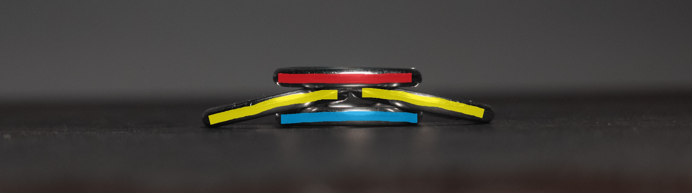
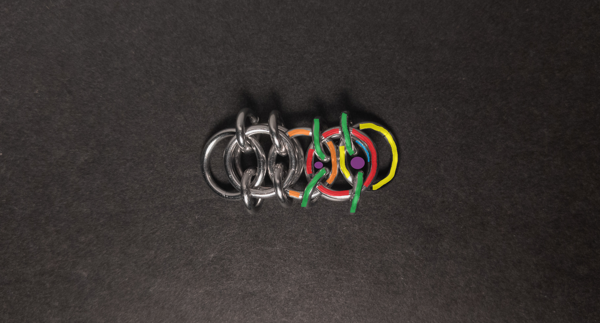
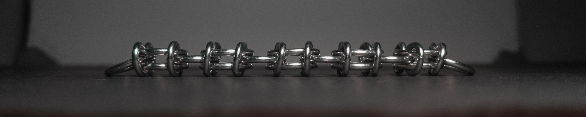

 posted: 2024-09-15 

## Celtic Weave

### Overview

While searching the internet for new weaves to try to make, I found the unattributed [Celtic](https://chainmaillers.com/maillepedia/celtic.1396/) in [Chainmaillers](https://chainmaillers.com/)' Maillepedia. Celtic is a variant of [Celtic Visions](celtic_visions.md) that removes the rings holding the central 2-in-1 chain together. Unfortunately, I could not find a tutorial; however, I have written the included tutorial for those interested in making it at home.

### Materials

For the sample piece showcased in this post, I used two sizes of rings made by hand(bonus post coming soon) from 16 SWG Bright Aluminum wire purchased from [The Ring Lord](https://theringlord.com/). The smaller rings have an ID(Inner Diameter) of 5mm for an AR(Aspect Ratio) of 3.1. The larger rings have an ID of 9mm for an AR of 5.5.

### Tutorial

1. Start with four closed large rings. One on the bottom(blue in the images below), two in the middle(yellow in the images below), and one on top(red in the images below). Additionally, note the two eyes(purple in the images below) formed between the top(red in the images below) and bottom(blue in the images below) rings with the middle rings. When done, it should look something like this:

    
    
    

2. Add four new small rings(green in the image below), two through each eye(purple in the images above and below). Each new ring should go through three rings. All four new rings should go through the top(red in images above and below) and bottom(blue in images above) rings. Two new rings should go through each middle ring(yellow in images above and below). When done, it should look something like this:

    

3. Pick one side of the chain and add three new closed large rings. One(blue in the images below) underneath the ring sticking out of that side(orange in the images below), one(yellow in the images below) above that ring and next to the ring sticking out, and one on top of the ring sticking out and the new middle ring. Please note the two eyes(purple in the images below) formed between the top(red in the images below) and bottom(blue in the images below) rings and the middle rings(yellow and orange in the images below). When done, it should look something like this:

    

    

4. Add four new small rings(green in the image below), two through each eye from the previous step(purple in the images above and below). Each new small ring should again go through three closed large rings. All four new rings should go through the top (red in the images above and below) and bottom(blue in the images above) rings. Two new rings should go through each middle ring(yellow and orange in the images above and below). When done, it should look something like this:

    

5. Repeat steps 3 through 4 until you are happy with the length of the chain.

### Notes

The Celtic weave can be somewhat complex to understand but is easy to create. Although I don't think the weave is very aesthetically appealing, it is a flat and broad chain weave, making it well-suited for bracelets, chokers (though not necklaces), or even straps. I suggest learning how to make this weave because, despite its mediocre appearance, it is versatile and easy to craft.

### Pictures

#### Flat

#### Flat: Angled

#### Flat: Profile

#### Vertical

#### Vertical: Profile

#### In Process

 

 

 

