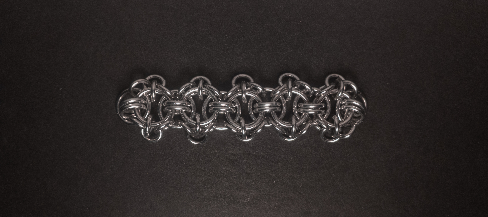
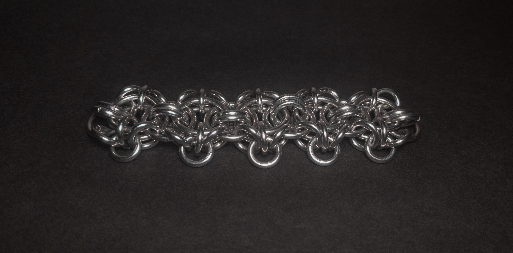
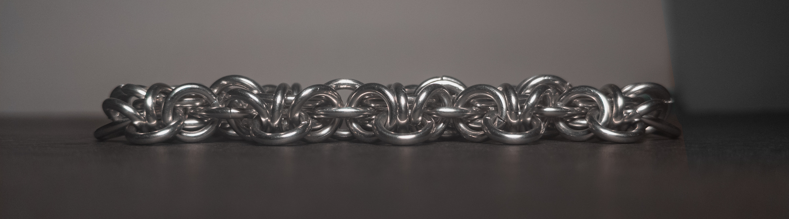
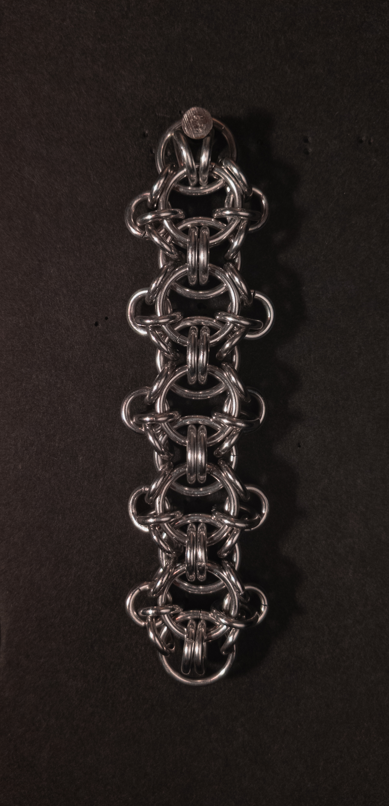
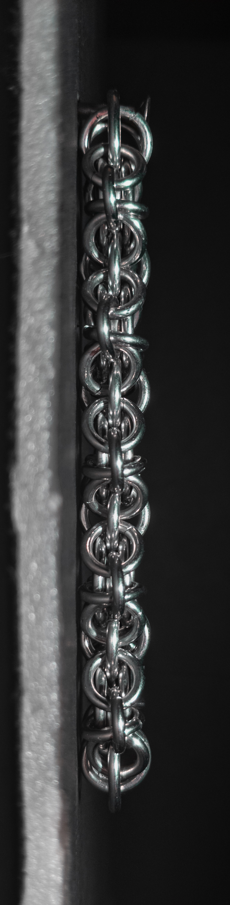
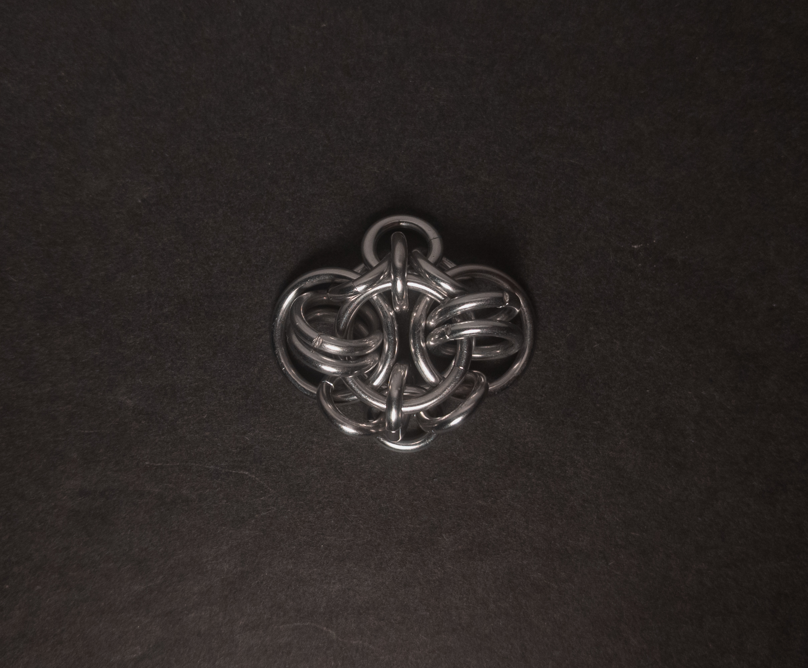
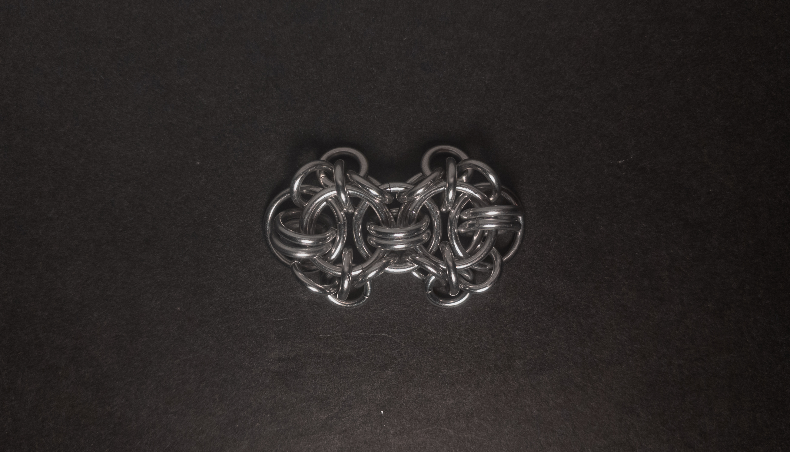
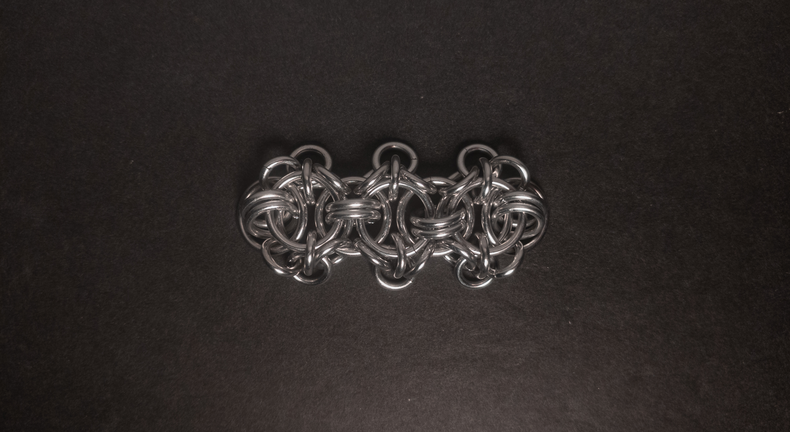
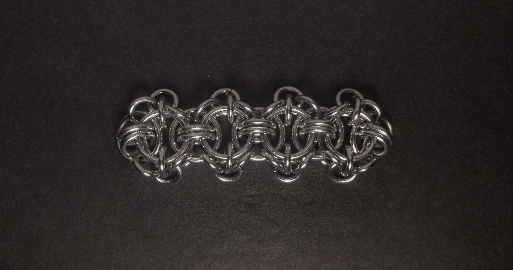

 posted: 2024-09-22 

## Celtic Dawn

### Overview

While checking [M.A.I.L.](https://www.mailleartisans.org/) out for new weaves to try, I came across [Celtic Dawn](https://www.mailleartisans.org/weaves/weavedisplay.php?key=726) by [BlueBuddha](https://www.mailleartisans.org/members/memberdisplay.php?key=2239). Celtic Dawn is a [Helm Chain](helm_chain.md) variant made by adding edging, making it part of the European and Helm families. I followed [this tutorial](https://www.mailleartisans.org/articles/articledisplay.php?key=476) by [MaxumX](https://www.mailleartisans.org/members/memberdisplay.php?key=949) to make this weave, and I recommend it if you want to make it yourself.

### Materials

For the sample piece showcased in this post, I used three sizes of rings made from 16 SWG Bright Aluminum wire. The largest rings, which I made myself(bonus post coming soon), have an ID(Inner Diameter) of 10mm for an AR(Aspect Ratio) of 6.15. The medium rings have an ID of .25in for an AR of 4, purchased from [The Ring Lord](https://theringlord.com/). The smallest rings, which I also made myself, have an ID of 5mm for an AR of 3.1.

<!-- Reshoot flat angled & Flat profile -->

### Notes

The Celtic Dawn weave is somewhat complex to understand but easy to create, as long as your rings are appropriately sized. The weave is aesthetically pleasing, especially the edging, which adds a distinctive touch. You can easily make good bracelets, chokers, and strapping with it due to its flat and broad cross-section. According to the entry on M.A.I.L., the name comes from its resemblance to the Celtic weave and the submitter's intern, Dawn, who was helpful during its creation. Given its versatility and appealing design, I recommend learning to make this weave.

### Pictures

#### Flat

#### Flat: Angled

#### Flat: Profile

#### Vertical

#### Vertical: Profile

#### In Process

 

 

 

