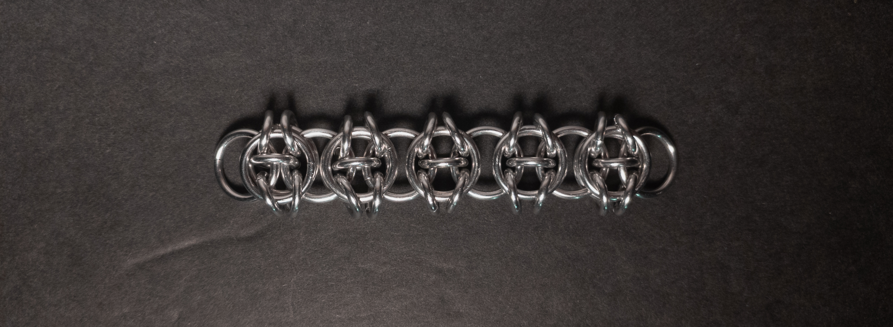
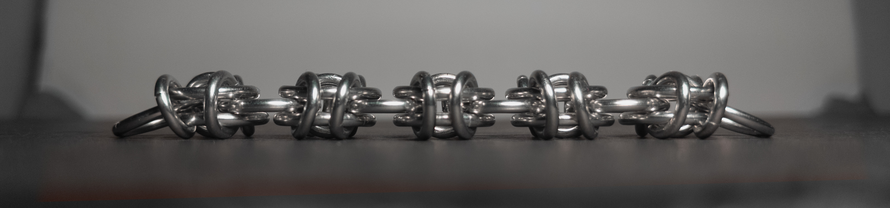
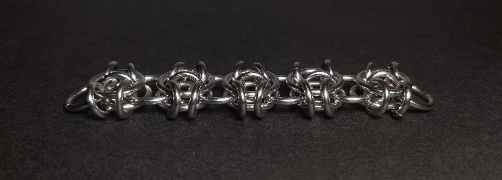
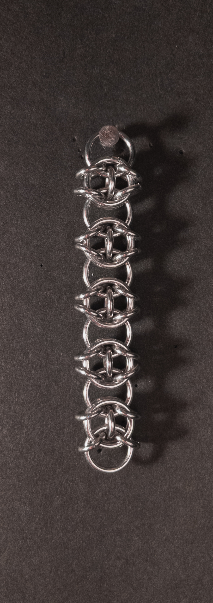
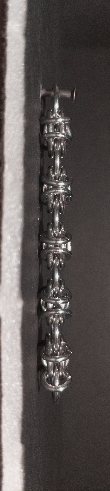
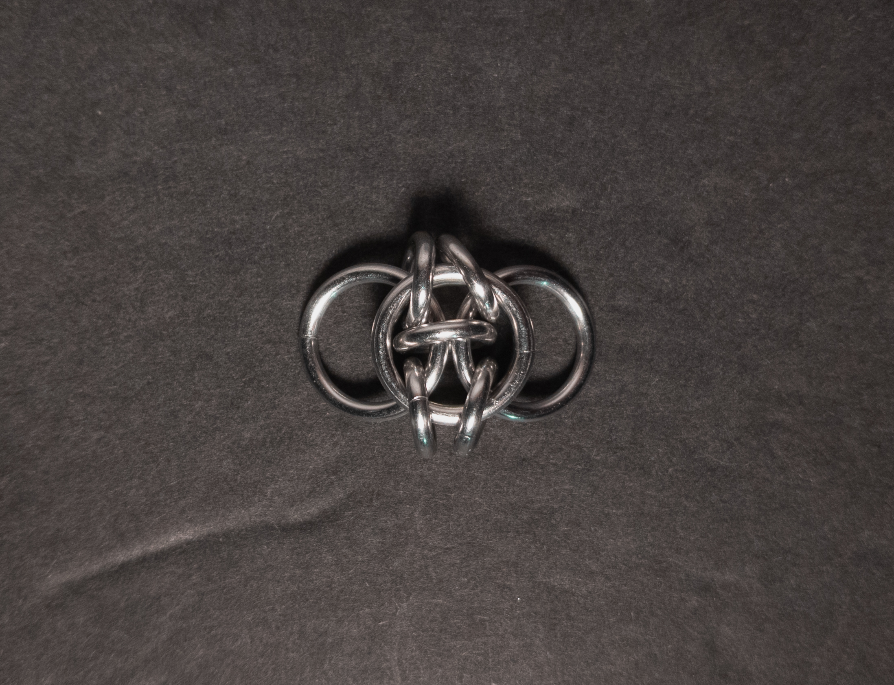
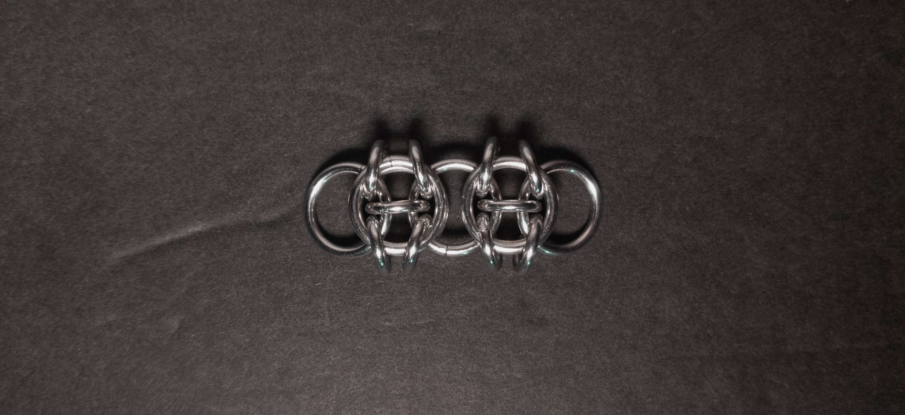
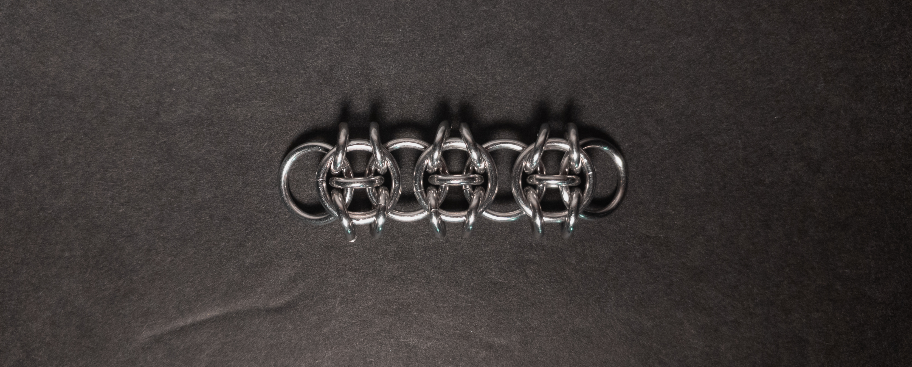
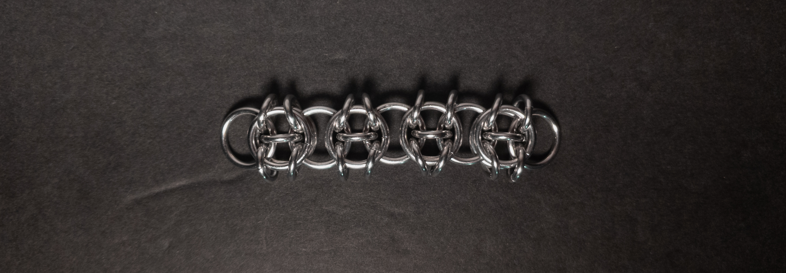

 posted: 2024-08-11 

## Celtic Visions

### Overview

While checking out [M.A.I.L.](https://www.mailleartisans.org/) I came across [Celtic Visions](https://www.mailleartisans.org/weaves/weavedisplay.php?key=244) by [Dragorlad](https://www.mailleartisans.org/members/memberdisplay.php?key=742). Celtic Visions is a visually yet simple stunning variant of [Helm Chain](helm_chain.md) that adds some nice sharpness. If you want to make this weave yourself, I recommend this helpful [tutorial](https://artofmakingthings.com/articles/celtic-visions-weave-tutorial) by [Simon Livingston](https://artofmakingthings.com/author/p9cnoqm5).

### Materials

For the sample piece showcased in this post, I used two sizes of rings made by hand(bonus post coming soon) from 16 SWG Bright Aluminum wire purchased from [The Ring Lord](https://theringlord.com/). The smaller rings have an ID(Inner Diameter) of 5mm for an AR(Aspect Ratio) of 3.1. The larger rings have an ID of 9mm for an AR of 5.5.

### Notes

The Celtic Visions weave is relatively simple to understand and create. In my opinion, it looks stunningly beautiful. The sample shown in the images below uses rings with an Aspect Ratio (AR) difference of 2.4, while the optimal difference would be 2, which would lock the small ring in the big ring more securely, leaving room for improvement. Since the weave is flat and broad, it is a perfect base for bracelets, chokers, or strapping. Given that it is easy to learn and create, in addition to being aesthetically pleasing, I highly recommend learning how to make this weave.

### Pictures

#### Flat

#### Flat: Profile

#### Flat: Angled

#### Vertical

#### Vertical: Profile

#### In Process

 

 

 

