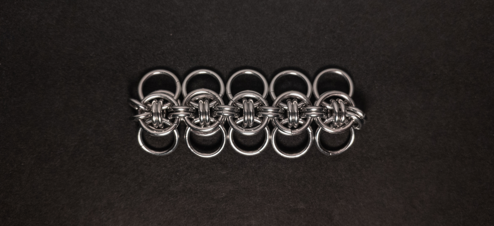
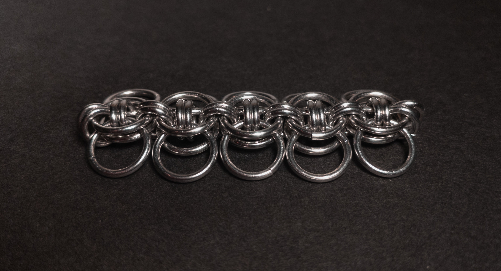
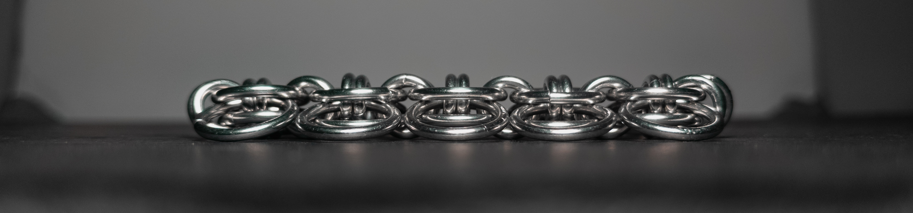
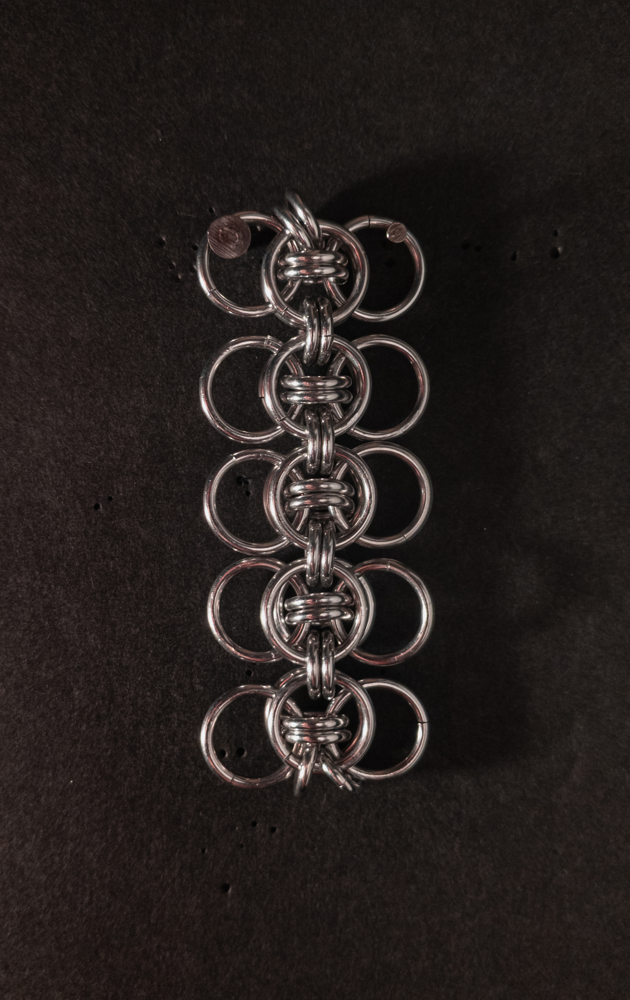
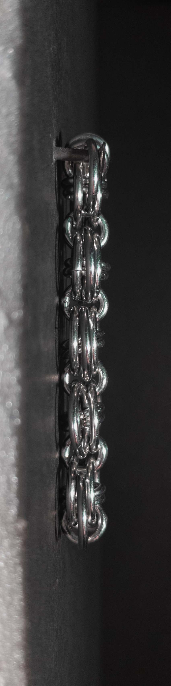
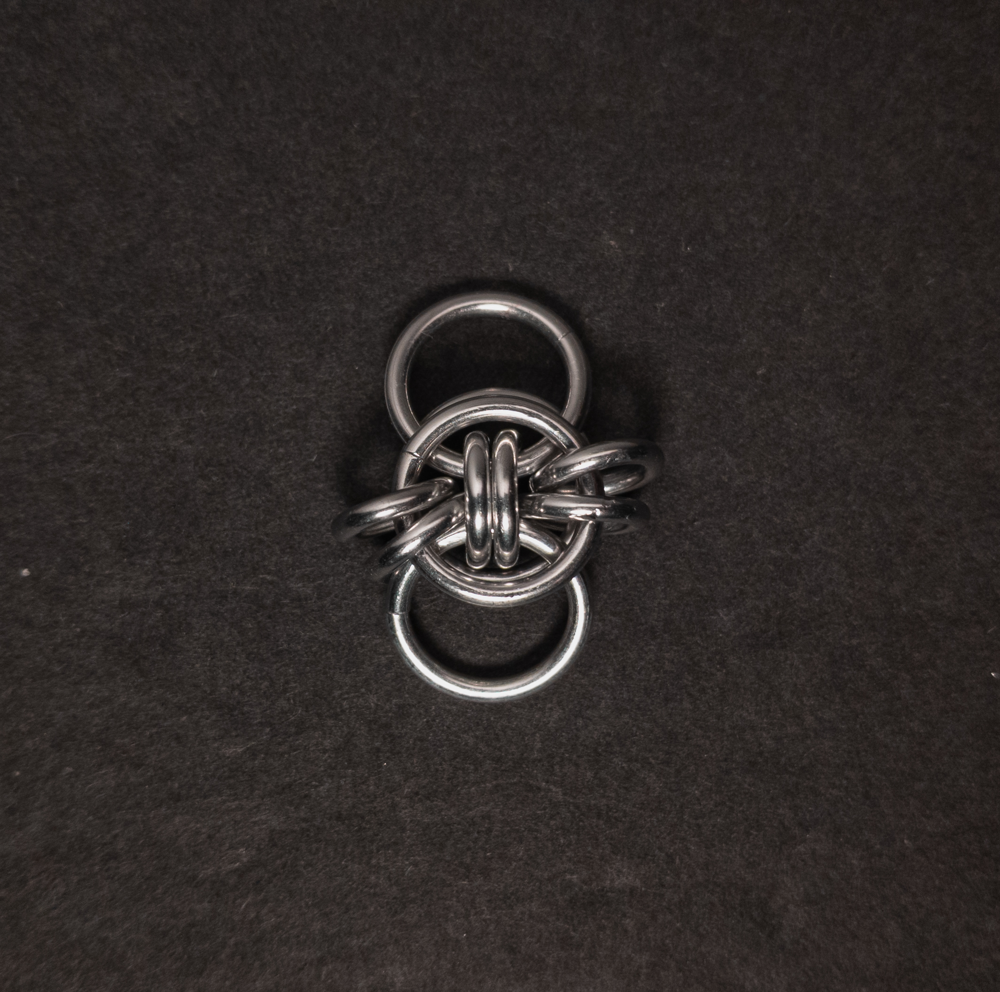
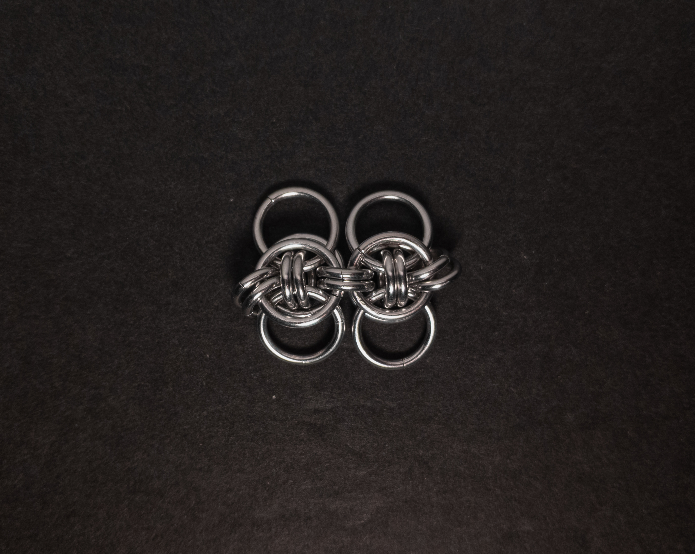
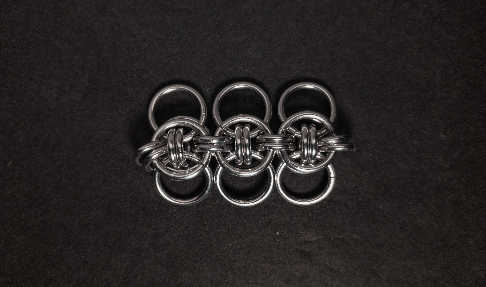
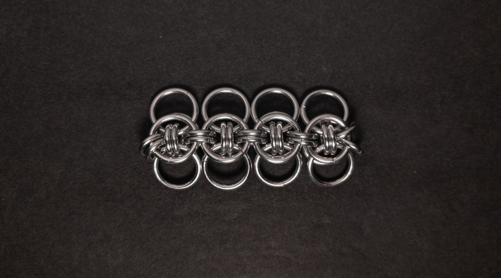

 posted: 2024-09-08 

## Celtic Wings

### Overview

While searching for weaves to make, I came across [Celtic Wings](https://www.mailleartisans.org/weaves/weavedisplay.php?key=1263) by [Ironband](https://www.mailleartisans.org/members/memberdisplay.php?key=351) on [M.A.I.L.](https://www.mailleartisans.org/). Celtic Wings is a modification of [Celtic Visions](celtic_visions.md) and a member of the [Helm Chain](helm_chain.md) family. Celtic Wings is made from the same underlying units as Celtic Visions, just rotated 180 degrees before joining. If you want to try making it yourself, this [tutorial](https://www.mailleartisans.org/articles/articledisplay.php?key=688) by [Catweazle](https://www.mailleartisans.org/members/memberdisplay.php?key=10314) was helpful to me.

### Materials

For the sample piece showcased in this post, I used two sizes of rings made by hand(bonus post coming soon) from 16 SWG Bright Aluminum wire purchased from [The Ring Lord](https://theringlord.com/). The smaller rings have an ID(Inner Diameter) of 5mm for an AR(Aspect Ratio) of 3.1. The larger rings have an ID of 9mm for an AR of 5.5.

### Notes

The Celtic Wings weave is easy to understand and make. In my opinion, it looks captivating. The sample I made is quite stiff, which can limit some use cases; however, making the rings that join each section slightly larger addresses that. With its flat and broad cross-section, chokers, bracelets, and straps are great uses for the weave. Given its ease of creation, attractive appearance, and practical applications, I highly suggest learning how to make this weave.

### Pictures

#### Flat

#### Flat: Angled

#### Flat: Profile

#### Vertical

#### Vertical: Profile

#### In Process

 

 

 

