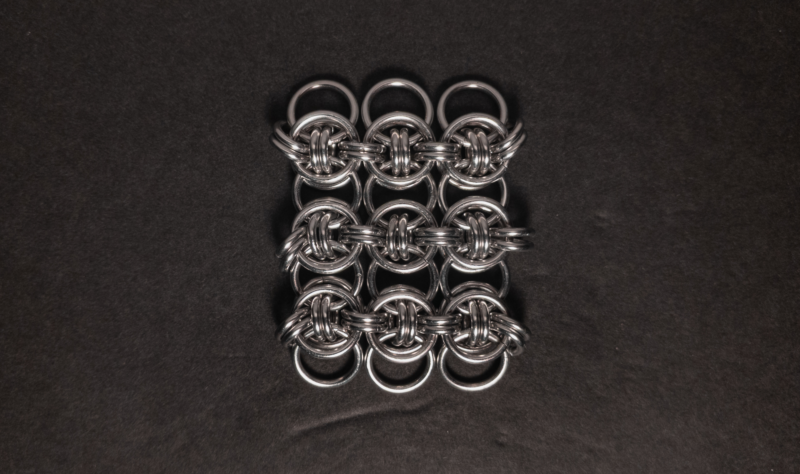
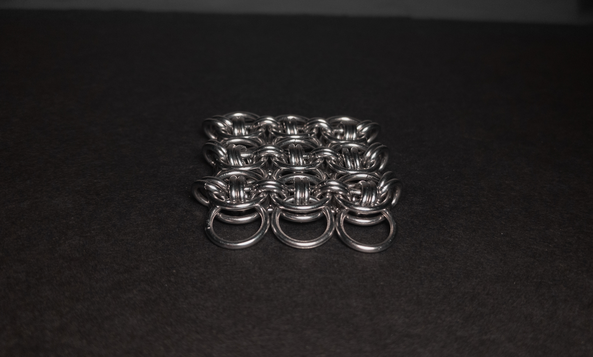
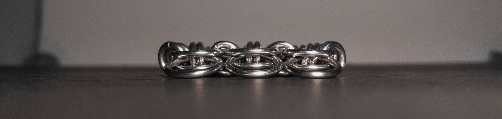
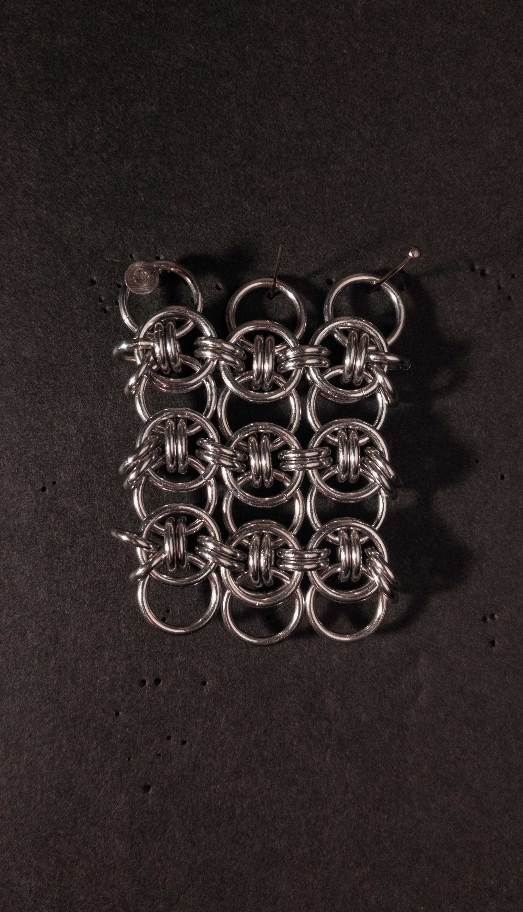
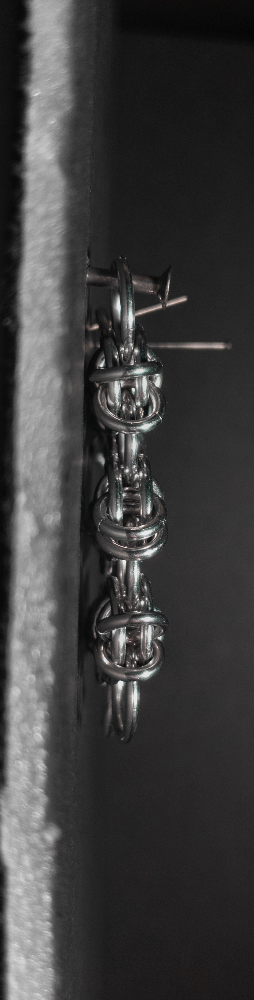
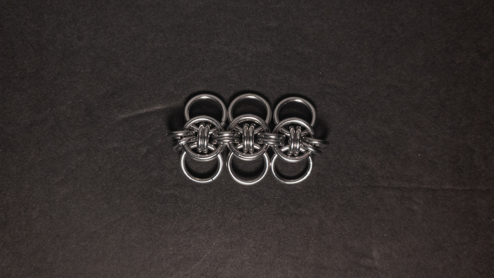
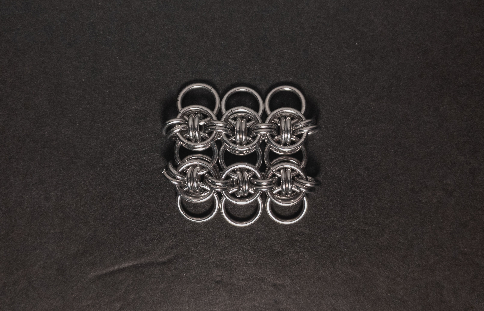

 posted: 2024-10-13 

## Celtic Wings Sheet

### Overview

While looking through [M.A.I.L](https://www.mailleartisans.org/) for new weaves to try, I came across [Celtic Wings Sheet](https://www.mailleartisans.org/weaves/weavedisplay.php?key=1264), attributed as a historical weave. This fellow member of the Helm family is the sheet version of [Celtic Wings](celtic_wings.md), made by stacking chains and using the rings perpendicular to the length of the chain in multiple chains to link them together. If you are looking for a tutorial to follow at home, I recommend this [tutorial](https://www.mailleartisans.org/articles/articledisplay.php?key=688) by [Catweazle](https://www.mailleartisans.org/members/memberdisplay.php?key=10314).

### Materials

For the sample piece showcased in this post, I used two sizes of rings made by hand(bonus post coming soon) from 16 SWG Bright Aluminum wire purchased from [The Ring Lord](https://theringlord.com/). The smaller rings have an ID(Inner Diameter) of 5mm for an AR(Aspect Ratio) of 3.1. The larger rings have an ID of 9mm for an AR of 5.5.

### Notes

The weave is not very hard to understand and is fairly easy to create. The main challenge is adding the second closing ring in step 6, as it can be tight depending on your ring sizing. I find the weave to be quite aesthetically pleasing. As a sheet weave, you can make bracelets, chokers, strapping, or even fabric from it. The weave can be stiff with some ring sizes, which may limit its usefulness. Due to the potential stiffness, I  highly recommend making a test patch before ramping up a project. I recommend learning how to make this weave due to its attractive appearance, minimal creation difficulty, and numerous potential applications.

### Pictures

#### Flat

#### Flat: Angled

#### Flat: Profile

#### Vertical

#### Vertical: Profile

#### In Process

 

