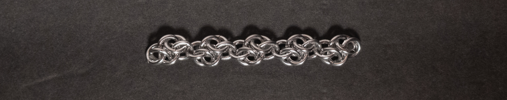
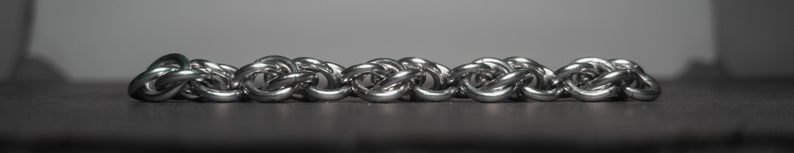
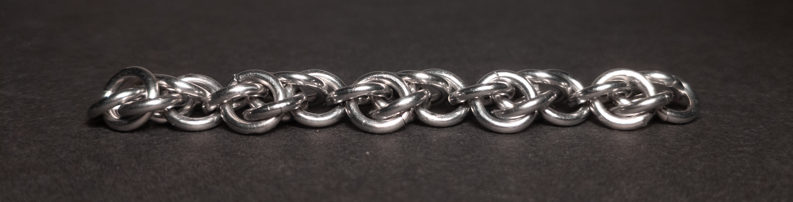
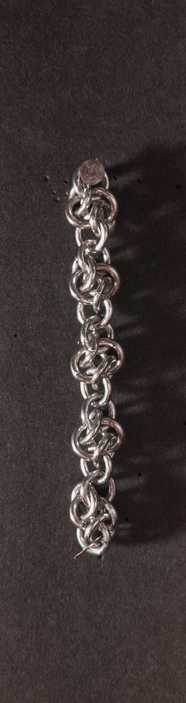
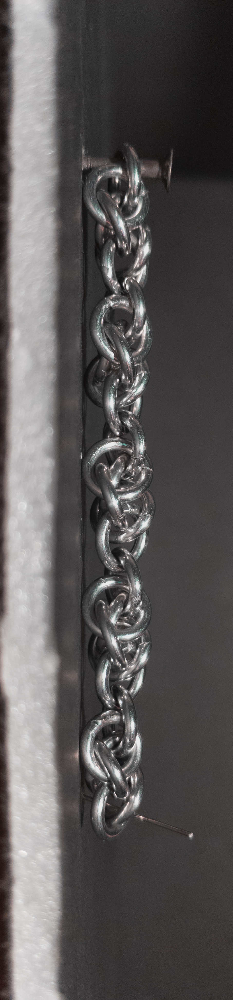
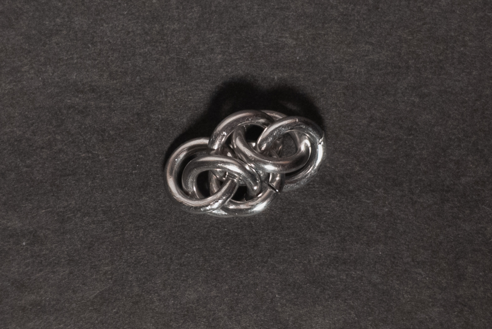
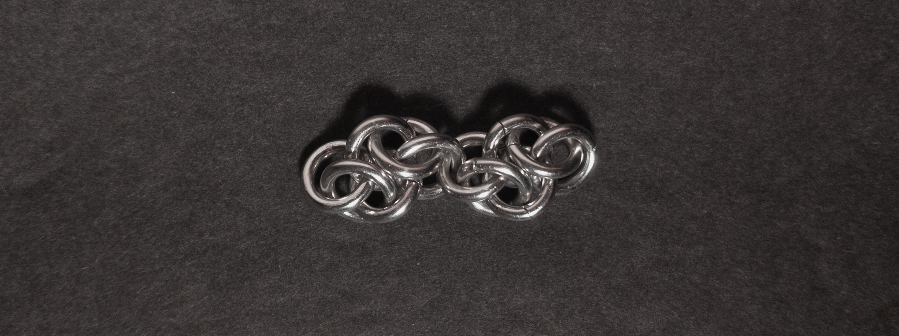
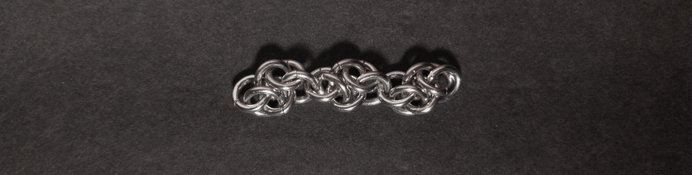
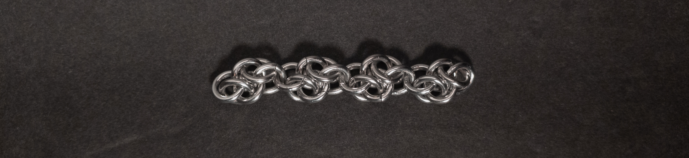

 posted: 2024-06-30 

## Cloud Cover

### Overview

On a recent browse though [M.A.I.L.](https://www.mailleartisans.org/) I came across [Cloud Cover](https://www.mailleartisans.org/weaves/weavedisplay.php?key=982) by [chainge_maker](https://www.mailleartisans.org/members/memberdisplay.php?key=13268). Cloud Cover is a fairly basic weave in the [Rhino](rhinos_snorting_drano.md) family. If you want to make it yourself, I recommend this [tutorial](https://www.mailleartisans.org/articles/articledisplay.php?key=583) by [lorraine](https://www.mailleartisans.org/members/memberdisplay.php?key=9915).

### Materials

For the sample piece showcased in this post, I made the rings myself (bonus post coming soon if you are interested). I used 16 SWG Bright Aluminum wire from [The Ring Lord](https://theringlord.com/) coiled around a 5mm mandrel for an approximate aspect ratio of 3.1.

### Notes

The Cloud Cover weave can be tricky to understand and create, primarily due to the difficulty of adding rings to the 1-1-1-1 chain (steps 5-6). I find that the weave looks decent, neither bad nor great. As a chain weave, it is well suited for use in bracelets, necklaces, chokers, or as cord. Given its complexity of creating and understanding, along with its mediocre aesthetics, I don't recommend learning to make it unless it fits your aesthetic sense or you have a specific plan requiring it.

### Pictures

#### Flat

#### Flat: Profile

#### Flat: Angled

#### Vertical

#### Vertical: Profile

#### In Process

 

 

 

