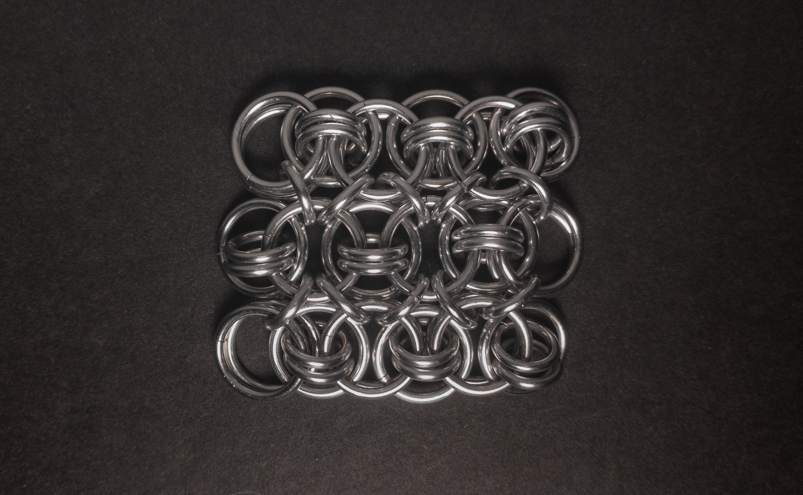
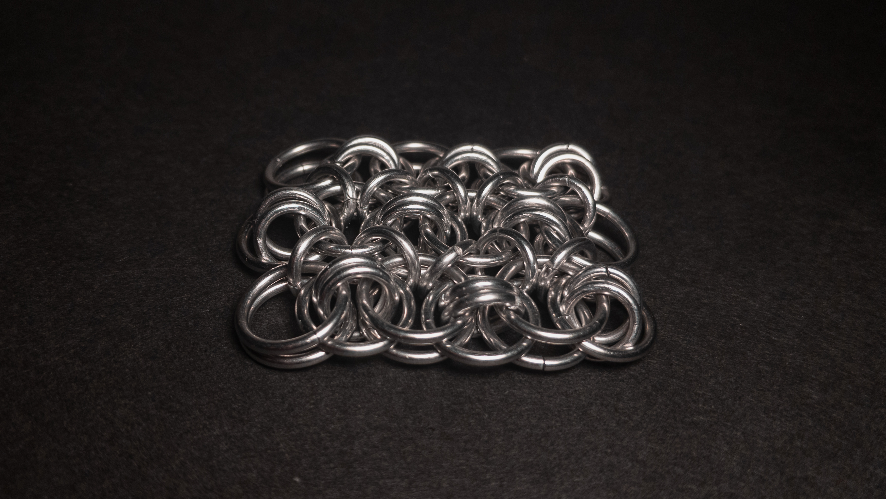
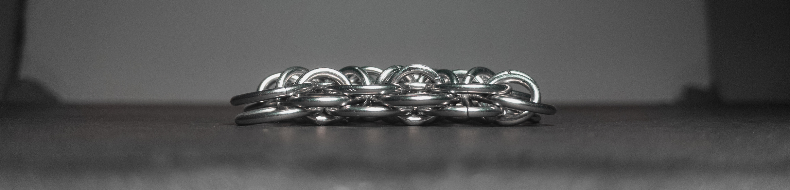
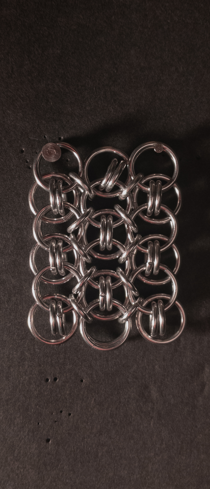
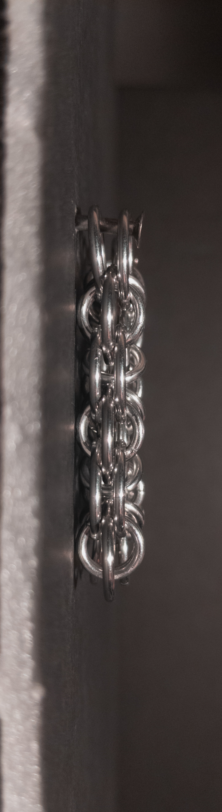
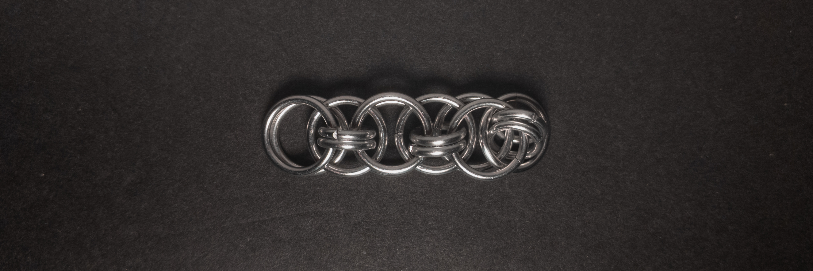
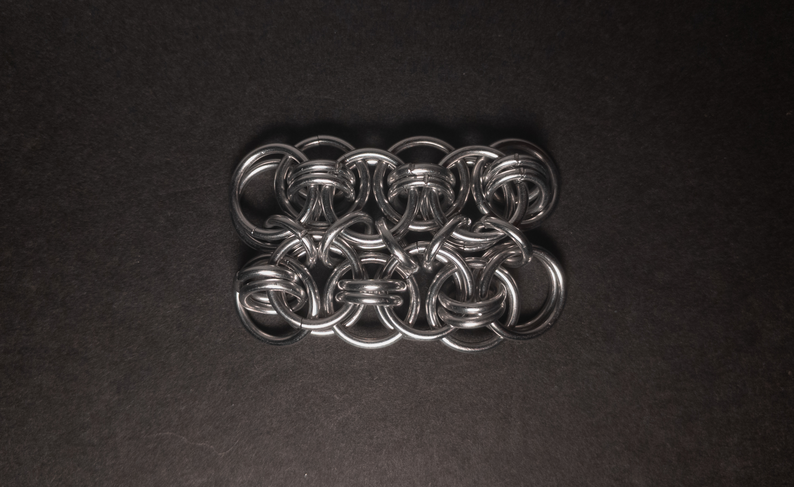

 posted: 2024-04-07 

## Conundrum

### Overview

While trawling through [M.A.I.L.](https://www.mailleartisans.org/) for new weaves to try, I came across [Conundrum](https://www.mailleartisans.org/weaves/weavedisplay.php?key=358) by [Criterion](https://www.mailleartisans.org/members/memberdisplay.php?key=1493). Conundrum is a sheet variant of [Helm Chain](helm_chain.md), made by bolting multiple strands of Helm Chain together. I suggest following this [tutorial](https://www.mailleartisans.org/articles/articledisplay.php?key=476) by [MaxumX](https://www.mailleartisans.org/members/memberdisplay.php?key=949), if you wish to make the weave yourself.

### Materials

For the sample piece showcased in this post, I used two sizes of rings made from 16 SWG Bright Aluminum wire. The larger rings, which I made myself(bonus post coming soon), have an ID(Inner Diameter) of 10mm for an AR(Aspect Ratio) of 6.15. The smaller rings have an ID of .25in for an AR of 4, purchased from [The Ring Lord](https://theringlord.com/).

### Notes

The Conundrum weave is not very complex to understand and is not too difficult to create if the rings are appropriately sized. I find the weave's appearance to be moderately aesthetically pleasing. As a sheet weave, it can be used in many ways, from simple bracelets and necklaces to entire garments or as fabric. You can modify the flexibility and stiffness of the weave by changing the sizes of the rings used to make the weave. If you plan to make it yourself, I suggest leaving time to make samples to achieve your desired flexibility, ensuring your samples are three chains tall and each chain three units long to get a proper sense of how the final sheet will be. If you like the look of the weave and have a variety of ring sizes available, I suggest learning how to make it as it looks nice, has many uses, and is not too complex to create.

### Pictures

#### Flat

#### Flat: Angled

#### Flat: Profile

#### Vertical

#### Vertical: Profile

#### In Process

 

