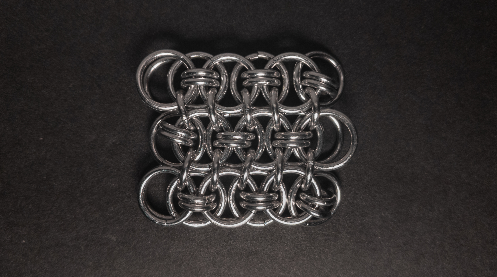
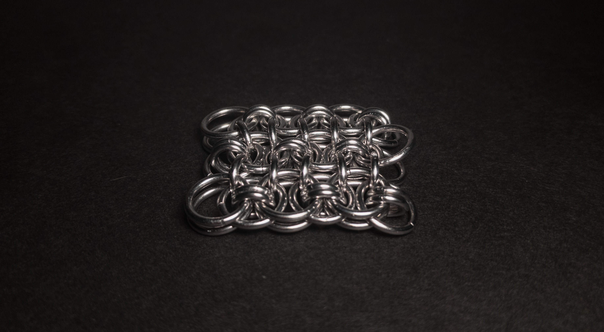
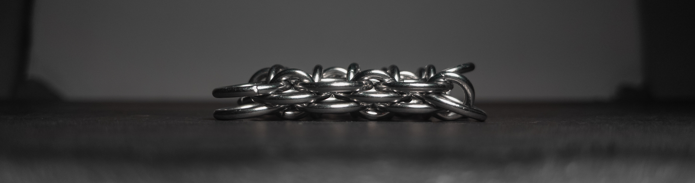
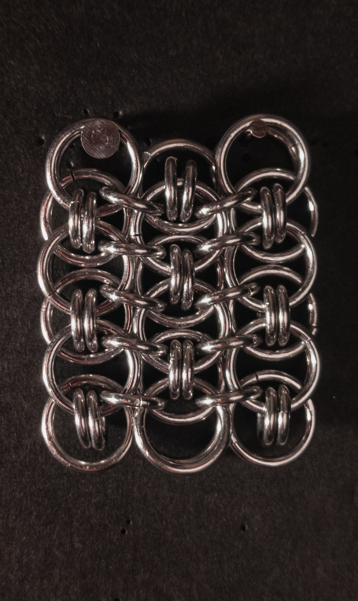
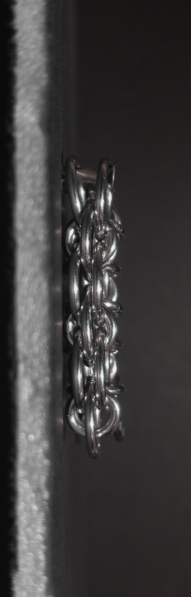
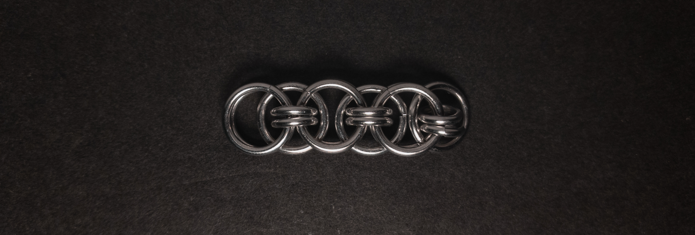
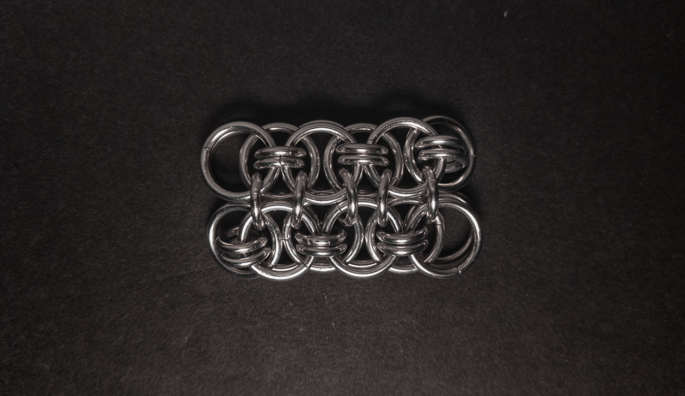

 posted: 2024-08-25 

## Conundrum 2

### Overview

While searching through [M.A.I.L.](https://www.mailleartisans.org/) for new weaves to try, I found [Conundrum 2](https://www.mailleartisans.org/weaves/weavedisplay.php?key=359) by [Criterion](https://www.mailleartisans.org/members/memberdisplay.php?key=1493). Conundrum 2 is another sheet variant of [Helm Chain](helm_chain.md) created by bolting individual strands together. If you want to make it yourself, I suggest following this helpful [tutorial](https://www.mailleartisans.org/articles/articledisplay.php?key=476) by [MaxumX](https://www.mailleartisans.org/members/memberdisplay.php?key=949).

### Materials

For the sample piece showcased in this post, I used three sizes of rings made by hand(bonus post coming soon) from 16 SWG Bright Aluminum wire purchased from [The Ring Lord](https://theringlord.com/). The smallest rings have an ID(Inner Diameter) of 5mm for an AR(Aspect Ratio) of 3.1. The medium rings have an ID of 6mm for and AR of 3.7. The largest rings have an ID of 9mm for an AR of 5.5.

### Notes

The Conundrum 2 weave is not very complex to understand and is not too hard to create as long as your rings are an appropriate size. I find the weave to be moderately aesthetically appealing. As a sheet weave, you can use it in many applications, from chokers and bracelets to clothing or fabric. If you want to make the weave yourself, I recommend budgeting time to make a few test samples to fine-tune the stiffness of the weave. A test sample should be at least three chains of at least three units; otherwise, it may not represent the final product. I suggest learning this weave as it is versatile, simple to create and understand, and looks decent.

### Pictures

#### Flat

#### Flat: Angled

#### Flat: Profile

#### Vertical

#### Vertical: Profile

#### In Process

 

