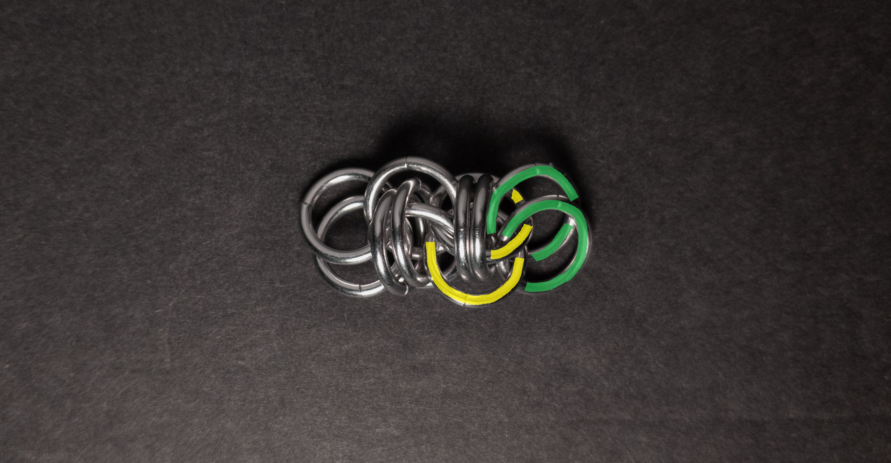

 posted: 2023-12-31 

## Crow Chain

### Overview

While checking [M.A.I.L.](https://www.mailleartisans.org/) for new weaves to try, I came across [Crow Chain](https://www.mailleartisans.org/weaves/weavedisplay.php?key=746) by [Silver Crow](https://www.mailleartisans.org/members/memberdisplay.php?key=10019) and decided to make it myself. Crow Chain is a member of the [Rhino](rhinos_snorting_drano.md) family. Since no tutorial was available, I created and included a tutorial.

### Materials

For the sample piece showcased in this post, I made the rings myself (bonus post coming soon if you are interested). I used 16 SWG Bright Aluminum wire from [The Ring Lord](https://theringlord.com/) coiled around an 8mm mandrel for an approximate aspect ratio of 4.9.

### Tutorial

1. Start with a 2-2-2 chain as shown below:

    

2. Add 2 new rings(green in the image below) around the eye formed by the center 2 rings from step 1(yellow in the image below). When done, it should look something like this:

    

3. Add 2 new rings(green in the image below) around the eye formed by the rightmost 2 rings from step 1(yellow in the image below). When done, it should look something like this:

    

4. Add 2 new rings(green in the image below) through the eye of the rightmost 2 rings from step 1(yellow in the image below). When done, it should look something like this:

    

5. Repeat steps 3-4, targeting the rings added in the previous step 4 until you are happy with the length of your chain.

### Notes

The Crow Chain weave is characterized by its simplicity in understanding and creation. While the weave possesses an appealing look, it's worth noting that the rings around the eye may not always align perfectly perpendicular to the other rings. Attention to detail in maintaining the orientation of rings during the creation process, especially when forming eyes, is essential. With a square cross-section, the weave proves versatile, making it suitable for various applications such as bracelets, necklaces, chokers, or even as a cord. Given its fun name and ease of crafting, I recommend learning how to make the Crow Chain weave.

### Pictures

#### Vertical

#### Vertical: Profile

#### Flat

#### Flat: Profile

#### In Process

 

 

 

