 posted: 2023-12-24 

## Dolphin

### Overview

I found [Dolphin](https://www.mailleartisans.org/weaves/weavedisplay.php?key=1413) by [Snjezna](https://www.mailleartisans.org/members/memberdisplay.php?key=26945) on [M.A.I.L.](https://www.mailleartisans.org/) and decided to try making it. Dolphin is an interesting weave in the same family as [Barrel Weave](barrel_weave.md). Sadly, I could not find any tutorials, so I have included one for those who want to try it themselves.

### Materials

For the sample piece showcased in this post, I used Bright Aluminum rings purchased from [The Ring Lord](https://theringlord.com/). The rings are 16 SWG with a 1/4" internal diameter, resulting in an aspect ratio of 4.03.

### Tutorial

1. Start with 2 rings as shown below:

    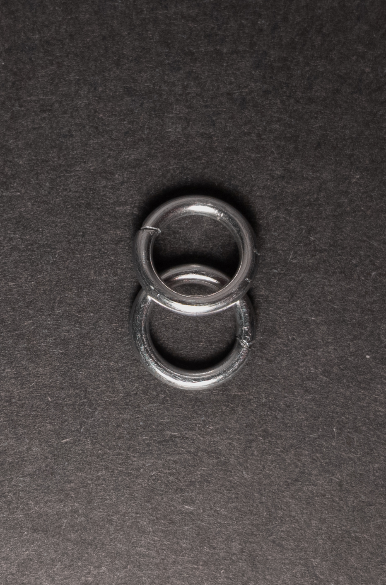

2. Add 2 new rings(green in the image below) through the 2 rings from step 1(blue in the image below). When done, it should look something like this:

    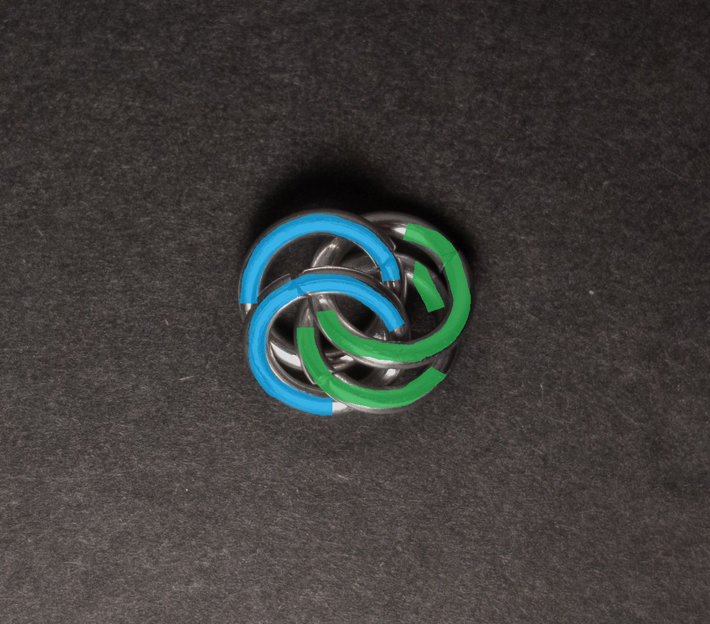

3. Add 2 new rings(green in the image below) through the 2 rings from step 2(blue in the image below). When done, it should look something like this:

    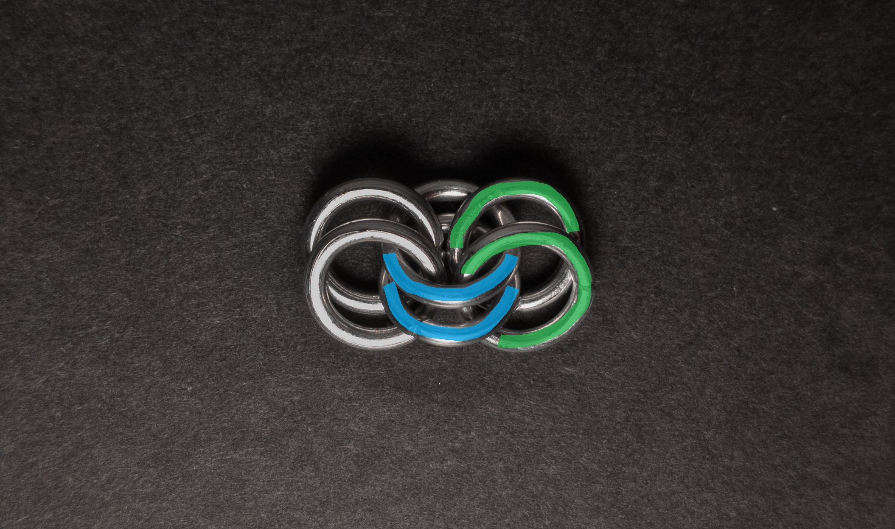

4. Add 1 ring(green in the image below) around the eye formed between the 2 rings from step 3(blue in the image below). This ring should also go through the bottom of the bottom ring of the 2 rings from step 2(yellow in the image below). When done, it should look something like this:

    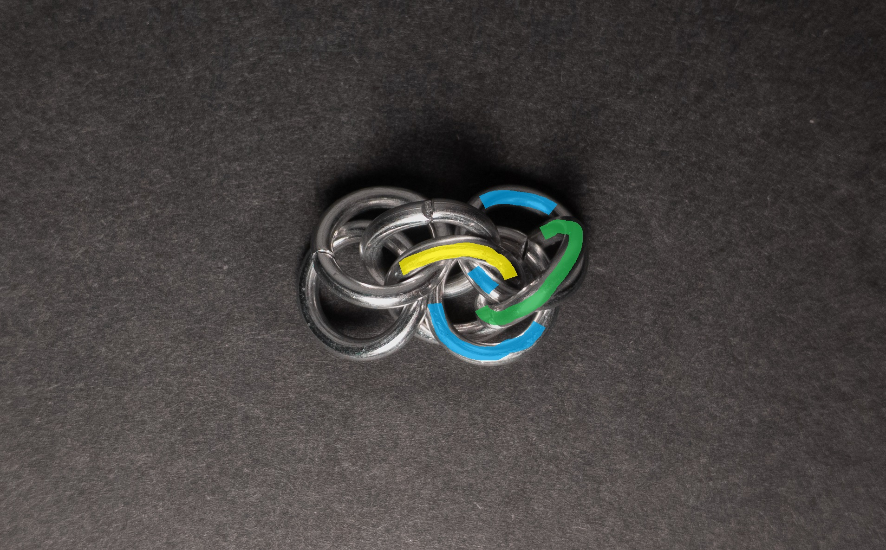

5. Add 2 new rings(green in the image below) through the eye formed by the 2 rings from step 3(yellow in the image below). One ring(green without red dot in the image low) should go through just those rings, while the topmost ring(green with red dot in the image below) should also go through the ring added in step 4. When done, it should look something like this:

    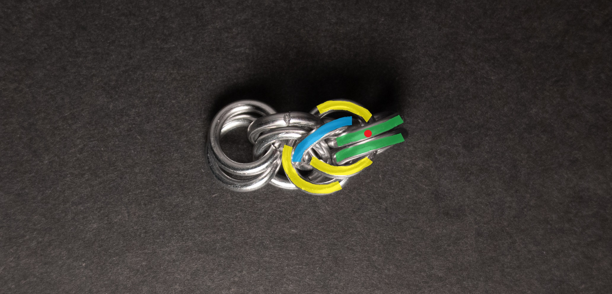

6. Add 2 new rings(green in the image below) though the 2 rings added in step 5(blue in the image below).

    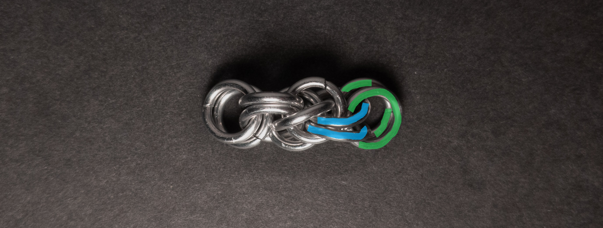

7. Repeat steps 2 through 6 until you are happy with the length of your chain.

### Notes

The Dolphin weave presents a moderate level of complexity, both in understanding its structure and in the creation process, with a notable challenge being the precise placement of the ring around the eye through the rings connecting the units. While the weave tends to twist, you can straighten it, offering flexibility in achieving the desired appearance. Featuring a square cross-section, Dolphin is well-suited for various jewelry applications, including bracelets, necklaces, chokers, and cords. Despite its somewhat complex nature, it is a fun and engaging weave, making it a suitable choice for those who appreciate its aesthetic appeal or beginners looking for a weave to enhance their skills.

### Pictures

#### Flat

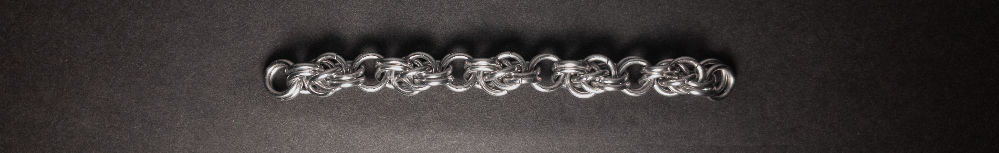

#### Flat: Profile

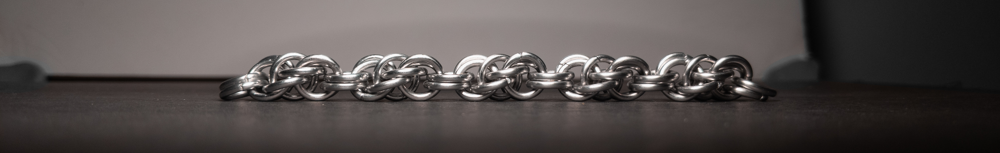

#### Vertical

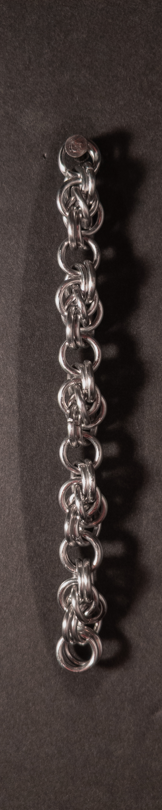

#### Vertical: Profile

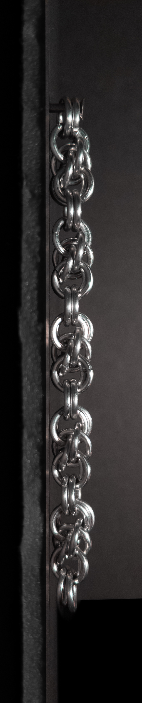

#### In Process

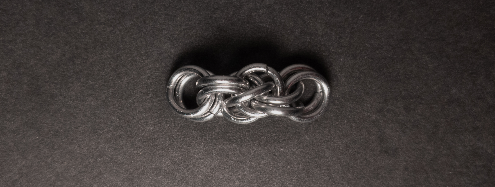

 

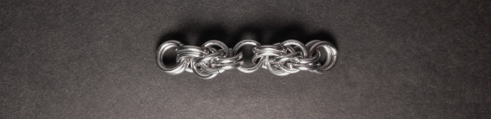

 

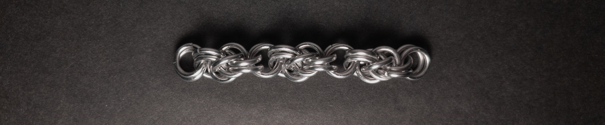

 

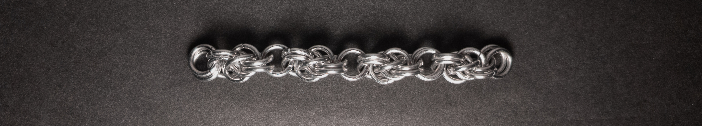
