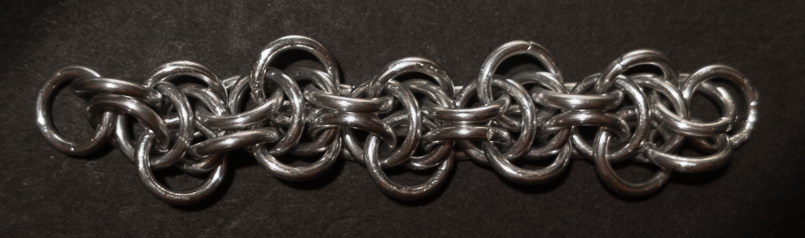
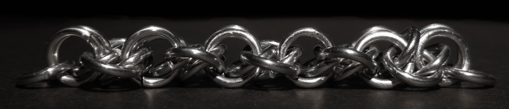
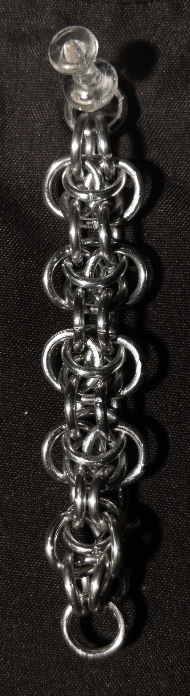
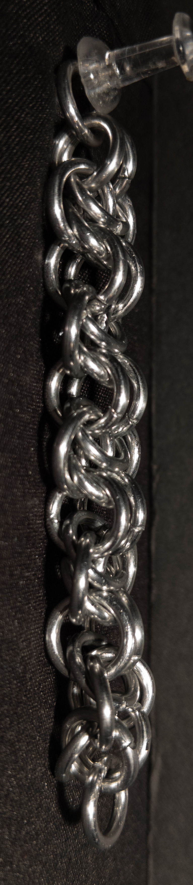
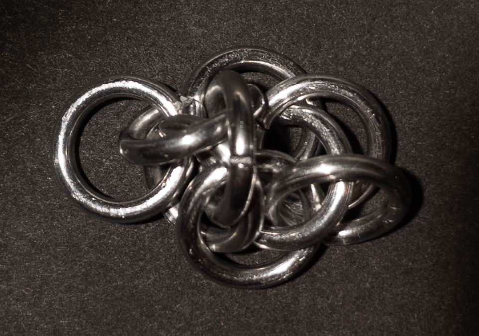
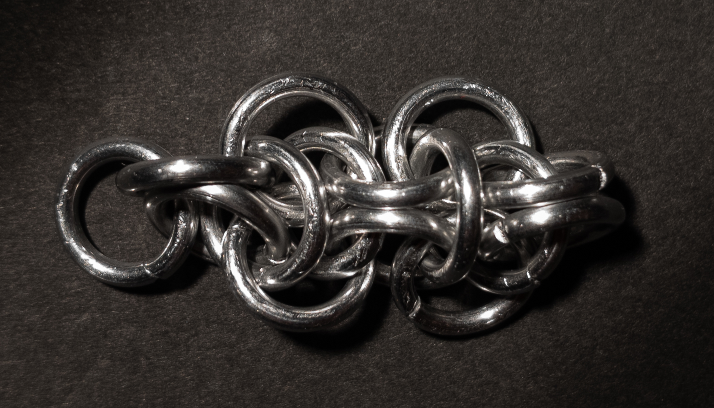
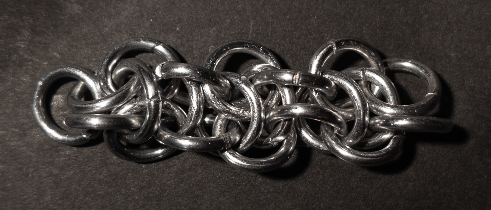
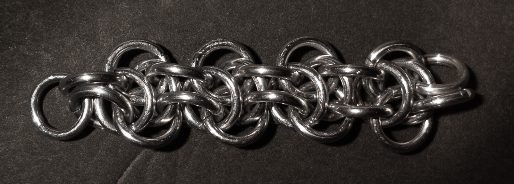

 posted: 2023-05-28 

## Elfin

### Overview

Some time ago, while checking out [M.A.I.L.](https://www.mailleartisans.org/) I found a weave called [Elfin](https://www.mailleartisans.org/weaves/weavedisplay.php?key=695) uploaded by [Corvus](https://www.mailleartisans.org/members/memberdisplay.php?key=4033). Elfin is a variation of [Elfweave](elfweave.md) that manages to be simpler, narrower, and avoid the folding problem, which makes it an interesting weave worth trying out. If you want to do so [this tutorial](https://www.mailleartisans.org/articles/articledisplay.php?key=537) by Corvus is quite good and will help you make it.

### Materials

The rings used for the sample piece shown in this post are 16 SWG with a 1/4" internal diameter for an aspect ratio of 4.03 made of Bright Aluminum that I bought from [The Ring Lord](https://theringlord.com/).

### Notes

The Elfin chainmail weave offers an enjoyable and rewarding learning experience. What sets Elfin apart from other Elfweave variations is that it doesn't require prior knowledge of Elfweave. While it may pose some initial challenges and require time to grasp the pattern, once understood, it becomes a relatively simple weave to execute. One unique aspect of Elfin is its distinctive appearance, which can vary depending on the viewing angle. It is important to note that the weave benefits from applying tension to maintain its visual appeal. Elfin's flexibility makes it particularly suitable for creating bracelets, although its rectangular cross-section may make it awkward if used in necklaces. Overall, I recommend exploring the Elfin chainmail weave for its enjoyable learning experience.

### Pictures

#### Flat

#### Flat: Profile

#### Vertical

#### Vertical: Profile

#### In Process

 

 

 

