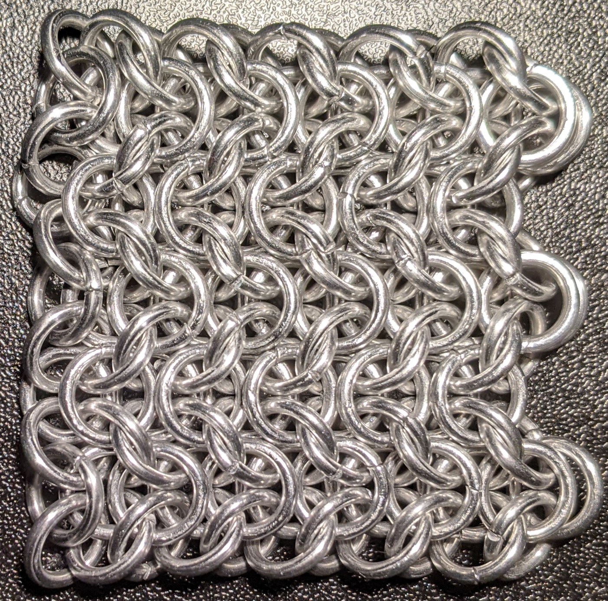
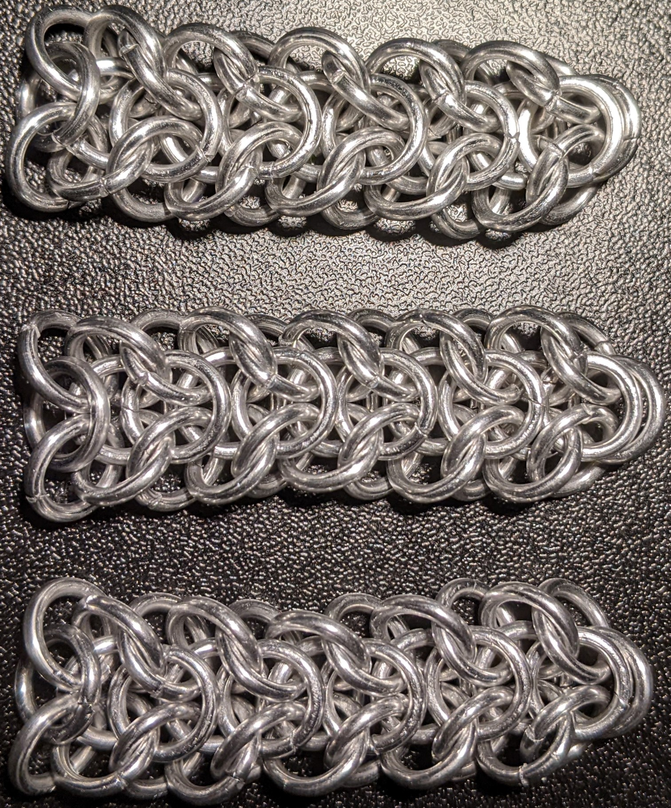
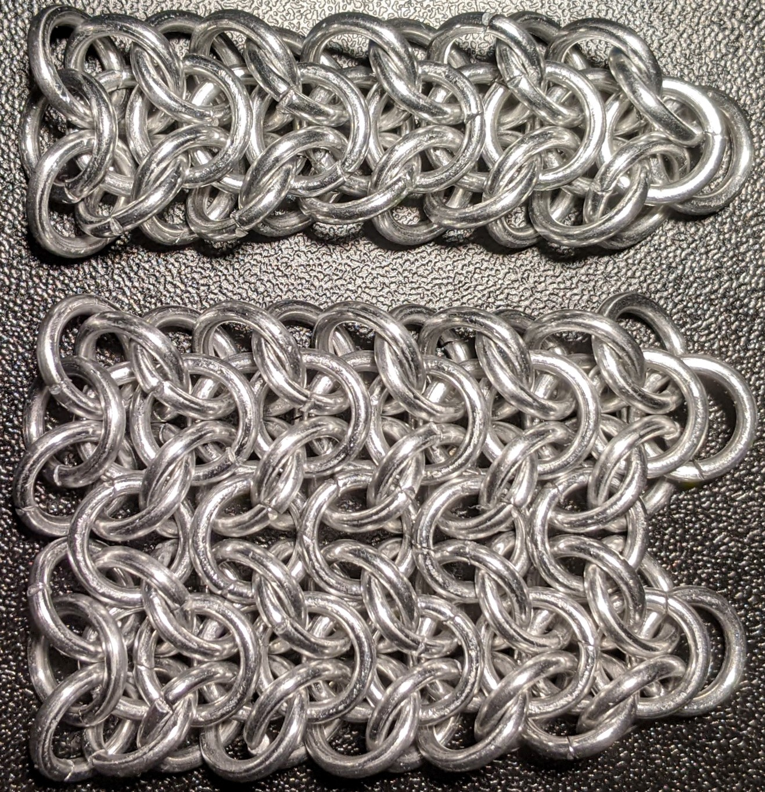
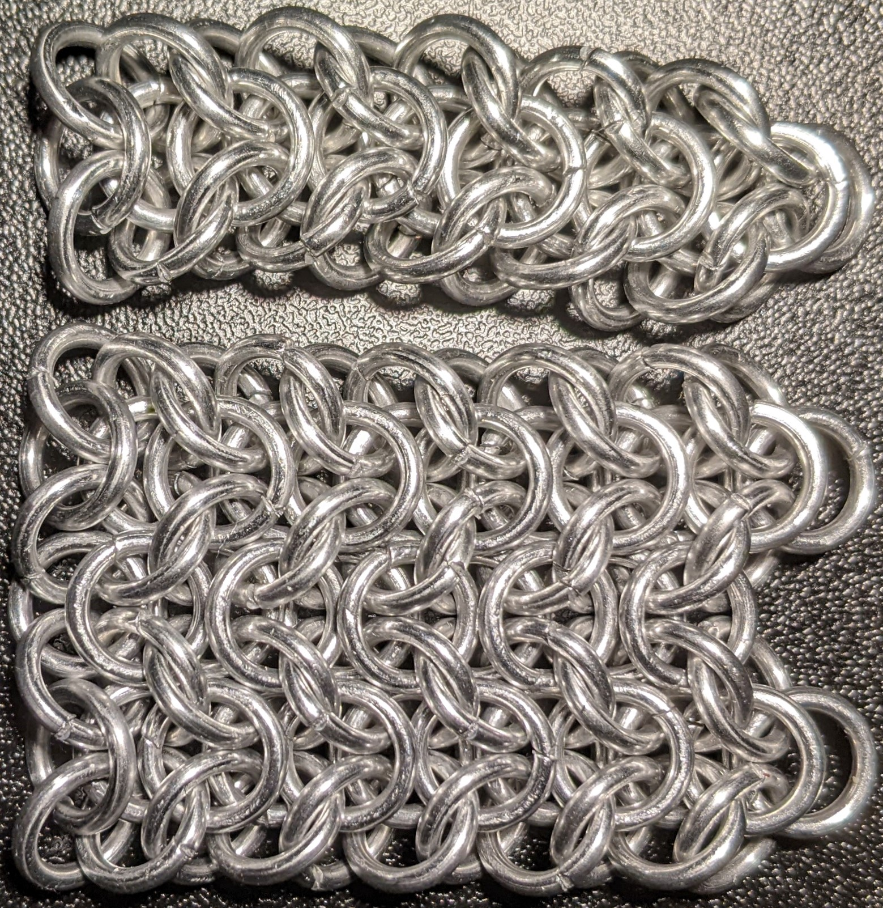
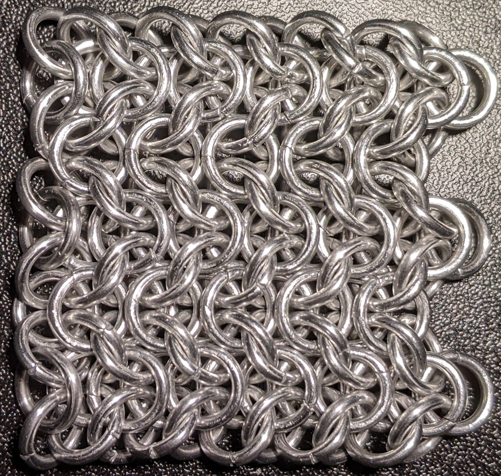

 posted: 2023-05-21 

## Elfsheet

### Overview

After learning how to make [Elfweave](elfweave.md) I wanted to try making its sheeted variant [Elfsheet](https://www.mailleartisans.org/weaves/weavedisplay.php?key=1099) which I found on [M.A.I.L.](https://www.mailleartisans.org/). Thankfully there was a [tutorial](https://www.mailleartisans.org/articles/articledisplay.php?key=268) by [Quizad Saderack](https://www.mailleartisans.org/members/memberdisplay.php?key=2127) which showed me how to make it. It is a nice weave which also fixes Elfweave's folding issue.

### Materials

The rings used for the sample piece shown in this post are 16 SWG with a 1/4" internal diameter for an aspect ratio of 4.03 made of Bright Aluminum that I bought from [The Ring Lord](https://theringlord.com/).

### Notes

Elfsheet is a derivative of Elfweave that is relatively simple to make once you have mastered Elfweave, as the complexity of the weaves comes from making the needed Elfweave chains. Turning the Elfweave chains into Elfsheet is not difficult, making this weave relatively straightforward. However, being able to make it is gatekept by the challenge of making Elfweave. Unfortunately, as Elfsheet requires individual Elfweave chains, you will face instability each time you start a new chain. Thankfully, unlike Elfweave, Elfsheet does not fold in any orientation, as joining the Elfweave chains together locks them into place. 

As a sheet, Elfsheet has a wide variety of uses, such as bracelets, chokers, or clothing; however, it is not as useful for necklaces as it can be too wide.

Though Elfsheet has an ideal AR of 4.2 it can be made with an AR of 4.03, which I used for the samples in the pictures below. I found the individual Elfweave chains fairly easy to make. However, joining the Elfweave chains was difficult due to how tight the rings were. Elfsheet is a great weave which is worth trying out if you have some experience with chainmail weave, despite the challenges of making the Elfweave chains.

### Pictures

#### Flat

#### In Process

 

 

 

