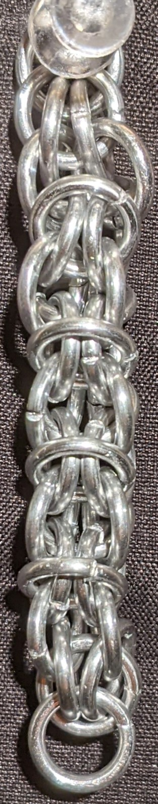
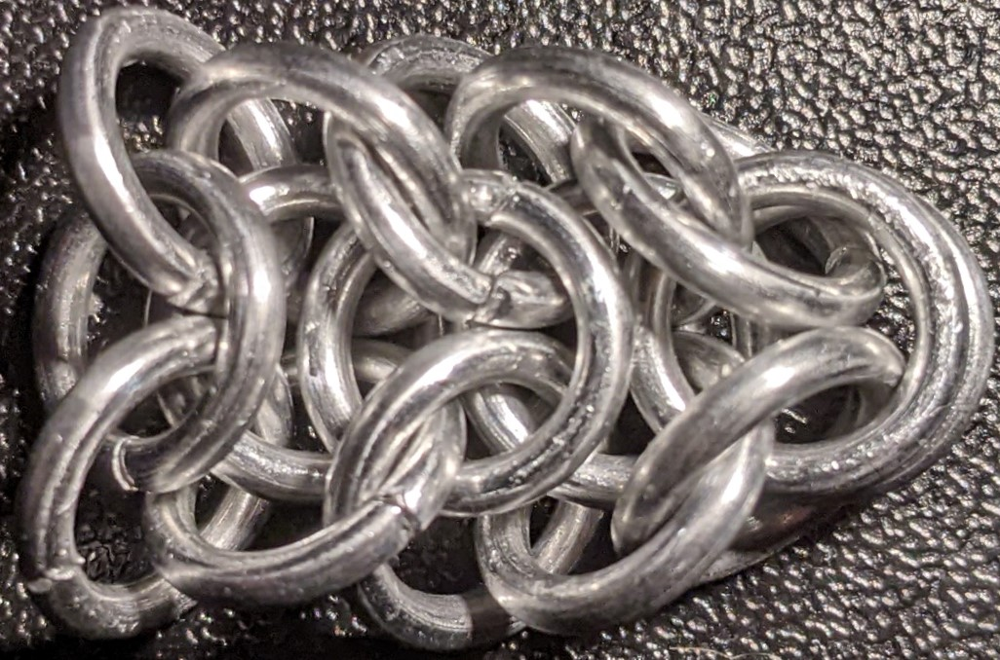

 posted: 2023-05-07 

## Elfweave

### Overview

Quite some time ago, I found the weave [Elfweave](https://www.mailleartisans.org/weaves/weavedisplay.php?key=300) by [Bative](https://www.mailleartisans.org/members/memberdisplay.php?key=349) on [M.A.I.L.](https://www.mailleartisans.org/), and I wanted to try making it. At that time, I found it hard to make and the available tutorials confusing. Now that I have more skill, experience, and a more detailed [tutorial](https://artofmakingthings.com/articles/elfweave-weave-tutorial) by [Simon Livingston](https://artofmakingthings.com/author/p9cnoqm5), I decided to try making it again. Elfweave is worth checking out as it looks appealing and has inspired numerous other weaves.

### Materials

The rings used for the sample piece shown in this post are 16 SWG with a 1/4" internal diameter for an aspect ratio of 4.03 made of Bright Aluminum that I bought from [The Ring Lord](https://theringlord.com/).

### Notes

The Elfweave chainmail weave can be challenging to learn, particularly when starting out. The weave is quite unstable while the first unit is being made. I found holding the weave in place when adding rings for this period helpful. Additionally, when the weave goes vertical it will likely fold up, so it is best used for bracelets or other applications where it would remain flat. The most common way to combat this issue is by making modifications that lock the rings in place to prevent folding. However, once the start and the pattern are understood, the weave becomes much easier to manage. Despite the initial difficulties, Elfweave can produce a nice aesthetic and is worth learning after gaining some experience. It is important to note that this weave is not considered beginner-friendly due to its complexity. Though the rings used in the sample piece in the images have an aspect ratio (AR) of 4.03 compared to the ideal AR of 4.2, the weave was neither too stiff nor too tight. If you're up for a challenge and want to try your hand at Elfweave, don't hesitate to try it yourself!

### Pictures

#### Vertical

#### Vertical: Profile

#### Flat

#### Flat: Profile

#### In Process

 

 

 

