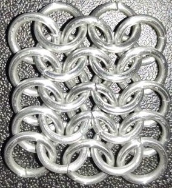

 posted: 2023-02-12 

## The European 4-in-1 Weave: A Versatile Pattern

### Introduction

Recently, I discovered a wonderful [tutorial](https://www.mailleartisans.org/articles/articledisplay.php?key=140) by [laurad](https://www.mailleartisans.org/members/memberdisplay.php?key=843) on [M.A.I.L.](https://www.mailleartisans.org/), the Maille Artisans International League, that guides the creation of the [European 4-in-1](https://www.mailleartisans.org/weaves/weavedisplay.php?key=6) pattern. This weave has a rich history as it was once utilized in the crafting of European chainmail and serves as the foundation for many modern and exciting weaves. The ease of creating this pattern makes it an excellent starting point for those new to chainmail.

### Materials

For the sample piece featured in this post, I used 16 SWG rings with a 1/4" internal diameter and an aspect ratio of 4.03, made of bright aluminum. These rings were obtained from [The Ring Lord](https://theringlord.com/).

### Notes

The European 4-in-1 weave is both simple to construct and expand. It has a fabric-like quality, enabling it to be used in a wide range of projects, making it incredibly versatile. However, it can be labor-intensive and require a significant amount of rings when working with smaller rings. Despite this, the European 4-in-1 weave has a fascinating historical significance, as it was commonly used in European armor during the Middle Ages, and is ideal for creating items such as hauberks and coifs. To sum it up, the European 4-in-1 weave is visually appealing, effortless to make, and flexible, making it a great option for a variety of projects. I strongly recommend giving this weave a try.

### Picture

