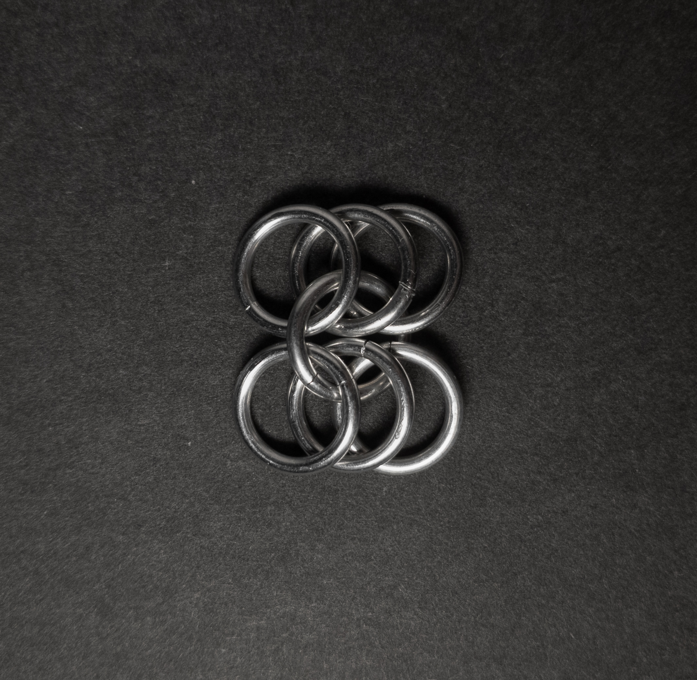

 posted: 2023-10-01 

## European 6-in-1

### Overviewwx

While checking out [M.A.I.L.](https://www.mailleartisans.org/) recently I saw a [tutorial](https://www.mailleartisans.org/articles/articledisplay.php?key=37) by [Aderamelech](https://www.mailleartisans.org/members/memberdisplay.php?key=7) for [European 6-in-1](https://www.mailleartisans.org/weaves/weavedisplay.php?key=7). European 6-in-1 is a simple progression of [European 4-in-1](european_4_in_1.md) that seems more stable and has a denser look. If you want to experiment with a denser version of European 4-in-1 this is the weave for you.

### Materials

For the sample piece showcased in this post, I made the rings myself (bonus post coming soon if you are interested). I used 16 SWG Bright Aluminum wire from [The Ring Lord](https://theringlord.com/) coiled around a 8mm mandrel for an approximate aspect ratio of 4.9.

### Notes

The European 6-in-1 chainmail weave is simple both to understand and create. Its appearance is particularly appealing when laid flat; however, it tends to bunch up when oriented vertically, which is less visually appealing. One of its notable advantages is its versatility; as a sheet weave, it can serve the same purposes as fabric, making it suitable for various applications. This weave is essentially a straightforward modification of the well-established European 4-in-1 weave. Consequently, if you are already familiar with the latter, learning the European 6-in-1 variant should be quick and easy. Given its simplicity and its' status as a foundational weave, I recommend adding it to your repertoire of chainmail weaves to enhance your skills and versatility.

### Pictures

#### Flat

#### Flat: Profile

#### Vertical

#### Vertical: Profile

#### In Process

 

 

 

 

 

 

