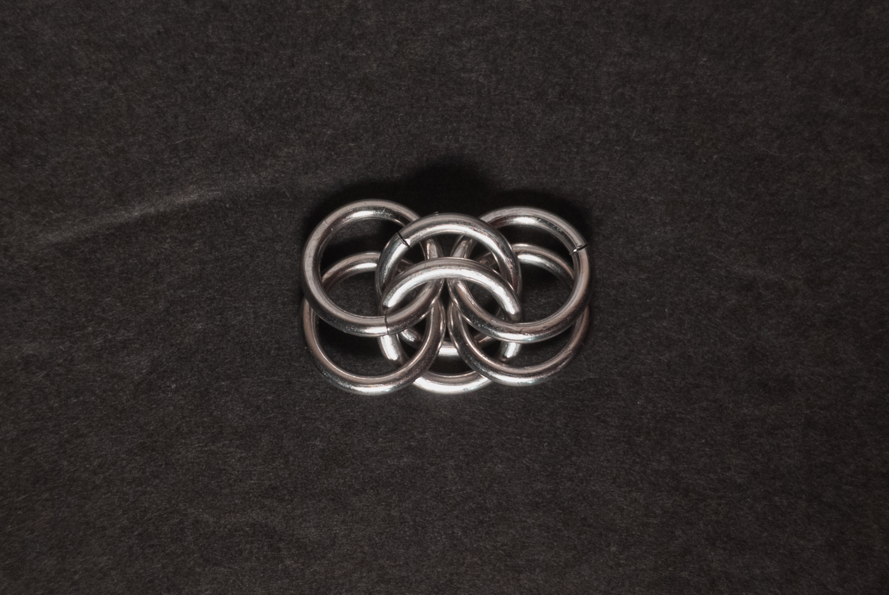
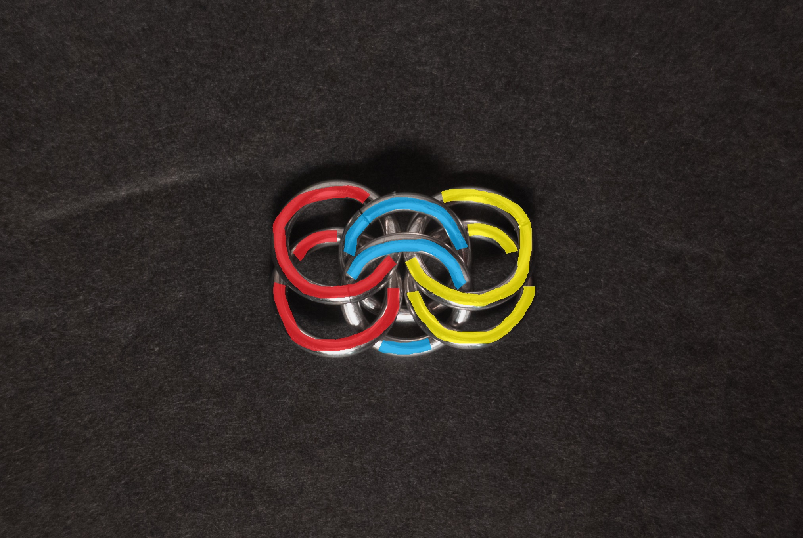
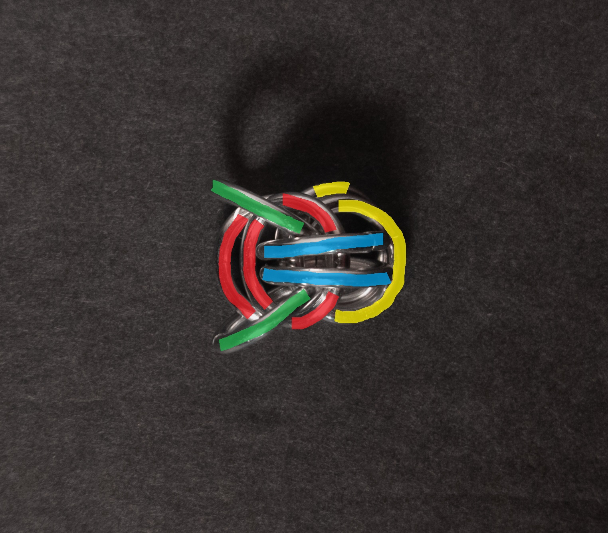
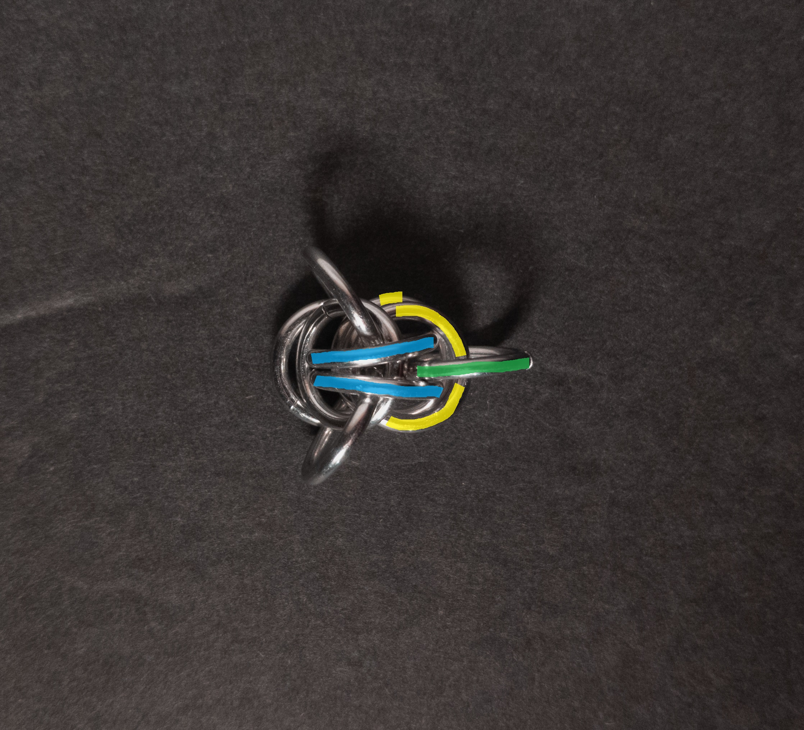
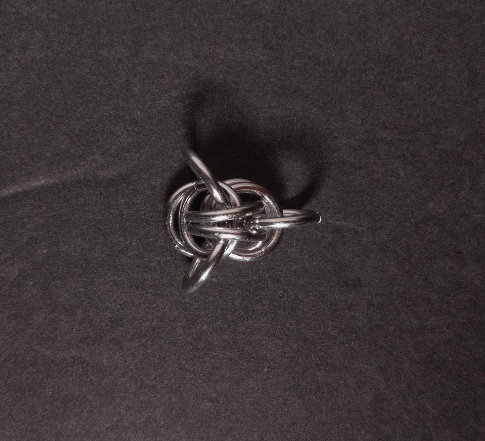
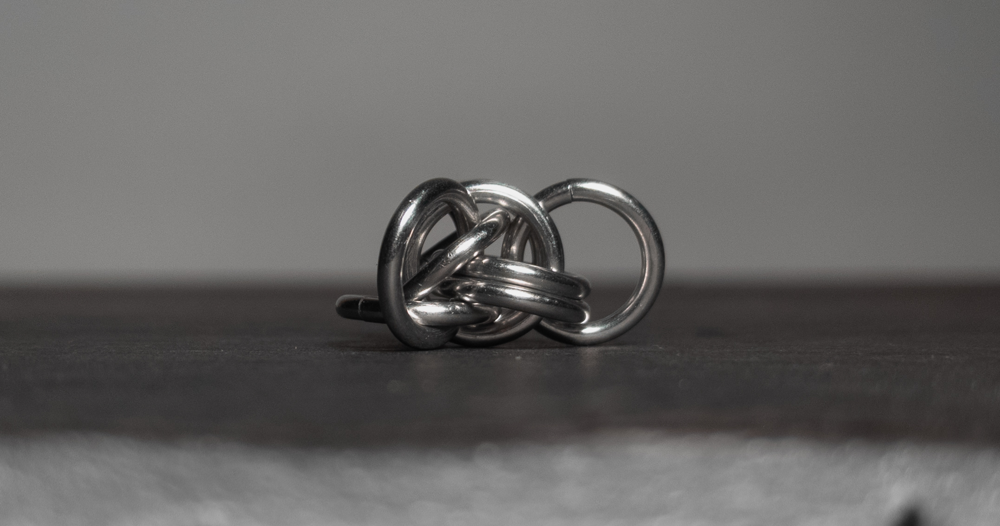
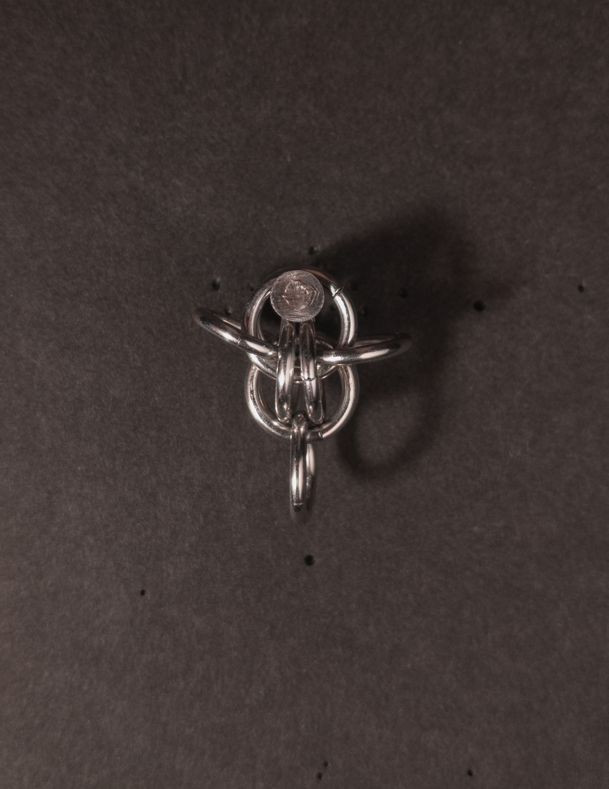
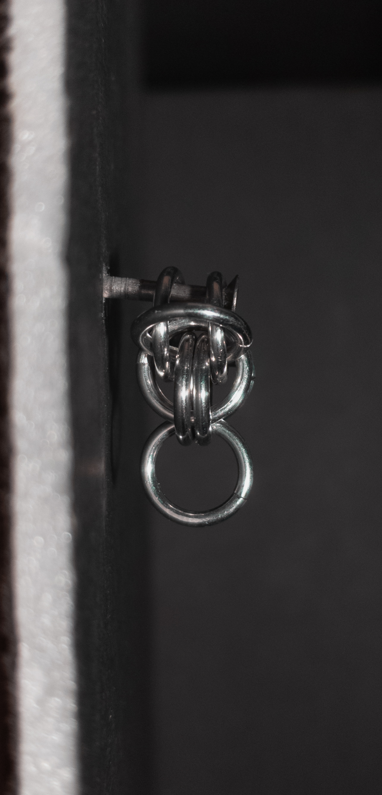

 posted: 2024-07-21 

## Fairy Link

### Overview

While looking over [M.A.I.L.](https://www.mailleartisans.org/) for new weaves to make, I came across [Fairy Link](https://www.mailleartisans.org/weaves/weavedisplay.php?key=773) by [Zxentix](https://www.mailleartisans.org/members/memberdisplay.php?key=9716). Zentix created the Fairy Link Unit while attempting to make [Full Persian 6-in-1](full_persian_6_in_1.md), explaining the similarities in appearance. Unfortunately, I couldn't find any existing tutorials, so I have written one and included it in this post.

### Materials

For the sample piece showcased in this post, I made the rings myself (bonus post coming soon if you are interested). I used 16 SWG Bright Aluminum wire from [The Ring Lord](https://theringlord.com/) coiled around a 7mm mandrel for an approximate aspect ratio of 4.3.

### Tutorial

1. Start with a 2-2-2 chain as shown below:

    

2. Below is a version of the above image colored to assist with the next step:

    

3. Move the first 2 rings from Step 1(red in the images above and below) and the last 2 rings from Step 1(yellow in the images above and below) towards each other so that one of each of the red rings is above the pair of yellow rings and the other red ring is below. Moving the rings like this creates 2 eyes with one on each side of the middle 2 rings from Step 1(blue in the images above and below). Add 2 new rings(green in the image below), one through each eye. When done, it should look something like this:

    

4. Add 1 new ring(green in the image below) to the last 2 rings from Step 1(yellow in the image below) between the middle 2 rings from Step 1(blue in the image below). When done, it should look something like this:

    

### Notes

The Fairy Link weave is quite simple to understand but somewhat complex to create, primarily due to the difficulty of step 3, where the weave can fall apart. The weave looks quite interesting, though the sample I made is a bit too big and loose. It is big and loose because I made it with rings whose Aspect Ratio(AR) was 4.3 compared to the listed ideal AR of 4.0. I did try using rings with an AR of 4.03 (16 SWG with 1/4" Inner Diameter); however, they were too small. Thus, I had to use the next size up of rings I  had (the AR 4.3 rings). As a unit weave, it is made for use in earrings or pendants. When making the weave, I found it helpful to keep it on a flat surface during step 3 to avoid it falling apart. Despite its complexity, the weave looks quite intriguing, so I recommend learning to make it if you have rings with an AR of 4.1 - 4.2.

### Pictures

#### Flat

#### Flat: Profile

#### Vertical

#### Vertical: Profile

