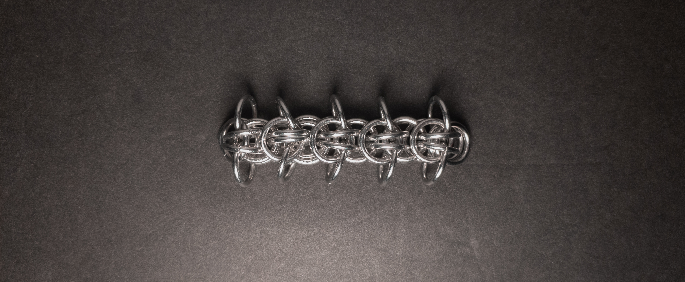
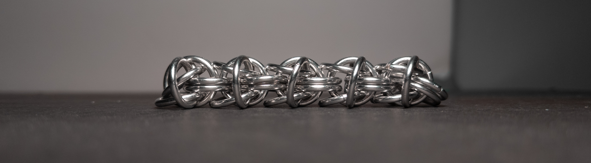
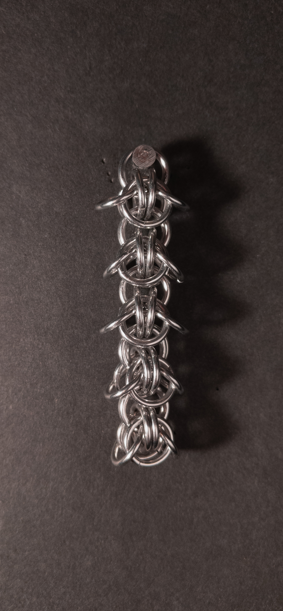
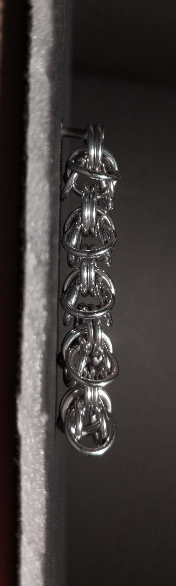
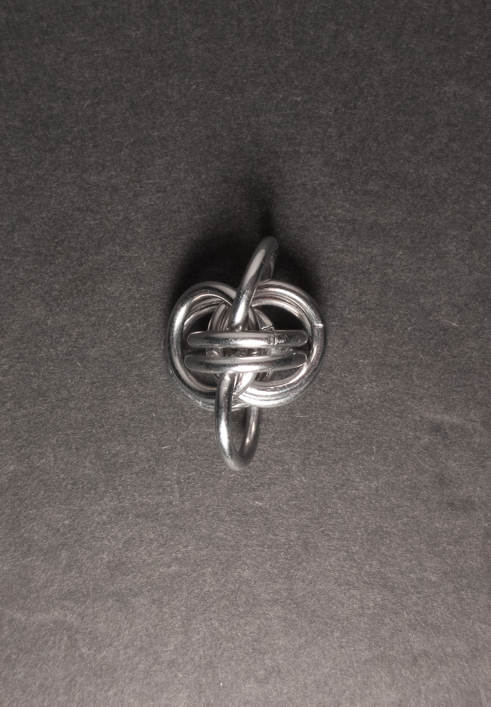
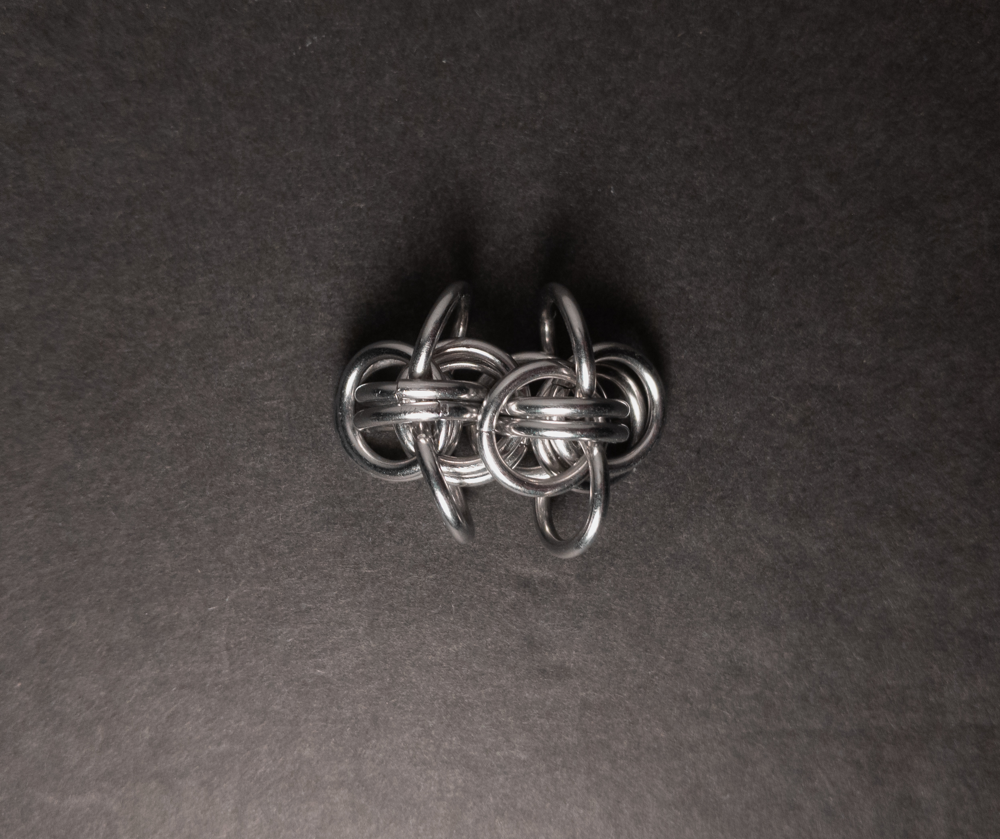
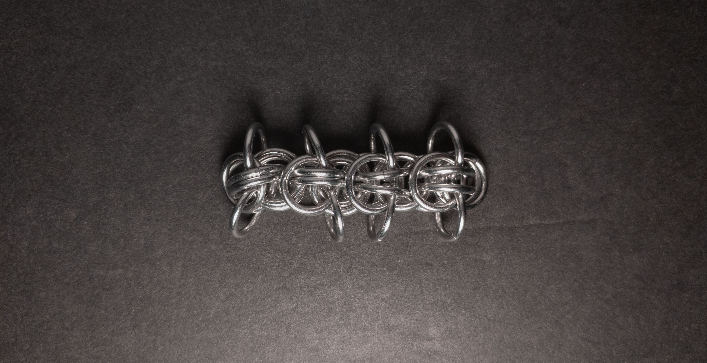

 posted: 2024-03-10 

## Ficus

### Overview

While checking out [M.A.I.L.](https://www.mailleartisans.org/) for a fun new weave to try, I came across [Ficus](https://www.mailleartisans.org/weaves/weavedisplay.php?key=984) by [chainge_maker](https://www.mailleartisans.org/members/memberdisplay.php?key=13268). Ficus is a [Byzantine](byzantine.md) variant created while chainge_maker was toying with Byzantine. If you want to make it yourself at home, I highly suggest this helpful [tutorial](https://artofmakingthings.com/articles/ficus-chain-weave-tutorial) by [Simon Livingston](https://artofmakingthings.com/author/p9cnoqm5).

### Materials

For the sample piece showcased in this post, I made the rings myself (bonus post coming soon if you are interested). I used 16 SWG Bright Aluminum wire from [The Ring Lord](https://theringlord.com/) coiled around an 8mm mandrel for an approximate aspect ratio of 4.9.

### Notes

The Ficus weave offers simplicity in both understanding its structure and creating it. While it boasts an attractive appearance with its leaves extended, the weight of the weave does not provide enough tension to extend all the leaves. Unfortunately, the surroundings can also prevent the leaves from extending. With its square cross-section, it may seem suited for use in bracelets, necklaces and chokers; unfortunately, the leaves get in the way. For this reason, it is best in earrings and free-hanging pendants. The name originates from the resemblance of the rings extending from the center chain to hanging leaves. Despite its usage limitations, the weave's aesthetic appeal and ease of learning and making make it worth exploring; thus, I recommend learning how to create it.

### Pictures

#### Flat

#### Flat: Profile

#### Vertical

#### Vertical: Profile

#### In Process

 

 

 

