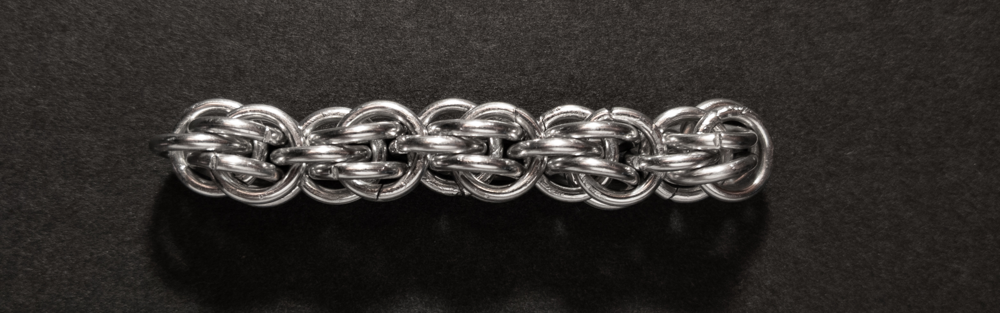
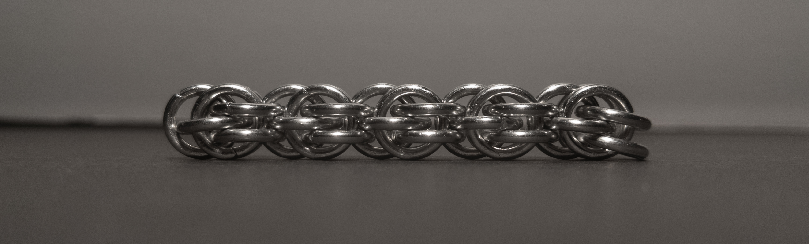
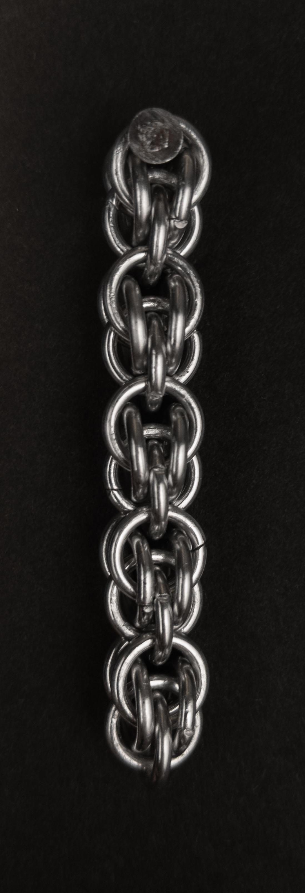
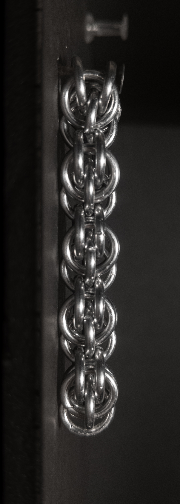
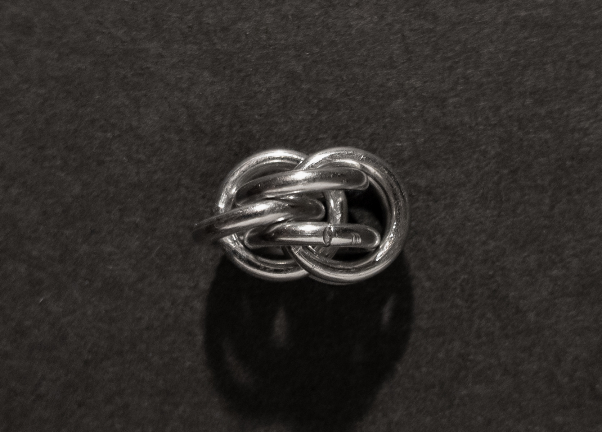
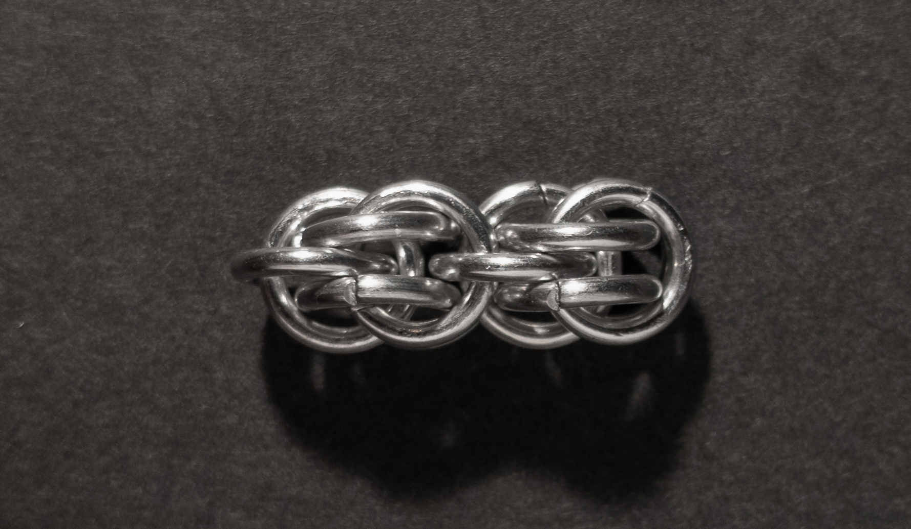
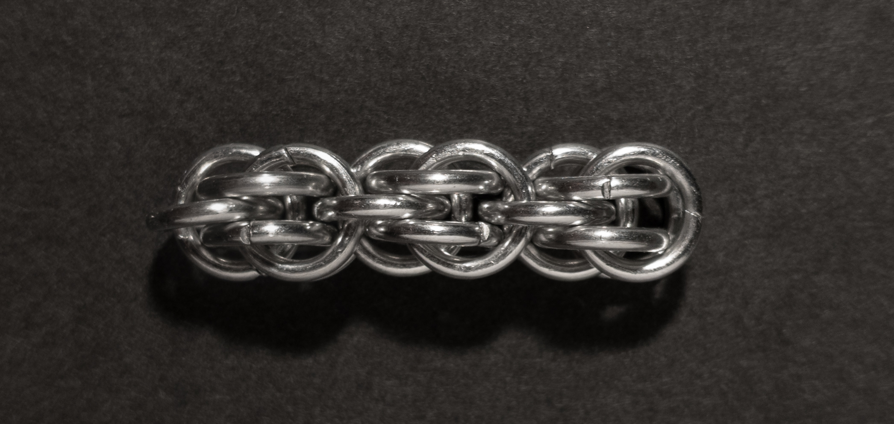
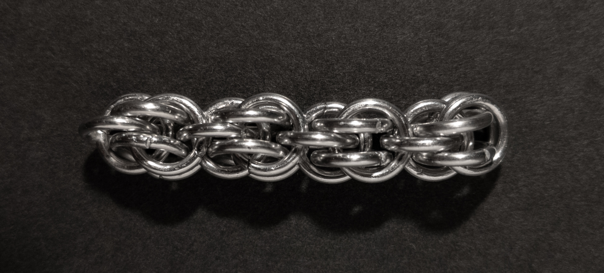

 posted: 2023-06-11 

## Fieldstone

### Overview

While researching the [Sweetpea](sweetpea.md) weave on [M.A.I.L.](https://www.mailleartisans.org/), I came across another [tutorial](https://www.mailleartisans.org/articles/articledisplay.php?key=565) by [Corvus](https://www.mailleartisans.org/members/memberdisplay.php?key=4033) featuring a related weave called [Fieldstone](https://www.mailleartisans.org/weaves/weavedisplay.php?key=955). Fieldstone belongs to the Persian family and bears a striking resemblance to Sweetpea. If you're drawn to its aesthetic, I highly recommend exploring Fieldstone and discovering its unique qualities.

### Materials

For the sample piece showcased in this post, I used Bright Aluminum rings purchased from [The Ring Lord](https://theringlord.com/). The rings are 16 SWG with a 1/4" internal diameter, resulting in an aspect ratio of 4.03.

### Notes

Fieldstone is a beautiful and versatile chainmail weave known for its graceful and delicate appearance. Despite its slender profile, Fieldstone offers remarkable strength and durability. This makes it an excellent choice for various applications, including creating elegant necklaces, and intricate bracelets, or even utilizing it as a cord in different projects. The weave's concept is relatively straightforward, making it easy to grasp and envision. However, executing the weave with precision and consistency may require some practice and attention to detail. The flexibility and compact cross-section of the Fieldstone weave allow for fluid movement and a charming drape, making it ideal for achieving an alluring aesthetic in your jewelry or craft creations. If you're looking to incorporate a captivating and versatile weave into your designs, I highly recommend exploring the possibilities of the Fieldstone weave.

### Pictures

#### Flat

#### Flat: Profile

#### Vertical

#### Vertical: Profile

#### In Process

 

 

 

