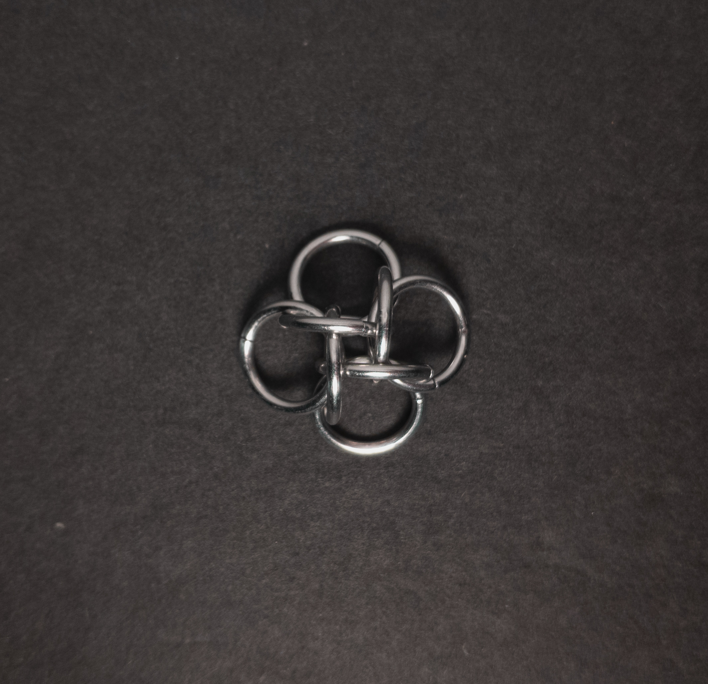
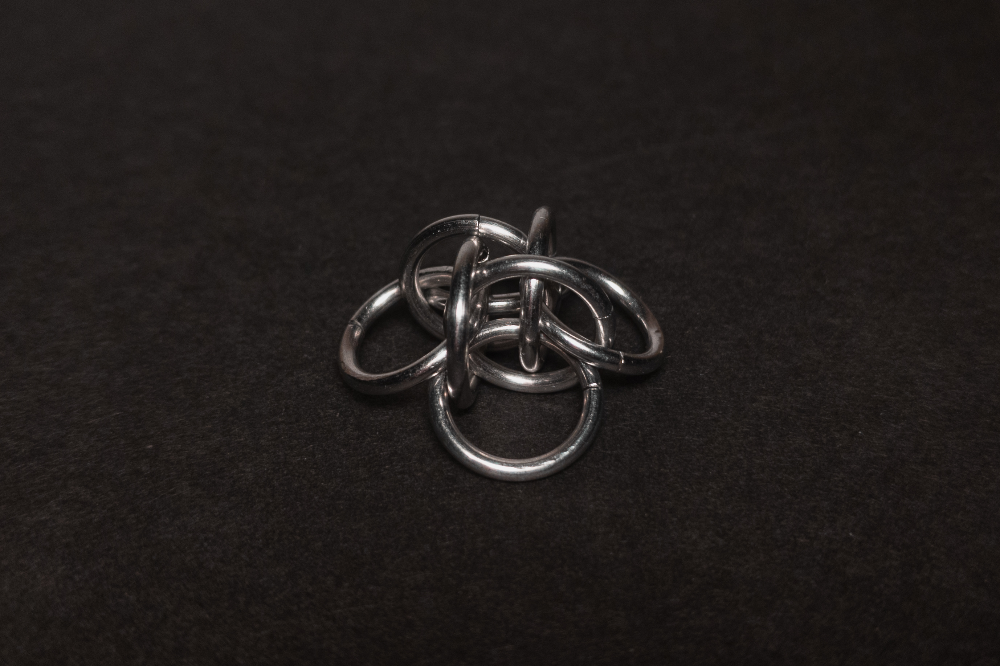
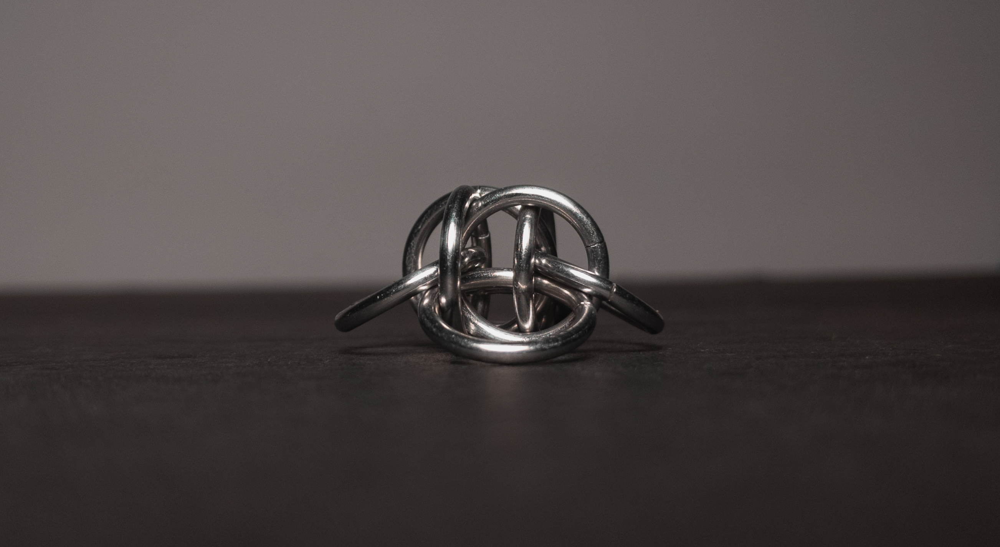
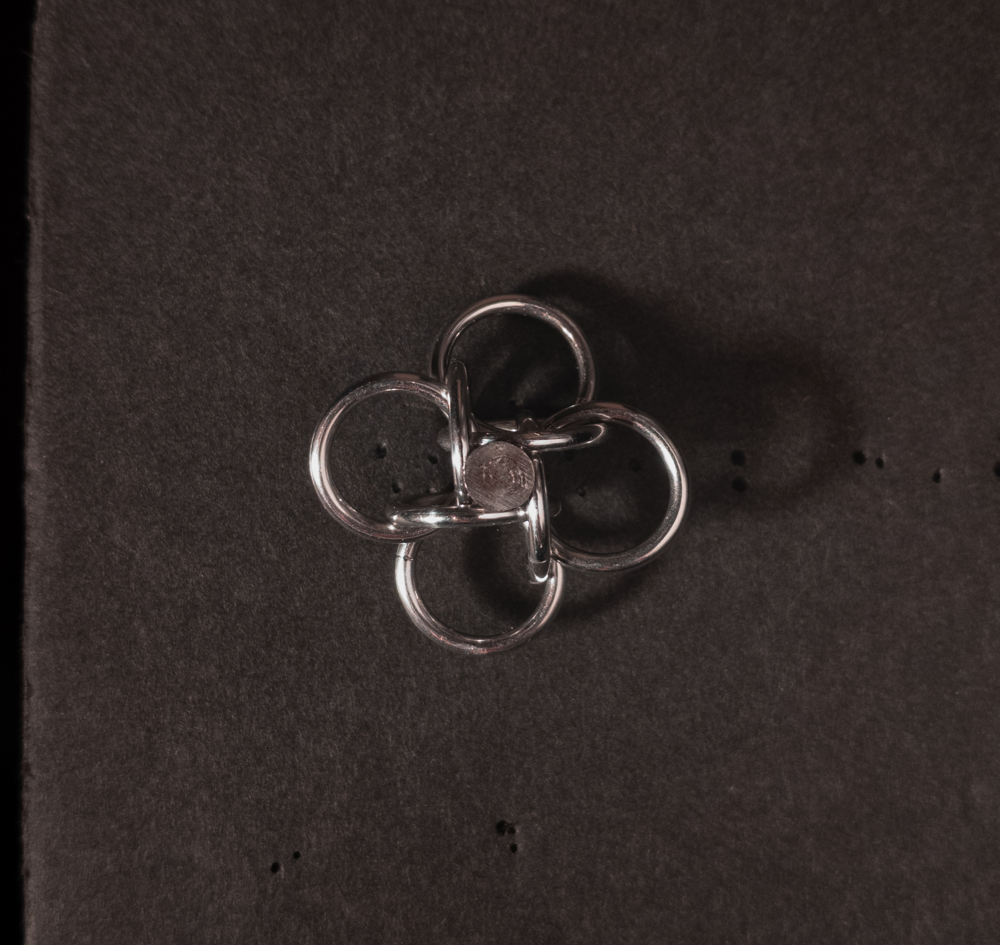
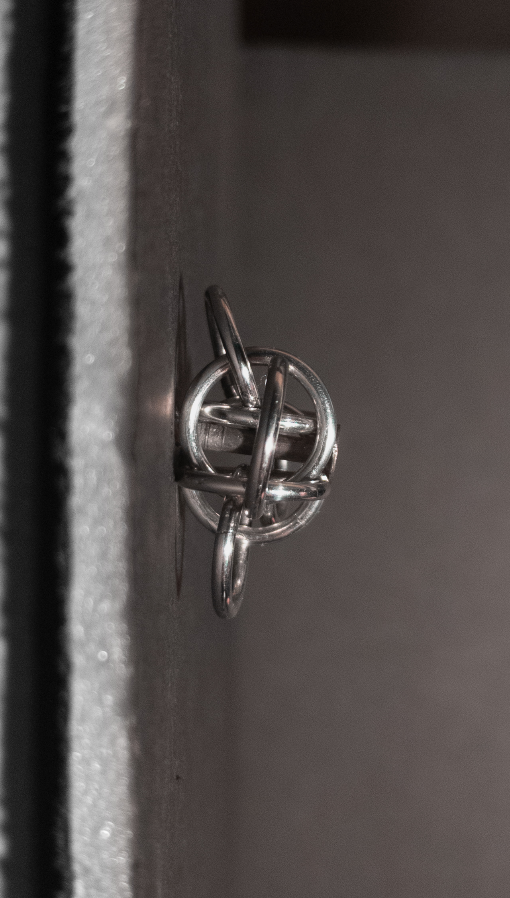
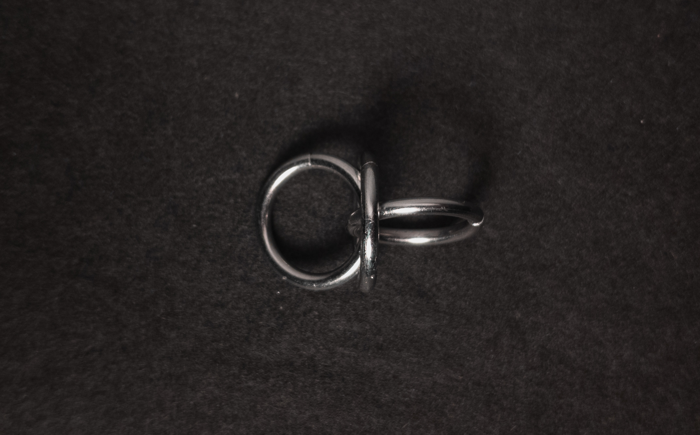
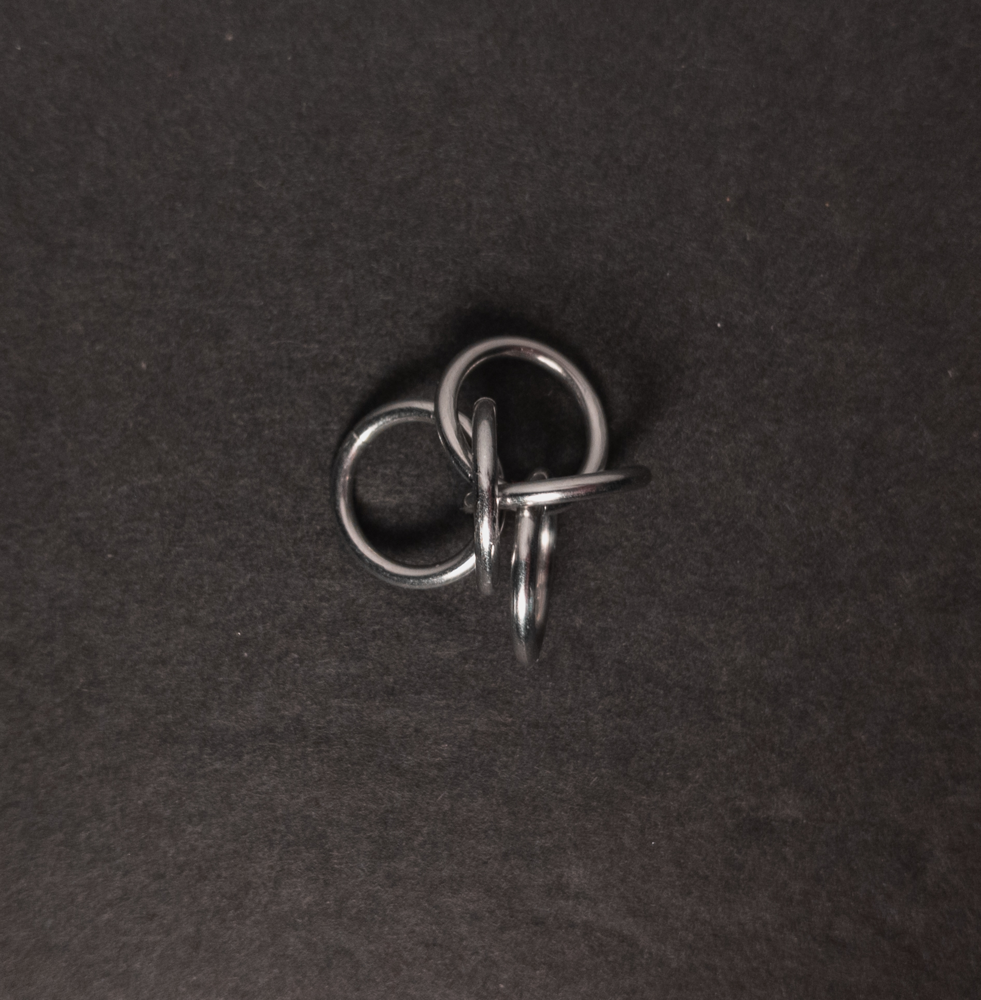
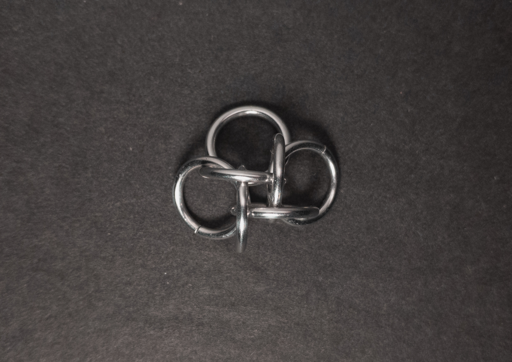

 posted: 2024-12-01 

## Fireman's Hold 4

### Overview

I found [Fireman's Hold 4](https://www.mailleartisans.org/weaves/weavedisplay.php?key=625) by [Gnomeofdoom](https://www.mailleartisans.org/members/memberdisplay.php?key=4374) while drifting through [M.A.I.L.](https://www.mailleartisans.org/) in search of new weaves to try. Fireman's Hold 4 is a Japanese unit weave related to the [Tao 4 Unit](tao_4_unit.md). For those interested in making it themselves, I recommend this [tutorial](https://www.mailleartisans.org/articles/articledisplay.php?key=483) by [MaxumX](https://www.mailleartisans.org/members/memberdisplay.php?key=949).

### Materials

For the sample piece showcased in this post, I made the rings myself (bonus post coming soon if you are interested). I used 16 SWG Bright Aluminum wire from [The Ring Lord](https://theringlord.com/) coiled around a 9mm mandrel for an approximate aspect ratio of 5.5.

### Notes

The Fireman's Hold 4 weave is quite simple to understand and create. I find it to be aesthetically pleasing, making it a worthwhile project. As it is a unit weave, you can easily use it for great charms, pendants and desk ornaments. With only eight rings, this weave is light on ring count, making it an easy and quick project. I recommend learning to make this weave, as it requires minimal effort to produce a visually appealing object.

### Pictures

#### Flat

#### Flat: Angled

#### Flat: Profile

#### Vertical

#### Vertical: Profile

#### In Process

 

 

