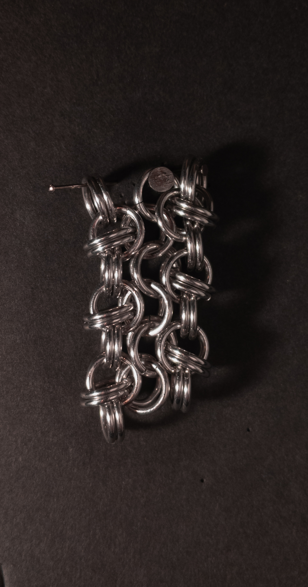
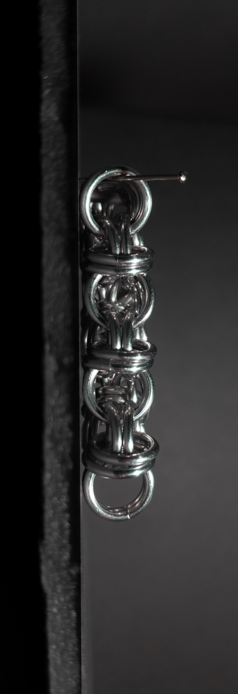
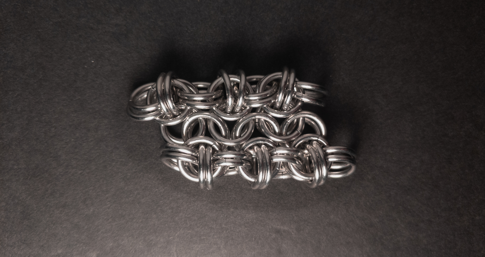
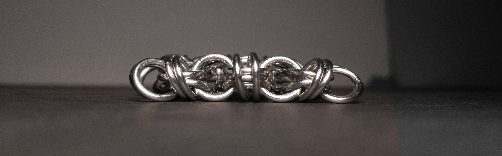

 posted: 2024-03-24 

## Flat Byz 4-in-1 Tube

### Overview

I recently found [Flat Byz 4-in-1 Tube](https://www.mailleartisans.org/weaves/weavedisplay.php?key=1075) uploaded to [M.A.I.L.](https://www.mailleartisans.org/) by [MaxumX](https://www.mailleartisans.org/members/memberdisplay.php?key=949) when looking for an interesting new weave to try making. Flat Byz 4-in-1 Tube is a variant of the [Byzantine](byzantine.md) and [European 4-in-1](european_4_in_1.md) that strongly reminds me of [Beez Stew](beez_stew.md). To make this weave, I followed this [tutorial](https://www.mailleartisans.org/articles/articledisplay.php?key=606) by MaxumX. I also recommend MaxumX's tutorial for those who wish to try making this weave at home.

### Materials

For the sample piece showcased in this post, I made the rings myself (bonus post coming soon if you are interested). I used 16 SWG Bright Aluminum wire from [The Ring Lord](https://theringlord.com/) coiled around a 7mm mandrel for an approximate aspect ratio of 4.3.

### Notes

The Flat Byz 4-in-1 Tube weave offers an intriguing variation of the classic Byzantine pattern. While the weave's structure is not overly complex to grasp, its creation process presents some challenges, contributing to its somewhat complex nature. Despite its complexity, the weave yields a visually appealing and intricate design. My experimentation with aspect ratios revealed that while the recommended 4.0 aspect ratio was too tight, a slightly larger ratio of 4.3 proved more suitable, albeit with slight looseness. Primarily, the weave forms a flat and wide band, making it ideal for bracelets, chokers, or as a strap. A notable similarity exists between Flat Byz 4-in-1 Tube and Beez Stew, particularly in their connection methods. The direct connection of rings in Flat Byz 4-in-1 Tube results in staggered units, distinguishing it from Beez Stew's lined-up units with its indirect connections. If you appreciate Byzantine weaves, exploring the intricacies of Flat Byz 4-in-1 Tube can be a rewarding endeavour.

### Pictures

#### Vertical

#### Vertical: Profile

#### Flat

#### Flat: Profile

