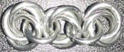
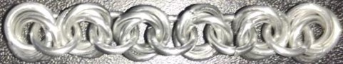

 posted: 2023-03-19 

## Flower

### Overview

I found a [tutorial](https://www.mailleartisans.org/articles/articledisplay.php?key=42) by [Aderamelech](https://www.mailleartisans.org/members/memberdisplay.php?key=7) on [M.A.I.L.](https://www.mailleartisans.org/) that shows how to create a [Flower](https://www.mailleartisans.org/weaves/weavedisplay.php?key=25) weave. The Flower weave is a variant of the [Mobius Ball](mobius_ball.md) made by connecting pairs of Mobius Balls together with a single ring. Flower is an interesting weave that I suggest you try if you enjoy how Mobius Balls work and want to make sASomething larger using them.

### Materials

The rings used for the sample piece shown in this post are 16 SWG with a 1/4" internal diameter for an aspect ratio of 4.03 made of Bright Aluminum that I bought from the [Ring Lord](https://theringlord.com/).

### Notes

The Flower weave is simple to make, though some care may be required to get the individual Mobius Ball units to sit properly and look nice. This difficulty can be overcome by being careful when joining two Mobius Ball units together. The weave looks good regardless of its orientation and tension, and is quite flexible in all directions. Overall, the Flower weave is a wonderful and highly versatile pattern that is worth learning.

### Pictures

#### Vertical

#### Flat

#### In Process

 

 

 

 

 

