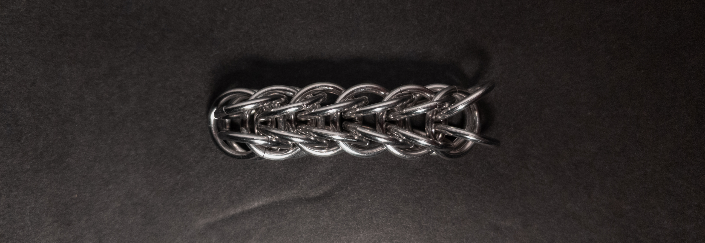
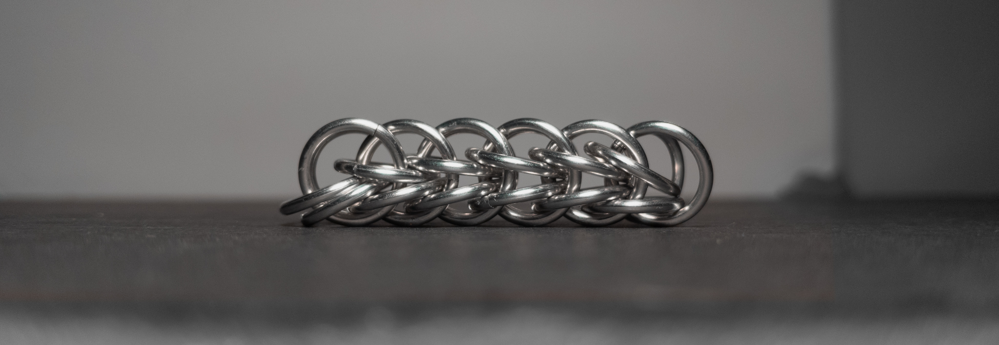
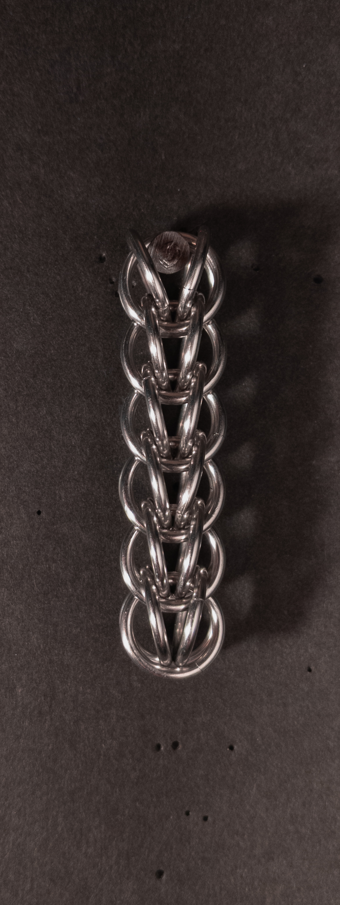
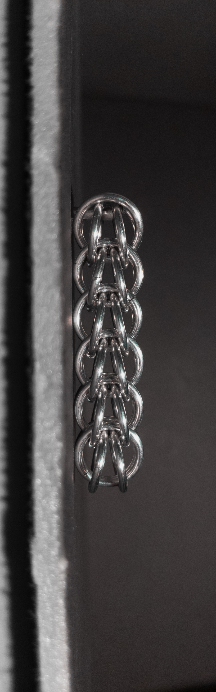
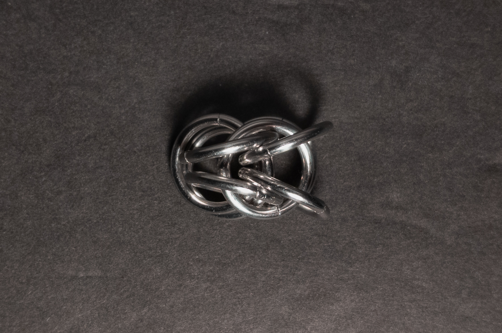
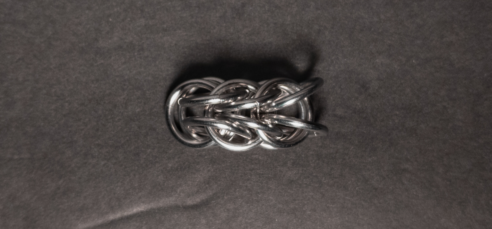
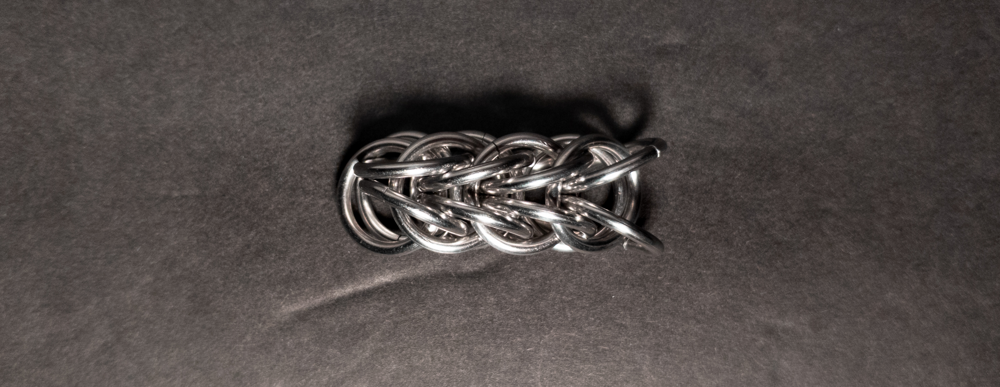
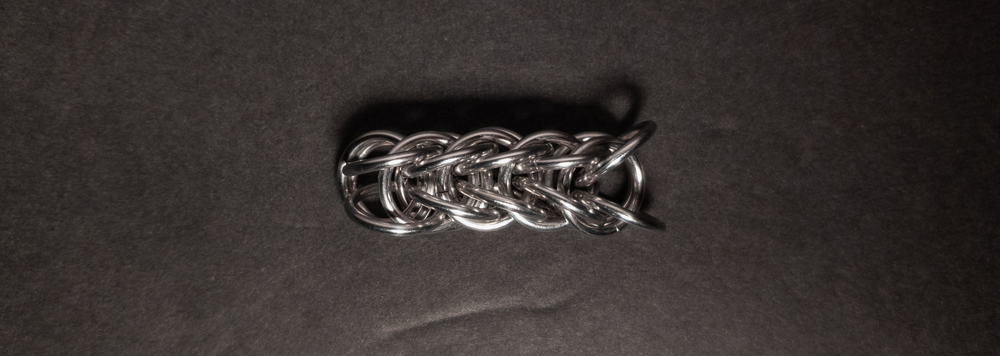

 posted: 2024-06-23 

## Full Persian 6-in-1 

### Overview

While searching through [M.A.I.L.](https://www.mailleartisans.org/) for weaves to try making, I came across the historic [Full Persian 6-in-1](https://www.mailleartisans.org/weaves/weavedisplay.php?key=44) weave. Full Persian 6-in-1 is the base weave that [Half Persian 3-in-1](half_persian_3_in_1.md) and [Half Persian 4-in-1](half_persian_4_in_1.md) are derived from. If you want to make this yourself, I recommend [this tutorial](https://www.mailleartisans.org/articles/articledisplay.php?key=13) by [Kateryne](https://www.mailleartisans.org/members/memberdisplay.php?key=62).

### Materials

For the sample piece showcased in this post, I made the rings myself (bonus post coming soon if you are interested). I used 16 SWG Bright Aluminum wire from [The Ring Lord](https://theringlord.com/) coiled around a 9mm mandrel for an approximate aspect ratio of 5.5.

### Notes

The Full Persian 6-in-1 weave is straightforward to grasp and remarkably easy to create. Its aesthetic appeal is undeniable, presenting a visually pleasing design. With its round cross-section, it's well-suited for many uses, including bracelets, chokers, necklaces, or even for use as cordage. Moreover, its hollow center offers the perfect opportunity for incorporating captive items (items inside the rings kept in place by the placement of the rings). Given its simplicity and attractive appearance, I highly recommend making it yourself and mastering the technique.

### Pictures

#### Flat

#### Flat: Profile

#### Vertical

#### Vertical: Profile

#### In Process

 

 

 

