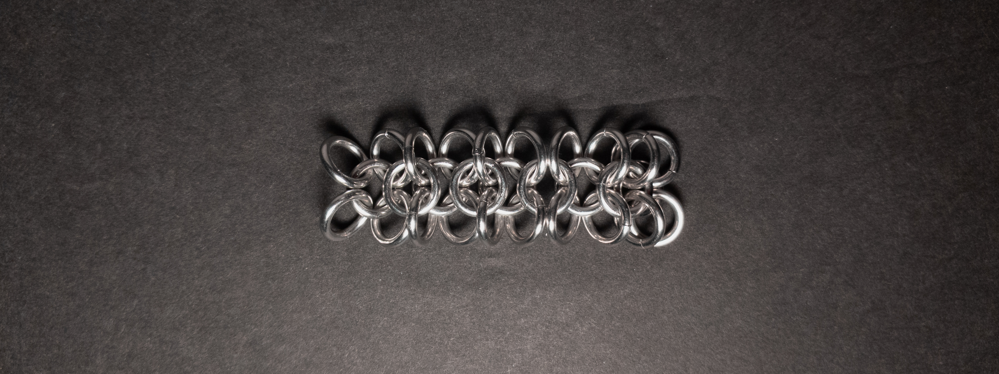
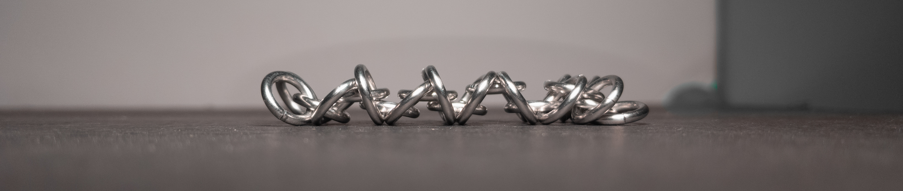
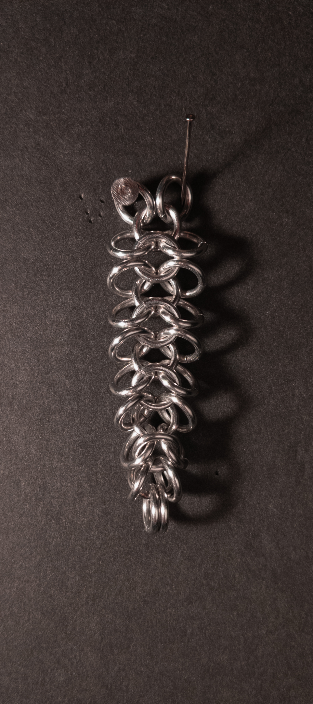
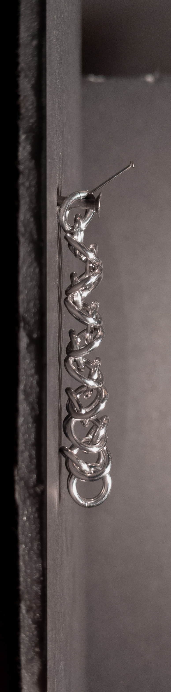
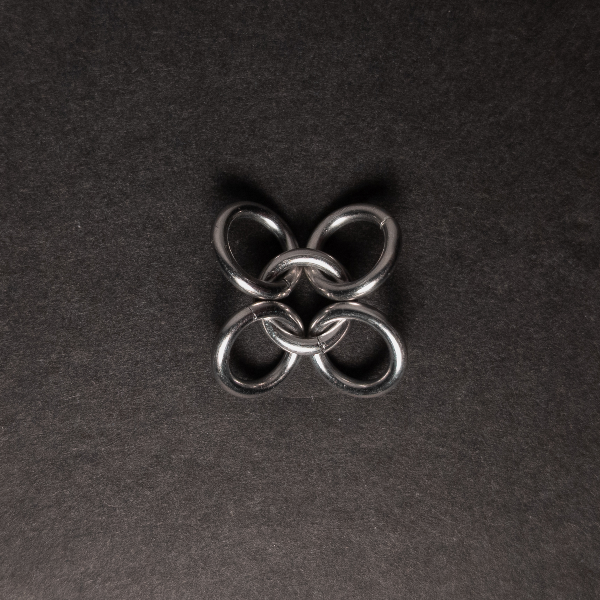
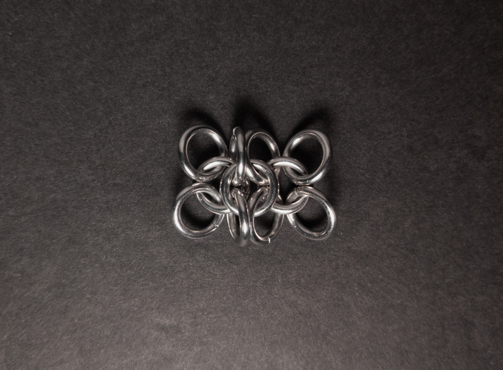
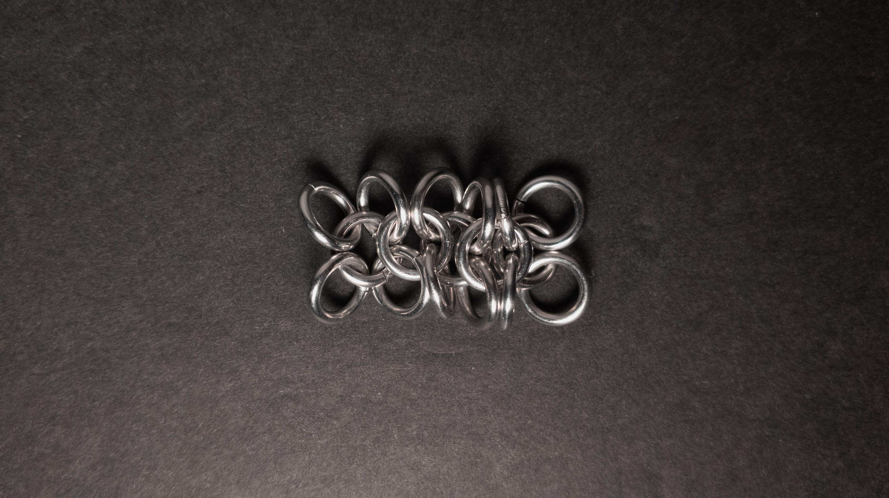
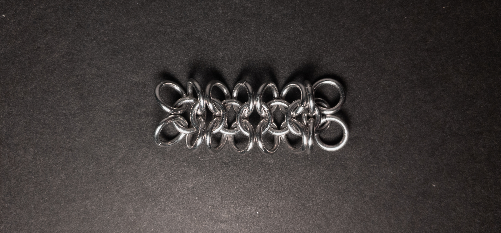

 posted: 2023-12-31 

## Gridlock

### Overview

While looking for new weaves to try, I came across [Gridlock](https://www.mailleartisans.org/weaves/weavedisplay.php?key=14) on [M.A.I.L.](https://www.mailleartisans.org/). Gridlock is a cool and historical variant of [European 4-in-1](european_4_in_1.md); thus, I do not know who created it. If you would like to try making this yourself at home, I recommend [this tutorial](https://www.mailleartisans.org/articles/articledisplay.php?key=245) by [Tesserex](https://www.mailleartisans.org/members/memberdisplay.php?key=1705).

### Materials

For the sample piece showcased in this post, I made the rings myself (bonus post coming soon if you are interested). I used 16 SWG Bright Aluminum wire from [The Ring Lord](https://theringlord.com/) coiled around a 6mm mandrel for an approximate aspect ratio of 3.7.

### Notes

Gridlock is a weave characterized by its simplicity in both understanding and creation. While it has the potential to look good, it tends to have a messy appearance with ends that fold in an unstructured manner. Despite its visual drawbacks and a tendency not to maintain a defined structure well, Gridlock is a versatile weave suitable for bracelets and chokers. In fact, as a sheet weave, it can even be used like fabric in larger projects. Although it might not align with personal preferences due to its structural issues, the simplicity of learning makes it a recommended weave, particularly if you have appropriately sized rings available.

### Pictures

#### Flat

#### Flat: Profile

#### Vertical

#### Vertical: Profile

#### In Process

 

 

 

